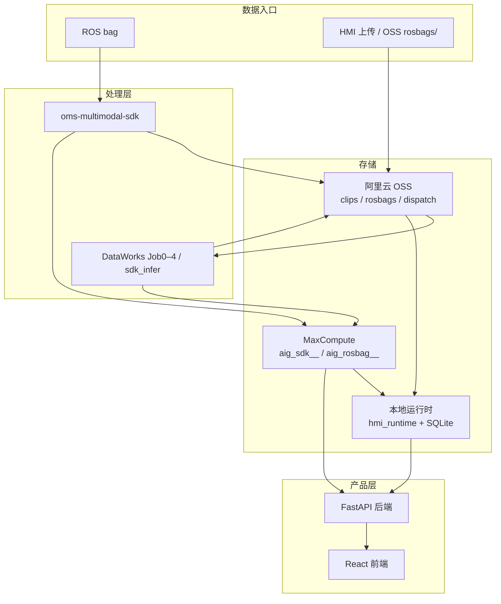

# Multimodal Data Generation & Management Platform

**多模态数据生成与管理平台** — 从 ROS bag 录制到 OMS 标签、向量检索、人工校核与数据集交付的一体化 Monorepo。

面向车载 / 机器人多模态场景：解析 rosbag → AI 打标与向量化 → Web 校核 → 训练集导出。支持**本地 SDK 批跑**、**阿里云 DataWorks + MaxCompute + OSS 上云**，以及 **Docker / ECS 一键部署**。

| | |
|---|---|
| **详细 Wiki** | [docs/WIKI.md](docs/WIKI.md) |
| **目录说明** | [docs/REPO_LAYOUT.md](docs/REPO_LAYOUT.md) |
| **产品需求** | [docs/prd-rosbag-labels.md](docs/prd-rosbag-labels.md) |

---

## 核心能力

| 模块 | 能力 |
|------|------|
| **数据管线** | ROS bag 解析、多路相机对齐、ASR、OMS 68 项 taxonomy 打标、融合向量；内容寻址 `clip_id = sha256:{hex}`，版本化 `run_id` |
| **OMS Multimodal SDK** | `oms-multimodal-sdk`：本地/云端统一 CLI，产出 `sdk_v1` jsonl + 预览 MP4/WAV |
| **云端编排** | DataWorks Job0–4（Legacy clip-omni v2）+ SDK 推理节点；MaxFrame + DPE；MC 表 `aig_sdk__` / `aig_rosbag__` |
| **校核 HMI** | FastAPI + React：时间轴浏览、标签检索、OSS 管理、管线进度、Taxonomy 版本治理、校核工作台 v2、数据集快照 |
| **账号与治理** | JWT 登录、多角色 RBAC、校核任务分配、审计与导出权限隔离 |

---

## 系统架构



**推荐主路径（新数据）**：SDK 批跑 → OSS `layout_version: sdk_v1` → MC 入库 → HMI 本地 sync / 导入 → 校核与 dataset 导出。  
Legacy 全链 Job1–4（clip-omni v2）仍可用于历史资产维护，新 clip 请勿再写入 `parsed/aligned/ai` 树。

---

## 仓库结构

```text
rosbag_to_labels_pipline/
├── shared/              # 全局 config.yaml、Taxonomy、clip_id、路径常量
├── piplinesdk/          # oms-multimodal-sdk 源码与 wheel
├── pipeline/            # DataWorks 节点、MC DDL、本地 parse、验数脚本
├── hmi/
│   ├── backend/         # FastAPI（python run.py → :8000）
│   ├── frontend/        # React + Vite + Ant Design
│   ├── deploy/          # Docker / compose / ECS rollout
│   ├── data/            # app.db、hmi_runtime、样例 real_data
│   └── scripts/         # sync、导入、bootstrap admin 等
├── docs/                # Wiki、PRD、设计文档
├── project-management/  # 里程碑、acceptance、CURRENT.md
└── archive/             # 历史脚本与参考（非主路径）
```

| 目录 | 职责 |
|------|------|
| [`piplinesdk/`](piplinesdk/) | Rosbag 抽取、预览编码、百炼 ASR / 打标 / embedding 客户端 |
| [`pipeline/`](pipeline/) | 上云节点、`sql/maxcompute/` DDL、`clips/` 样本 bag |
| [`hmi/`](hmi/) | 校核 Web 全栈与应用库 |
| [`shared/`](shared/) | OSS / MC / Job 配置的单一事实来源 |

---

## 快速开始（本地 HMI）

### 环境要求

| 组件 | 版本 |
|------|------|
| Python | 3.12+ |
| Node.js | 18+（前端） |
| ffmpeg | SDK 预览编码（可选，跑管线时需要） |

### 1. 克隆与依赖

```powershell
git clone https://github.com/mjnn/Multimodal-Data-Generation-Management-Platform.git
cd Multimodal-Data-Generation-Management-Platform

# Python：HMI + 管线 + editable SDK
cd hmi
py -3 -m pip install -r requirements-dev.txt

# 前端
cd frontend
npm install
```

### 2. 配置环境变量

```powershell
# 仓库根目录
copy .env.example .env
```

| 变量 | 用途 | 本地最小集 |
|------|------|------------|
| `HMI_DATA_SOURCE` | `local` / `cloud` | `local` |
| `HMI_RUNTIME_ROOT` | 本地 SQLite + artifacts 根目录 | 默认 `hmi/data/hmi_runtime` |
| `HMI_JWT_SECRET` | JWT 签名 | 任意长随机串 |
| `ODPS_*` / `OSS_*` | 云端 sync、OSS 管理 | 仅在线模式需要 |
| `DASHSCOPE_*` | SDK AI 打标/ASR | 跑 SDK 管线时需要 |

### 3. 初始化本地运行时与管理员

```powershell
cd hmi

# 创建 hmi_runtime 目录结构（若尚未存在）
py -3 scripts/init_local_runtime.py

# 首个管理员（交互式输入密码，至少 8 位）
py -3 scripts/bootstrap_admin.py --username admin

# 可选：导入仓库内样例 SDK 产物到本地
py -3 scripts/import_real_data_clips.py --source pipeline_latest
```

### 4. 启动前后端

**终端 1 — 后端**

```powershell
cd hmi\backend
$env:HMI_DATA_SOURCE="local"
$env:HMI_RUNTIME_ROOT="..\data\hmi_runtime"   # 或绝对路径
py -3 run.py
# → http://127.0.0.1:8000/api/health
```

**终端 2 — 前端**

```powershell
cd hmi\frontend
npm run dev
# → http://127.0.0.1:5174/  （VITE_DEV_PORT，/api 代理到 :8000）
```

浏览器打开前端地址，使用 `admin` 与 bootstrap 时设置的密码登录。

### 5. 健康检查

```powershell
curl.exe http://127.0.0.1:8000/api/health
```

期望 JSON 含 `"ok": true`、`"data_source": "local"`。

---

## HMI 功能一览

| 路由 | 功能 |
|------|------|
| `/` | Clip 总览、批次统计、快捷校核 |
| `/clips/:clipId` | 多模态时间轴：迷你地图、磁吸、波形、±200ms 快照、Run 切换、相似时刻 |
| `/search` | OMS 标签树 + 关键词检索（2s 时刻簇聚合） |
| `/pipeline` | 本地 rosbag 上传、SDK 管线执行与进度 |
| `/oss` | OSS 浏览/上传、bag 管线进度、dispatch 同步 |
| `/taxonomy` | Taxonomy 版本编辑与发布 |
| `/review` | 校核工作台 v2（逐标签校核、争议任务） |
| `/review/assignments` | 校核任务领取（进行中 / 已完成） |
| `/datasets` | 数据集快照列表与导出 |
| `/admin/users` | 用户与角色管理 |
| `/system/env` | 运行时环境只读查看（管理员） |

### 角色与权限（PRD）

| 角色 | 典型能力 |
|------|----------|
| **admin** | 用户、Taxonomy、全校核与 dataset、系统配置 |
| **pipeline_manager** | 管线管理、OSS、bag 上传 |
| **reviewer** | 校核队列、任务领取、标签修正 |
| **dataset_manager** | 数据集创建与导出 |
| **model_trainer** | 数据集只读下载 |

重置管理员密码：

```powershell
cd hmi
py -3 scripts/reset_admin_password.py --username admin --password <新密码>
```

---

## 数据管线

### SDK v1（推荐）

```powershell
# 检查 bag 结构
python -m oms_multimodal inspect --bag path\to\output.bag

# 完整跑批（需 DASHSCOPE_* 与 ffmpeg）
python -m oms_multimodal process --bag path\to\output.bag --out ./work
```

产物布局：`labels.jsonl`、`fusion_embeddings.jsonl`、`clip_videos.jsonl`、`preview/*.mp4`。  
详见 [`piplinesdk/README.md`](piplinesdk/README.md) · [`docs/sdk-first-pipeline-design.md`](docs/sdk-first-pipeline-design.md)。

### 云端 DataWorks

- 编排与节点参数：[`pipeline/dataworks/WORKFLOW.md`](pipeline/dataworks/WORKFLOW.md)
- 开发者指南：[`pipeline/dataworks/PIPELINE_DEVELOPER_GUIDE.md`](pipeline/dataworks/PIPELINE_DEVELOPER_GUIDE.md)
- MC DDL：`pipeline/sql/maxcompute/aig_sdk__ddl.sql`

### 从云端同步到本地

```powershell
cd hmi
py -3 scripts/sync_hmi_local.py --clip-id sha256:...
# 仅同步表、不下载 OSS 大文件：--skip-oss
```

HMI 可轮询 OSS `pipeline/dispatch/latest.json` 自动 sync（ECS 部署时通过环境变量开启，见 [`hmi/backend/README.md`](hmi/backend/README.md)）。

---

## Docker 部署

镜像内嵌前端静态资源 + uvicorn 单进程，适合 ECS / 内网服务器。

```powershell
cd hmi\deploy

# 参考 .env.runtime.example 准备 .env.runtime
docker compose up -d
```

| 变量 | 说明 |
|------|------|
| `HMI_RUNTIME_ROOT` | 挂载持久化目录（compose 默认 `./data/hmi_runtime`） |
| `HMI_PUBLIC_API_BASE` | 反代路径前缀，如 `/tools/rosbag-labels/api` |
| `HMI_LOCAL_SDK_POLL_ENABLED` | 本地 SDK 后台队列（上传 bag 后自动 infer） |
| `HMI_OSS_SYNC_POLL_ENABLED` | 轮询 OSS dispatch 自动 sync |

构建与推送 ACR、ECS rollout：[`hmi/deploy/push-acr.ps1`](hmi/deploy/push-acr.ps1) · [`hmi/deploy/ecs_rollout.sh`](hmi/deploy/ecs_rollout.sh)。

---

## 技术栈

| 层级 | 技术 |
|------|------|
| SDK / 本地管线 | Python 3.12 · `rosbags` · ffmpeg · DashScope API |
| 云端 | 阿里云 DataWorks · MaxFrame · DPE · MaxCompute · OSS |
| HMI 后端 | FastAPI · PyODPS · oss2 · SQLite |
| HMI 前端 | React · TypeScript · Ant Design · Vite |
| 部署 | Docker · nginx 静态资源 · compose |

---

## 文档索引

| 主题 | 路径 |
|------|------|
| 项目总览 Wiki | [docs/WIKI.md](docs/WIKI.md) |
| 目录与开发命令 | [docs/REPO_LAYOUT.md](docs/REPO_LAYOUT.md) |
| 产品需求 PRD | [docs/prd-rosbag-labels.md](docs/prd-rosbag-labels.md) |
| SDK-first 设计 | [docs/sdk-first-pipeline-design.md](docs/sdk-first-pipeline-design.md) |
| OSS / MC CLI 手册 | [docs/cloud-cli-runbook.md](docs/cloud-cli-runbook.md) |
| HMI 后端 | [hmi/backend/README.md](hmi/backend/README.md) |
| HMI 前端 | [hmi/frontend/README.md](hmi/frontend/README.md) |
| OMS SDK | [piplinesdk/README.md](piplinesdk/README.md) |
| Agent / 工单流程 | [AGENTS.md](AGENTS.md) |

---

## 开发说明

- **Git 根目录**即本 Monorepo 根；Python 脚本通过 `shared/repo_paths.py` 解析 `REPO_ROOT`。
- **配置单一来源**：`shared/config.yaml`（bucket、表前缀、对齐窗口等）。
- **忽略大文件**：`.gitignore` 已排除 `node_modules/`、本地 DB、`hmi/data/hmi_local/` 运行时产物等；样例 jsonl 在 `hmi/data/real_data/` 供离线体验。
- **贡献与里程碑**：当前按 [project-management/CURRENT.md](project-management/CURRENT.md) 工单推进；收工需更新 acceptance 与进度看板（见 [AGENTS.md](AGENTS.md)）。

---

## License

SDK 子包许可见 [`piplinesdk/LICENSE`](piplinesdk/LICENSE)。仓库其余部分暂无统一开源许可证文件；使用前请与维护者确认。
