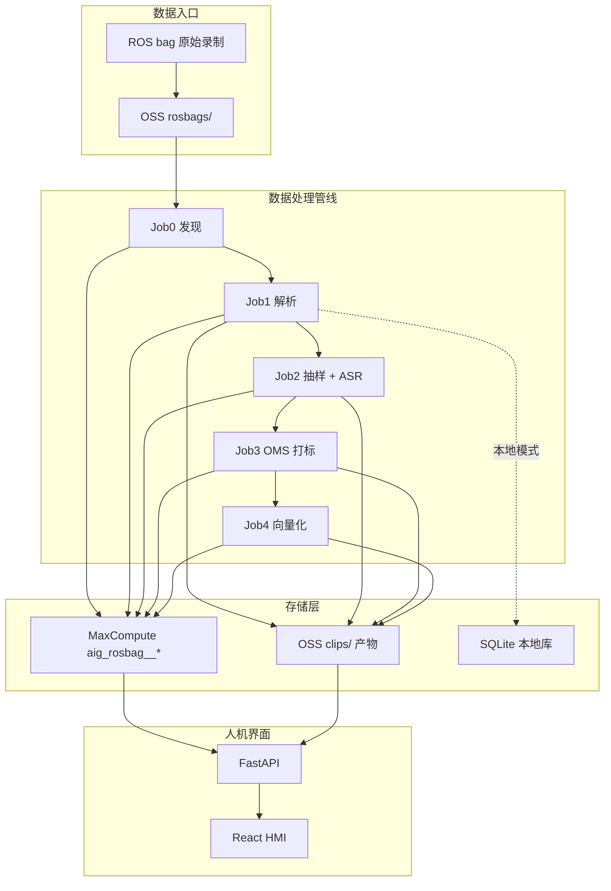

# Rosbag → Labels Pipeline — 项目 Wiki

> 最后更新：2026-07-08  
> 本文档为项目总览 Wiki，详细运维与编排见文末「相关文档索引」。

---

## 1. 项目简介

**rosbag_to_labels_pipline** 是一套面向车载/机器人 **ROS bag** 录制数据的端到端数据处理管线。它将原始多模态采集数据（四路相机、音频、事件标签）解析、抽样、ASR 转写、OMS 结构化打标、向量化，最终产出可检索、可浏览、可用于多模态 RAG 的结构化数据资产。

### 1.1 核心能力

| 能力 | 说明 |
|------|------|
| **Rosbag 解析** | 提取四路 JPEG 帧、合并音频 WAV + chunks、事件 JSONL、全 topic 时间轴 |
| **内容寻址** | `clip_id = sha256:{hex}`，与 OSS 路径名无关 |
| **版本化 Run** | 每次管线执行一个 `run_id`（UUID），通过 `active_run_id` 切换生效版本 |
| **多模态对齐** | 以 rosbag `record_time_ns` 为统一时间基准，默认 ±200ms 互查窗口 |
| **OMS 打标** | 按 68 项 OMS 标签 taxonomy 对抽样帧结构化标注 |
| **向量检索** | 帧/音频段 embedding，支持余弦相似检索 |
| **HMI 浏览** | React 时间轴浏览器 + FastAPI 后端，支持标签检索与相似时刻 |

### 1.2 技术栈

| 层级 | 技术 |
|------|------|
| 本地解析 | Python 3.12+ · `rosbags` · SQLite |
| 云端编排 | 阿里云 DataWorks · MaxFrame · DPE · MaxCompute · OSS |
| HMI 前端 | React 19 · TypeScript · Ant Design 6 · Vite 8 |
| HMI 后端 | FastAPI · PyODPS · oss2 · NumPy |
| AI（可选） | MaxCompute AI Function · 百炼 VL 模型 |

---

## 2. 系统架构



### 2.1 双模式运行

| 维度 | 本地模式 | 上云模式 |
|------|----------|----------|
| 入口 | `clips/{dir}/rosbag/` | OSS `rosbags/` |
| 解析产物 | `clips/{dir}/parsed_data/` | OSS `clips/{clip_id}/runs/{run_id}/parsed/` |
| 元数据 | SQLite `data/parse_records.db` · `data/timeline.db` | MaxCompute `aig_rosbag__*` |
| 执行 | 本地 Python 脚本 | DataWorks + MaxFrame + DPE |
| 配置 | `config.yaml` | 同文件 + DataWorks 工作流参数 |

本地与上云 **表结构 1:1**，便于对照验证。

---

## 3. 核心概念

### 3.1 Clip ID（内容寻址）

```python
clip_id = "sha256:{hex}"  # 对 rosbag 文件内容 SHA256
```

- 由 `clip_id.py` 计算，与目录名、OSS 路径无关
- 同一 bag 内容永远映射到同一 `clip_id`
- 测试 clip：`sha256:3cd012197d1f2112f51c7414500bb9770a143d1bbd1e1a2aaa84d9eccb51fc7b`

### 3.2 Run ID（版本化执行）

- 每次完整管线执行生成一个 UUID `run_id`
- `dim_clip.active_run_id` 指向当前生效版本
- 回滚 = 切换指针，不删 OSS 历史 run
- 本地开发固定 `run_id = "local"`

### 3.3 时间轴对齐

- **统一基准**：rosbag `record_time_ns`（纳秒）
- **默认窗口**：±200ms（`config.yaml` → `cloud.alignment.default_window_ms`）
- **对齐模式**：`independent`（各相机独立）/ `uniform_sync`（四路同步锚点）
- HMI 时间轴浏览以该基准驱动 minimap、磁吸、多模态快照

### 3.4 OSS 目录约定

```
rosbag-labels-pipline-bucket/
├── rosbags/                          # 原始 bag（Job0/Job1 同路径，禁止拷贝）
│   └── {clip_dir_name}/output.bag
├── config/
│   └── oms_label_taxonomy.yaml       # Job3 taxonomy（须预先上传）
├── pipeline/
│   └── dispatch/latest.json          # Job0 dispatch manifest
└── clips/
    └── {clip_id}/
        └── runs/
            └── {run_id}/
                ├── parsed/           # Job1：图像、audio.wav、chunks.jsonl
                ├── job2/             # 抽样 manifest + ASR 分段
                ├── job3/             # frame_labels.jsonl
                └── job4/             # embeddings.jsonl
```

---

## 4. 数据处理管线（Job0 ~ Job4）

### 4.1 节点拓扑

```
job0_discover
  → job0_dispatch
  → job1_parse → job1_mc_write
  → job2_sample ──→ job3_label → job3_mc_write → job4_embed → job4_mc_write
  → job2_asr   ──┘
  → job2_mc_write   （需 job2_sample + job2_asr；可与 Job3 并行）
```

### 4.2 各阶段说明

| Job | 节点 | 职责 | 产出 |
|-----|------|------|------|
| **Job0** | `job0_discover` | 扫描 OSS `rosbags/`，SHA256 hash，写入 `dim_clip` | clip 元数据 |
| | `job0_dispatch` | 写 dispatch manifest，驱动下游 clip/run 上下文 | `pipeline/dispatch/latest.json` |
| **Job1** | `job1_parse` | 解析 bag → 四路 JPEG、音频 WAV、chunks、事件 | OSS `parsed/` |
| | `job1_mc_write` | 写 MC 事实表，更新 `active_run_id` | timeline/frame/audio/event 表 |
| **Job2** | `job2_sample` | 按策略抽样帧（uniform / uniform_sync / event_dense） | `sample_manifest.jsonl` |
| | `job2_asr` | 切分音频 + ASR 转写（或 stub） | `asr_segments/*.wav` |
| | `job2_mc_write` | 合并 sample + asr payload | `fact_sample_policy` + `fact_audio_segment` |
| **Job3** | `job3_label` | 对抽样帧打 OMS 标签（或 stub） | `frame_labels.jsonl` |
| | `job3_mc_write` | 写 `fact_image_label` | OMS 结构化标签 |
| **Job4** | `job4_embed` | 帧 + 音频段向量化（或 stub） | `embeddings.jsonl` |
| | `job4_mc_write` | 写 `fact_embedding`，标记 `PIPELINE_DONE` | 多模态向量 |

### 4.3 状态机

| 状态 | `active_run_id` | 含义 |
|------|-----------------|------|
| 已发现 | `NULL` | Job0 写入，待 Job1 |
| 已解析生效 | UUID | Job1 写 MC 完成 |
| 回滚 | 切换 UUID | 只改指针，不删历史 |

`pipeline_step` 表记录每 run 各步骤：`job1_parse` → `job2_sample` → `job2_asr` → `job3_label` → `job4_embed`。

### 4.4 Driver vs DPE 分工

| 层级 | 运行环境 | 典型操作 |
|------|----------|----------|
| **Driver**（DataWorks Pod） | 自定义镜像 + pip | `new_session`、SQL、`open_writer` 写 MC、MC AI 调用 |
| **DPE Worker** | MC 登记镜像 | `@with_fs_mount` 读 bag、parse、写 OSS、抽样、打标、embed |

---

## 5. 数据模型

### 5.1 MaxCompute 表（前缀 `aig_rosbag__`）

| 表 | 写入 Job | 作用 |
|----|----------|------|
| `dim_clip` | Job0 插入；Job1 更新 | Clip 维度主数据、bag OSS key |
| `pipeline_run` | Job1 | Run 版本生命周期 |
| `pipeline_step` | 各 `*_mc_write` | 步骤状态审计 |
| `fact_message_timeline` | Job1 | 全 topic 时间轴（对齐中枢） |
| `fact_frame` | Job1 | 四路相机帧索引 |
| `fact_audio_chunk` | Job1 | 音频 chunk 索引 |
| `fact_event` | Job1 | 事件标签 |
| `clip_parse_summary` | Job1 | 解析汇总 |
| `fact_sample_policy` | Job2 | 抽样策略快照 |
| `fact_audio_segment` | Job2 | ASR 分段与转写 |
| `fact_sample_sync_group` | Job2 | 四路时间对齐抽样组 |
| `fact_image_label` | Job3 | OMS 图像标签 |
| `fact_embedding` | Job4 | 多模态向量 |

DDL 见 `sql/maxcompute/aig_rosbag__ddl.sql`。

### 5.2 本地 SQLite

| 文件 | 用途 |
|------|------|
| `pipeline/data/parse_records.db` | clip 解析记录 |
| `pipeline/data/timeline.db` | Job1 时间轴表（与 MC 1:1） |
| `hmi/data/hmi_local/` | HMI 本地 sync 后的 MC 表镜像 + OSS 产物 |

> 完整目录树见 **[REPO_LAYOUT.md](./REPO_LAYOUT.md)**。

---

## 6. 项目目录结构

```
rosbag_to_labels_pipline/          # Git 根
├── shared/                        # config.yaml、Taxonomy、cloud_config
├── piplinesdk/                    # oms-multimodal-sdk
├── pipeline/                      # DataWorks、parse、clips、MC DDL
│   ├── dataworks/
│   ├── sql/maxcompute/
│   ├── clips/
│   ├── data/                      # parse_records.db、timeline.db
│   └── scripts/                   # verify_pipeline_run、ingest_sdk_run_to_mc…
├── hmi/                           # 校核 Web
│   ├── backend/                   # FastAPI · run.py
│   ├── frontend/
│   ├── data/hmi_local/            # SQLite + sdk_v1 artifacts
│   └── scripts/                   # sync_hmi_local、import_real_data_clips
├── docs/                          # 文档（含本 Wiki）
├── archive/                       # 已归档脚本与 ref
└── project-management/            # 工单（见 AGENTS.md）
```

---

## 7. 快速开始

### 7.1 环境准备

```powershell
cd hmi
py -3 -m pip install -r requirements-dev.txt

copy ..\.env.example ..\.env
# 填写 ODPS_ACCESS_ID / ODPS_ACCESS_KEY / OSS 等（仓库根 .env）
```

### 7.2 本地解析 Rosbag

```powershell
cd pipeline
py -3 parse_rosbag.py --config ..\shared\config.yaml --clip {clip_dir_name}

py -3 run_pipeline.py run --clip {clip_dir_name}
py -3 run_pipeline.py status
```

### 7.3 启动 HMI

```powershell
# 终端 1
cd hmi\backend
py -3 run.py

# 终端 2
cd hmi\frontend
npm install
npm run dev
```

### 7.4 从云端同步到本地 HMI

```powershell
cd hmi
py -3 scripts\sync_hmi_local.py --clip-id sha256:...
# 仅同步表：--skip-oss
```

### 7.5 云上 E2E 验证

```powershell
cd pipeline
py -3 scripts\reset_cloud_test_env.py --yes
py -3 scripts\verify_pipeline_run.py --run-id <uuid>
```

---

## 8. HMI 系统

### 8.1 页面路由

| 路由 | 页面 | 功能 | 角色 |
|------|------|------|------|
| `/login` | LoginPage | JWT 登录 | 公开 |
| `/` | OverviewPage | Clip 总览列表 | 已登录 |
| `/clips/:clipId` | ClipExplorerPage | 多模态时间轴浏览 | 已登录 |
| `/search` | LabelSearchPage | OMS 标签检索（2s 时刻簇聚合） | 已登录 |
| `/oss` | OssManagePage | OSS 文件管理 + bag 上传 + 管线进度 | admin、dataset_manager |
| `/taxonomy` | TaxonomyPage | 标签树版本编辑 / 发布 | admin |
| `/review` | ReviewQueuePage | Clip 校核队列 | admin、reviewer |
| `/review/:clipId` | ReviewDetailPage | 校核详情编辑 | admin、reviewer |
| `/datasets` | DatasetListPage | 数据集快照列表 / 创建 | admin、dataset_manager、model_trainer（trainer 只读） |
| `/datasets/:id` | DatasetDetailPage | 快照详情 / 下载 manifest | 同上 |
| `/admin/users` | AdminUsersPage | 用户与角色管理 | admin |

> M1：JWT 用户库 `hmi/data/app.db`；初始化 admin：`cd hmi && py -3 scripts/bootstrap_admin.py`。

### 8.2 时间轴浏览能力

- **迷你地图**：抽样竖线 / 事件圆点 / ASR 色块
- **磁吸落点**：松手吸附抽样帧、事件、ASR 边界
- **音频波形**：点击/播放联动滑块（空格播放暂停）
- **对齐 Δms**：每路相机卡片显示与游标的时间差
- **时刻详情面板**：ASR、端侧事件、AI 标签结构化
- **向量相似**：「找相似时刻」抽屉（Job4）
- **Run 选择器**：多 run 版本切换
- **键盘快捷键**：←/→ ±100ms · Shift+←/→ 锚点 · 空格播放

### 8.3 数据源模式

| 模式 | 说明 |
|------|------|
| **local + real** | SQLite + 本地 artifacts（sync 后的真实 clip） |
| **local + demo** | 前端 Mock 占位数据 |
| **cloud** | 直连 MaxCompute + OSS 预签名 |

切换：HMI 固定使用本地真实 sync 数据（`hmi/data/hmi_local/`）。

### 8.4 ECS 自动 Sync

DataWorks 工作流无需回调公网。HMI 后台轮询 `pipeline/dispatch/latest.json`：

```bash
HMI_OSS_SYNC_POLL_ENABLED=1
HMI_OSS_SYNC_POLL_INTERVAL_SEC=30
HMI_OSS_SYNC_AUTO_LOCAL=1
```

---

## 9. API 速查

### 9.1 Clip 与时间轴

| 端点 | 说明 | MC 表 |
|------|------|-------|
| `GET /api/clips` | Clip 列表 | `dim_clip` + fact 聚合 |
| `GET /api/clips/{id}` | Clip 详情 | 多表 |
| `GET /api/clips/{id}/runs` | Run 版本列表 | `pipeline_run` |
| `GET /api/clips/{id}/timeline-meta` | Minimap + 磁吸锚点 | `fact_frame` + labels + ASR |
| `GET /api/clips/{id}/timeline?timestamp_ns=` | ±200ms 时刻快照 | 多表 |
| `GET /api/clips/{id}/events` | 事件列表 | `fact_event` |
| `GET /api/clips/{id}/audio-segments` | ASR 分段 | `fact_audio_segment` |

### 9.2 检索

| 端点 | 说明 |
|------|------|
| `GET /api/search/clusters` | 标签时刻簇检索 |
| `GET /api/label-taxonomy` | OMS 标签树 |
| `GET /api/similar?id=&top_k=` | 向量相似 Top-K |

### 9.3 OSS 与上传

| 端点 | 说明 |
|------|------|
| `GET /api/oss/list` | OSS 对象列表 |
| `POST /api/oss/upload` | 上传文件到 OSS |
| `POST /api/upload/rosbag` | 上传 bag + 创建跟踪任务 |
| `GET /api/upload/tasks` | 上传 + pipeline_step 进度 |
| `GET /api/oss/bag-pipeline` | bag 管线状态 |

### 9.4 认证与用户（M1）

| 端点 | 说明 | 角色 |
|------|------|------|
| `POST /api/auth/login` | JWT 登录 | 公开 |
| `GET /api/auth/me` | 当前用户 | 已登录 |
| `GET/POST /api/admin/users` | 用户 CRUD | admin |

初始化：`py -3 scripts/bootstrap_admin.py`

### 9.5 Taxonomy / 校核 / 数据集（M2–M4）

| 端点 | 说明 | 角色 |
|------|------|------|
| `GET/POST /api/taxonomy/versions` | 版本列表 / 创建 | admin |
| `POST /api/taxonomy/versions/{id}/publish` | 发布 | admin |
| `GET /api/review/queue` | 校核队列 | admin、reviewer |
| `PUT /api/review/clips/{id}` | 保存校核 | admin、reviewer |
| `GET/POST /api/datasets` | 数据集列表 / 创建 | 读：+trainer；写：admin、dataset_manager |
| `GET /api/datasets/{id}/download` | manifest 签名 URL | 同上读角色 |

### 9.6 系统

| 端点 | 说明 |
|------|------|
| `GET /api/health` | 健康检查 + 数据源状态 |
| `GET /api/sync/poller` | OSS dispatch 轮询状态 |
| `POST /api/config/local-profile` | 切换 real/demo |

---

## 10. 配置说明

### 10.1 环境变量（`.env`）

| 变量 | 说明 |
|------|------|
| `ODPS_PROJECT` | MaxCompute 项目名 |
| `ODPS_ACCESS_ID` / `ODPS_ACCESS_KEY` | MC 凭证 |
| `ODPS_ENDPOINT` | MC 端点 |
| `OSS_BUCKET` / `OSS_ENDPOINT` | OSS 配置 |
| `DPE_IMAGE` | DPE 自定义镜像地址 |
| `OSS_RAM_ROLE_ARN` | OSS RAM 角色（DPE 挂载用） |
| `HMI_OSS_SYNC_POLL_ENABLED` | 启用 ECS 自动 sync |

### 10.2 云资源常量

| 项 | 值 |
|----|-----|
| MC Project | `rogbag_label_pipline` |
| OSS Bucket | `rosbag-labels-pipline-bucket` |
| Region | `cn-shanghai` |
| 表前缀 | `aig_rosbag__` |
| Bag 前缀 | `rosbags/` |
| Clip 产物 | `clips/{clip_id}/runs/{run_id}/` |

### 10.3 抽样策略（`config.yaml` → `cloud.job2.sample_policies`）

| 策略 | 类型 | 说明 |
|------|------|------|
| `uniform` | uniform | 固定间隔均匀抽样 |
| `uniform_sync` | uniform_sync | 四路相机时间对齐抽样 |
| `event_dense` | event_window | 事件前后密集抽样 |
| `hybrid_default` | hybrid | 均匀 + 事件窗口混合 |

---

## 11. OMS 标签体系

- **版本**：v2
- **标签数**：68 项
- **来源**：`DMS数据采集标签选择方案_v2.xlsx`
- **配置文件**：`config/oms_label_taxonomy.yaml`
- **详细文档**：`docs/oms_label_taxonomy.md`

### 标签层级

| 层级 | 类别 | 示例 |
|------|------|------|
| L1 | 环境与车辆 | 时间维度、光照、天气、温度、噪声、车辆状态 |
| L2 | 乘员与状态 | 乘员统计、人口属性、疲劳、健康、情绪、注意力 |
| L3 | 行为交互 | 语音行为、肢体与物品交互 |
| L4 | 意图推断 | 隐式意图 |
| L5 | 决策与反馈 | 决策策略、服务执行、多模态反馈 |
| L6 | 质量与安全 | 客观质量、主观体验、安全合规 |

Job3 打标时排除部分时间类标签（由 `config.yaml` → `cloud.job3_label.exclude_labels` 配置）。

---

## 12. 常用脚本

| 脚本 | 用途 |
|------|------|
| `hmi/scripts/sync_hmi_local.py` | MC + OSS → 本地 HMI 数据 |
| `hmi/scripts/import_real_data_clips.py` | real_data → sdk_v1 本地 artifacts |
| `hmi/scripts/bootstrap_admin.py` | 初始化 admin 用户 |
| `pipeline/scripts/reset_cloud_test_env.py` | 清空 clips/** + MC 表（保留测试 bag） |
| `pipeline/scripts/verify_pipeline_run.py` | 全链路 SQL 验收 |
| `pipeline/scripts/apply_mc_ddl.py` | 执行 MC DDL |
| `pipeline/scripts/ingest_sdk_run_to_mc.py` | SDK run → `aig_sdk__` MC |
| `pipeline/scripts/publish_sdk_dispatch.py` | OSS dispatch manifest |
| `pipeline/scripts/bundle_all_dataworks.py` | 打包全部 DataWorks 节点 |
| `pipeline/scripts/sync_cloud_cli_config.py` | `.env` → ossutil/odpscmd |
| `pipeline/scripts/e2e_precheck.py` | E2E 前置检查 |

---

## 13. 阿里云服务角色

| 服务 | 在管线中的作用 |
|------|----------------|
| **OSS** | 数据湖：raw bag、解析产物、JSON payload |
| **DataWorks** | 编排器：十节点 DAG、调度、参数注入 |
| **MaxCompute** | 数仓：`aig_rosbag__*` 表；Driver 写分区表 |
| **MaxFrame** | 分布式引擎：`new_session` + `DataFrame.apply(UDF)` |
| **DPE** | 重计算 Worker：hash/parse/抽样/打标/向量 |
| **RAM** | 无 AK 挂载 OSS：`oss_ram_role_arn` |
| **ACR** | DPE 镜像仓库 |
| **MaxCompute AI** | 托管 ASR/打标/向量模型（可选） |

---

## 14. 演进路线

| 阶段 | 状态 | 内容 |
|------|------|------|
| 基础架构 | ✅ 已完成 | 十节点代码、MaxFrame+DPE 镜像分离、stub E2E 单节点 |
| 全链路联调 | 🔄 进行中 | 全工作流一键 stub 跑通 |
| AI 模型接入 | ⏳ 待做 | 真实 ASR / 打标 / 向量模型 |
| 批量处理 | ⏳ 待做 | Job0 + For-each 批量调度 |
| 生产运维 | ⏳ 待做 | 监控告警、自动重试、成本优化 |

---

## 15. 相关文档索引

| 文档 | 内容 |
|------|------|
| [`pipeline/dataworks/PIPELINE_OVERVIEW.md`](../pipeline/dataworks/PIPELINE_OVERVIEW.md) | 管线全流程说明 |
| [`pipeline/dataworks/WORKFLOW.md`](../pipeline/dataworks/WORKFLOW.md) | DataWorks 节点粘贴、连线 |
| [`pipeline/dataworks/WORKFLOW_COMPLETE.md`](../pipeline/dataworks/WORKFLOW_COMPLETE.md) | 完整工作流 |
| [`docs/REPO_LAYOUT.md`](REPO_LAYOUT.md) | **Monorepo 目录（必读）** |
| [`hmi/backend/README.md`](../hmi/backend/README.md) | HMI 后端 |
| [`hmi/frontend/README.md`](../hmi/frontend/README.md) | HMI 前端 |
| [`docs/sdk-first-pipeline-design.md`](sdk-first-pipeline-design.md) | SDK v1 设计 |
| [`docs/cloud-cli-runbook.md`](cloud-cli-runbook.md) | OSS/MC CLI |
| [`archive/ref/data-hmi-spec.md`](../archive/ref/data-hmi-spec.md) | HMI 规格（归档） |
| [`pipeline/docker/custom-dpe-image.md`](../pipeline/docker/custom-dpe-image.md) | DPE 镜像 |
| [`pipeline/sql/maxcompute/aig_sdk__ddl.sql`](../pipeline/sql/maxcompute/aig_sdk__ddl.sql) | SDK MC DDL |
| `.cursor/rules/maxframe-dpe-cloud.mdc` | 上云强制约定 |
| `.cursor/rules/pipeline-architecture.mdc` | 架构与 ID 约定 |

---

## 16. 测试资产

| 项 | 值 |
|----|-----|
| Bag 路径 | `rosbags/2026-06-05_13-27-07/output.bag` |
| clip_id | `sha256:3cd012197d1f2112f51c7414500bb9770a143d1bbd1e1a2aaa84d9eccb51fc7b` |
| clip_dir_name | `2026-06-05_13-27-07` |
| 时长 | ~14.25s |
| 相机 | 4 路 |
