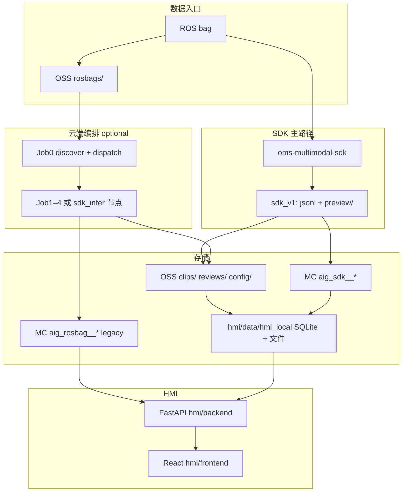

# Rosbag Labels Platform — 项目 Wiki

> **最后更新**：2026-07-27  
> **定位**：本仓库的**总览 Wiki**（产品、架构、目录、上手、索引）。细节编排见 DataWorks / PRD / 各模块 README。

---

## 0. 文档地图

| 你想… | 从这里开始 |
|--------|------------|
| 弄清目录与命令 | [`REPO_LAYOUT.md`](REPO_LAYOUT.md) |
| 做需求 / 里程碑 | [`prd-rosbag-labels.md`](prd-rosbag-labels.md) · [`project-management/CURRENT.md`](../project-management/CURRENT.md) |
| SDK 产物与 OSS `sdk_v1` | [`sdk-first-pipeline-design.md`](sdk-first-pipeline-design.md) |
| DataWorks 节点与参数 | [`pipeline/dataworks/WORKFLOW.md`](../pipeline/dataworks/WORKFLOW.md) · [`PIPELINE_DEVELOPER_GUIDE.md`](../pipeline/dataworks/PIPELINE_DEVELOPER_GUIDE.md) |
| HMI 本地 / 云端 | [`hmi/backend/README.md`](../hmi/backend/README.md) · [§8 HMI](#8-hmi-人机界面) |
| OSS / MC CLI | [`cloud-cli-runbook.md`](cloud-cli-runbook.md) |
| Agent 工单流程 | [`AGENTS.md`](../AGENTS.md) |

---

## 1. 项目简介

**rosbag_to_labels_pipline**（Rosbag Labels Platform）面向车载 / 机器人 **ROS bag** 多模态录制数据，提供：

1. **解析与 AI 管线** — 从 bag 到 clip 级 OMS 标签、ASR、融合向量，可上云（DataWorks + MaxCompute + OSS）或本地/SDK 批跑。  
2. **校核 HMI** — FastAPI + React：时间轴浏览、标签检索、OSS 与管线进度、账号与 Taxonomy、**校核工作台 v2**、数据集导出（按 PRD 里程碑扩展）。

### 1.1 核心能力

| 能力 | 说明 |
|------|------|
| **内容寻址 Clip** | `clip_id = sha256:{hex}`，与 OSS 目录名无关（`shared/clip_id.py`） |
| **版本化 Run** | 每次执行一个 `run_id`（UUID）；`active_run_id` 切换生效版本 |
| **SDK 批处理** | `piplinesdk`（`oms-multimodal-sdk`）：bag → jsonl + 预览 MP4/WAV |
| **云端编排** | Job0 发现 / dispatch；Job1–4（clip-omni **v2** 或 SDK 节点，见 §4） |
| **OMS 打标** | 68 项 taxonomy（v2）；Job3 / SDK Omni 模型 |
| **向量检索** | clip / 帧级 embedding（Job4 或 SDK fusion） |
| **HMI** | 以 `record_time_ns` 为轴的多模态浏览；local sync 与 cloud 查询 |

### 1.2 技术栈

| 层级 | 技术 |
|------|------|
| SDK / 本地 | Python 3.12+ · `rosbags` · `oms-multimodal-sdk` · ffmpeg |
| 云端 | 阿里云 DataWorks · MaxFrame · DPE · MaxCompute · OSS |
| HMI 前端 | React · TypeScript · Ant Design · Vite |
| HMI 后端 | FastAPI · PyODPS · oss2 · SQLite（应用库 + local 镜像） |
| AI | 百炼 / DashScope（SDK `MODEL_BACKEND=api`）；MC AI Function（legacy 路径） |

---

## 2. 仓库结构（Monorepo）

Git 根目录即本仓库；**所有路径均以仓库根为基准**。

```text
rosbag_to_labels_pipline/
├── shared/           # config.yaml、Taxonomy、cloud_config、clip_id、repo_paths
├── piplinesdk/       # oms-multimodal-sdk 源码与 wheel
├── pipeline/         # DataWorks 节点、DDL、clips 样本、验数脚本
├── hmi/              # 校核 Web（backend / frontend / data / scripts）
├── docs/             # Wiki、PRD、设计（本文件）
├── project-management/   # CURRENT、acceptance、看板
├── archive/          # 非主路径脚本与历史参考
└── .cursor/rules/    # 项目约定（HMI、上云、Job 交接）
```

| 模块 | 职责 |
|------|------|
| **`shared/`** | 单一配置源：`shared/config.yaml`（bucket、表前缀、`aig_sdk__` / legacy `aig_rosbag__`） |
| **`piplinesdk/`** | Rosbag 抽取、预览编码、ASR / 打标 / embedding API 客户端 |
| **`pipeline/`** | 上云节点代码、`sql/maxcompute/`、`scripts/verify_pipeline_run.py` 等 |
| **`hmi/`** | 产品 UI + 应用 DB；`hmi/data/hmi_local/` 为 sync 后的本地真相 |

完整树与开发命令：**[`REPO_LAYOUT.md`](REPO_LAYOUT.md)**。

---

## 3. 系统架构



**数据流要点**

- **新 clip / 新 run**：优先 **SDK 跑批** → OSS `layout_version: sdk_v1` → `ingest_sdk_run_to_mc` → HMI `import_real_data_clips` 或 `sync_hmi_local`。  
- **Legacy 全链**：OSS bag → DataWorks clip-omni v2（`parsed/` / `aligned/` / `ai/`）→ `aig_rosbag__*`；仅维护既有资产，新数据勿再写 v2 树（见 §4）。

---

## 4. 两条管线（如何选）

### 4.1 SDK v1（推荐 · 主路径）

| 项 | 说明 |
|----|------|
| **代码** | `piplinesdk/oms_multimodal` · 云上 `pipeline/dataworks/sdk_infer_node.py` |
| **本地样例** | `hmi/data/real_data/pipeline_latest/{run_dir}/` |
| **OSS 树** | `clips/{clip_id}/runs/{run_id}/`：`labels.jsonl`、`fusion_embeddings.jsonl`、`clip_videos.jsonl`、`preview/*` |
| **MC 表前缀** | `aig_sdk__`（DDL：`pipeline/sql/maxcompute/aig_sdk__ddl.sql`） |
| **设计文档** | [`sdk-first-pipeline-design.md`](sdk-first-pipeline-design.md) |

每个 run 文件夹典型内容：

| 相对路径 | 含义 |
|----------|------|
| `labels.jsonl` | clip 级 OMS 标签 + ASR + scene_summary |
| `fusion_embeddings.jsonl` | clip 融合向量 |
| `clip_videos.jsonl` | 多路 `clip_video_paths` / `encoded_cameras` |
| `work/output/clips/output_0000/clip_preview_camera{N}.mp4` | 预览视频 |
| `work/.../audio.wav` | 片段音频 |

### 4.2 clip-omni v2（Legacy · 维护模式）

| 项 | 说明 |
|----|------|
| **编排** | DataWorks：discover → dispatch → Job1 parse/align → Job2/3 双模型打标 → Job4 merge/embed |
| **OSS** | `clips/.../parsed/`、`aligned/`、`ai/`（桶 **`rosbag-labels-pipeline-bucket2`**） |
| **MC 表前缀** | `aig_rosbag__` |
| **文档** | [`pipeline/dataworks/WORKFLOW.md`](../pipeline/dataworks/WORKFLOW.md) · [`WORKFLOW_COMPLETE.md`](../pipeline/dataworks/WORKFLOW_COMPLETE.md) |
| **策略** | 节点与验数脚本保留；**新数据走 SDK v1**，旧树可归档到 `legacy/` |

### 4.3 本地轻量解析（开发）

```powershell
cd pipeline
py -3 parse_rosbag.py --config ..\shared\config.yaml --clip {clip_dir_name}
```

产物在 `pipeline/clips/{dir}/`，SQLite 在 `pipeline/data/`；与 MC 表结构对照开发用。

---

## 5. 核心概念

### 5.1 Clip ID

```text
clip_id = "sha256:{hex}"   # bag 文件内容 SHA256
```

- 计算：`shared/clip_id.py`  
- 与 OSS 上 `rosbags/{目录名}/` 无关；dispatch / sync 均以 `clip_id` 为键。

**联调 clip（legacy 全链 27/27）**

| 字段 | 值 |
|------|-----|
| bag OSS key | `rosbags/2026-06-05_13-27-07/output.bag` |
| clip_id | `sha256:3cd012197d1f2112f51c7414500bb9770a143d1bbd1e1a2aaa84d9eccb51fc7b` |
| clip_dir_name | `2026-06-05_13-27-07` |

### 5.2 Run ID 与 dispatch

- 每次管线 / SDK 上云注册一个 UUID **`run_id`**。  
- **`pipeline/dispatch/latest.json`**：Job0 写入；HMI 可轮询触发 `sync_hmi_local`。  
- Legacy：`dim_clip.active_run_id` 指向当前生效 run。

### 5.3 时间轴（Legacy HMI 浏览）

- 统一时间戳：**rosbag `record_time_ns`**（纳秒）。  
- 默认对齐窗口：**±200ms**（`shared/config.yaml` → `cloud.alignment.default_window_ms`）。  
- 抽样模式：`uniform` / **`uniform_sync`**（四路同组标签）/ `event_dense` 等。

SDK v1 校核以 **clip 级 jsonl** 为主；时间轴页仍可用于 legacy sync 数据。

### 5.4 OSS 布局速查

**当前配置桶**（见 `shared/config.yaml` → `cloud.oss.bucket`）：`rosbag-labels-pipeline-bucket2`。

```text
{bucket}/
├── rosbags/{clip_dir}/output.bag
├── config/taxonomy/…
├── pipeline/dispatch/latest.json
├── clips/{clip_id}/runs/{run_id}/     # sdk_v1 或 legacy v2 子树
├── reviews/clips/…                    # HMI 校核产出
└── datasets/…                         # 训练集导出
```

---

## 6. 数据模型

### 6.1 SDK 表（`aig_sdk__*`）

面向 `sdk_v1` run：clip 维表、run 步骤、标签/向量/预览索引等。  
DDL：**`pipeline/sql/maxcompute/aig_sdk__ddl.sql`** · 入库脚本 **`pipeline/scripts/ingest_sdk_run_to_mc.py`**。

### 6.2 Legacy 表（`aig_rosbag__*`）

| 表 | 作用 |
|----|------|
| `dim_clip` / `pipeline_run` / `pipeline_step` |  clip 与 run 生命周期 |
| `fact_message_timeline` / `fact_frame` / `fact_audio_chunk` / `fact_event` | Job1 时间轴与索引 |
| `fact_sample_policy` / `fact_audio_segment` / `fact_sample_sync_group` | Job2 |
| `fact_image_label` | Job3 OMS 标签 |
| `fact_embedding` | Job4 向量 |

DDL：**`pipeline/sql/maxcompute/aig_rosbag__ddl.sql`**。

### 6.3 HMI 应用库（SQLite）

路径：**`hmi/data/app.db`**（JWT 用户、Taxonomy 版本、校核 v2 任务、dataset 元数据、audit）。  
PRD 实体说明见 **[`prd-rosbag-labels.md`](prd-rosbag-labels.md) §5**。

### 6.4 HMI 本地数据（`hmi/data/hmi_local/`）

`sync_hmi_local.py` / `import_real_data_clips.py` 写入：MC 表镜像 + OSS 产物（含 `preview/`、`sdk_v1` jsonl）。

---

## 7. OMS Multimodal SDK

| 项 | 内容 |
|----|------|
| 包名 | `oms-multimodal-sdk`（目录 `piplinesdk/`） |
| 安装 | `cd hmi && pip install -r requirements-dev.txt`（editable SDK） |
| 环境 | 仓库根 `.env`：`DASHSCOPE_API_KEY`、`DASHSCOPE_WORKSPACE_ID` 等 |
| 文档 | [`piplinesdk/README.md`](../piplinesdk/README.md) · [`piplinesdk/docs/SDK.md`](../piplinesdk/docs/SDK.md) · [`piplinesdk/docs/DATAWORKS_SDK.md`](../piplinesdk/docs/DATAWORKS_SDK.md) |
| 本地 MC 联调 | [`pipeline/local_sdk_mc_test/`](../pipeline/local_sdk_mc_test/)（`.env` = 工作流参数，同级节点业务代码） |

```powershell
python -m oms_multimodal inspect --bag path\to\output.bag
```

云上推理节点与 bundled wheel 见 **`pipeline/dataworks/`** 与 **`pipeline/scripts/bundle_all_dataworks.py`**。

---

## 8. HMI（人机界面）

### 8.1 角色（PRD）

| 角色 | 典型能力 |
|------|----------|
| **admin** | 用户、Taxonomy、全校核与 dataset、OSS 上传 |
| **reviewer** | 校核队列 / 工作台 |
| **dataset_manager** | dataset、bag 上传 |
| **model_trainer** | dataset 只读下载 |

初始化 admin：`cd hmi && py -3 scripts/bootstrap_admin.py`。

### 8.2 主要路由

| 路由 | 功能 |
|------|------|
| `/login` | JWT 登录 |
| `/` | Clip 总览 |
| `/clips/:clipId` | 多模态时间轴（legacy 数据） |
| `/search` | OMS 标签检索（时刻簇） |
| `/oss` | OSS 与 bag 管线进度 |
| `/taxonomy` | Taxonomy 版本编辑 / 发布 |
| `/review` | **校核工作台 v2**（逐标签 · 双模式；`/review/:clipId` 重定向至此） |
| `/datasets` | 数据集快照 |
| `/admin/users` | 用户管理 |

前端细节：**[`hmi/frontend/README.md`](../hmi/frontend/README.md)**。

### 8.3 数据源

| 模式 | 说明 |
|------|------|
| **本地** | `hmi/data/hmi_runtime/`（`HMI_RUNTIME_ROOT`）：`hmi.db` + `artifacts/` + `oss/` |
| **在线** | MaxCompute + 阿里云 OSS |

侧栏 **本地模式 / 在线模式** → `POST /api/config/data-source`。初始化：`py -3 scripts/init_local_runtime.py`（见 `hmi/data/hmi_runtime/README.md`）。

ECS 自动 sync（轮询 dispatch）：

```bash
HMI_OSS_SYNC_POLL_ENABLED=1
HMI_OSS_SYNC_POLL_INTERVAL_SEC=30
HMI_OSS_SYNC_AUTO_LOCAL=1
```

### 8.4 时间轴能力（Explorer）

迷你地图、磁吸、波形联动、±200ms 快照、Run 切换、相似时刻（embedding）等 — 见前端 README。

---

## 9. 快速开始

### 9.1 依赖

```powershell
cd hmi
py -3 -m pip install -r requirements-dev.txt

copy ..\.env.example ..\.env
# 填写 ODPS_*、OSS_*；SDK 需 DASHSCOPE_*
```

### 9.2 启动 HMI

```powershell
# 终端 1
cd hmi\backend
py -3 run.py

# 终端 2
cd hmi\frontend
npm install
npm run dev
```

浏览器：`http://localhost:5173` · API：`http://127.0.0.1:8000/api/health`。

### 9.3 导入 SDK 样例到本地

```powershell
cd hmi
py -3 scripts\import_real_data_clips.py --list
py -3 scripts\import_real_data_clips.py --source pipeline_latest --reset
```

样例树说明：**`hmi/data/real_data/pipeline_latest/README.md`**。

### 9.4 从云端同步单个 clip

```powershell
cd hmi
py -3 scripts\sync_hmi_local.py --clip-id sha256:...
# 仅表：--skip-oss
```

### 9.5 Legacy 全链验数

```powershell
cd pipeline
py -3 scripts\e2e_precheck.py
py -3 scripts\verify_pipeline_run.py --clip-id sha256:3cd012197d1f2112f51c7414500bb9770a143d1bbd1e1a2aaa84d9eccb51fc7b
```

---

## 10. 配置与环境

### 10.1 环境变量（仓库根 `.env`）

| 变量 | 用途 |
|------|------|
| `ODPS_PROJECT` / `ODPS_ACCESS_ID` / `ODPS_ACCESS_KEY` / `ODPS_ENDPOINT` | MaxCompute |
| `OSS_BUCKET` / `OSS_ENDPOINT` | OSS（与 `shared/config.yaml` 一致） |
| `DASHSCOPE_API_KEY` / `DASHSCOPE_WORKSPACE_ID` | SDK API |
| `DPE_IMAGE` / `OSS_RAM_ROLE_ARN` | DPE 上云 |
| `HMI_OSS_SYNC_*` | ECS 自动 sync |

同步到 ossutil / odpscmd：**`cd pipeline && py -3 scripts/sync_cloud_cli_config.py`**（见 [`cloud-cli-runbook.md`](cloud-cli-runbook.md)）。

### 10.2 云资源（以 config 为准）

| 项 | 典型值 |
|----|--------|
| MC Project | `rogbag_label_pipline` |
| OSS Bucket | `rosbag-labels-pipeline-bucket2` |
| Region | `cn-shanghai` |
| SDK 表前缀 | `aig_sdk__` |
| Legacy 表前缀 | `aig_rosbag__` |

### 10.3 OMS Taxonomy

- **68 项 · v2**；文件 **`shared/config/oms_label_taxonomy.yaml`**（及 OSS `config/taxonomy/`）。  
- 说明：**[`docs/oms_label_taxonomy.md`](oms_label_taxonomy.md)**。  
- HMI 内可版本化编辑（PRD M2）；Job3 / SDK 通过版本 id 或 OSS latest 引用。

---

## 11. API 速查

基址：`http://127.0.0.1:8000`。需登录接口带 JWT。

### Clip / 时间轴

| 方法 | 路径 | 说明 |
|------|------|------|
| GET | `/api/clips` | Clip 列表 |
| GET | `/api/clips/{id}` | 详情 |
| GET | `/api/clips/{id}/runs` | Run 列表 |
| GET | `/api/clips/{id}/timeline-meta` | Minimap 元数据 |
| GET | `/api/clips/{id}/timeline?timestamp_ns=` | 时刻快照 |
| GET | `/api/clips/{id}/events` | 事件 |
| GET | `/api/clips/{id}/audio-segments` | ASR 段 |

### 检索 / Taxonomy

| GET | `/api/search/clusters` | 标签时刻簇 |
| GET | `/api/label-taxonomy` | 标签树 |
| GET | `/api/similar` | 向量相似 |

### 校核 v2 / Dataset / 管理

| 前缀 | 说明 |
|------|------|
| `/api/review/v2/…` | 任务队列、字段级校核、提交 |
| `/api/taxonomy/…` | 版本 CRUD / 发布 |
| `/api/datasets/…` | 快照与下载 |
| `/api/admin/users` | 用户 |
| `/api/auth/login` · `/api/auth/me` | 认证 |

### OSS / 系统

| GET/POST | `/api/oss/*` · `/api/upload/*` | OSS 与 bag 上传 |
| GET | `/api/health` | 健康检查 |
| GET | `/api/sync/poller` | dispatch 轮询状态 |

完整映射见 **`hmi/backend/README.md`** 与 OpenAPI（`/docs`）。

---

## 12. 常用脚本

| 脚本 | 用途 |
|------|------|
| `hmi/scripts/import_real_data_clips.py` | real_data → hmi_local（sdk_v1） |
| `hmi/scripts/sync_hmi_local.py` | MC + OSS → 本地 |
| `hmi/scripts/bootstrap_admin.py` | 首个 admin |
| `pipeline/scripts/verify_pipeline_run.py` | Legacy 全链 SQL 验收 |
| `pipeline/scripts/ingest_sdk_run_to_mc.py` | SDK run → `aig_sdk__` |
| `pipeline/scripts/publish_sdk_dispatch.py` | 写 dispatch manifest |
| `pipeline/scripts/bundle_all_dataworks.py` | 打包 DataWorks 节点 |
| `pipeline/scripts/sync_cloud_cli_config.py` | `.env` → CLI 配置 |
| `pipeline/scripts/e2e_precheck.py` | 云凭证自检 |

---

## 13. 阿里云服务角色

| 服务 | 作用 |
|------|------|
| **OSS** | bag、sdk_v1 / v2 产物、reviews、datasets、dispatch |
| **DataWorks** | DAG、调度、参数 |
| **MaxCompute** | `aig_sdk__` / `aig_rosbag__` 表 |
| **MaxFrame + DPE** | 分布式 parse / SDK 节点 / 重计算 |
| **RAM** | DPE 无 AK 挂载 OSS |
| **百炼 / DashScope** | SDK 与部分 Job 模型 |

上云强制约定：**`.cursor/rules/maxframe-dpe-cloud.mdc`**。

---

## 14. 产品与里程碑

| 文档 | 内容 |
|------|------|
| [`prd-rosbag-labels.md`](prd-rosbag-labels.md) | 账号、Taxonomy、校核、Dataset（需求权威） |
| [`project-management/CURRENT.md`](../project-management/CURRENT.md) | **当前工单**（如 M6 校核 v2 → M6.6 E2E） |
| [`AGENTS.md`](../AGENTS.md) | Agent 开工 / 收工四件套 |

**基线能力**（Wiki §1–§13）已具备管线 + HMI 浏览 / 检索 / OSS。  
**扩展能力**按 PRD 里程碑交付；冲突时 **PRD > 里程碑 Notes > CURRENT 摘要**。

---

## 15. 相关文档索引

| 文档 | 内容 |
|------|------|
| [`REPO_LAYOUT.md`](REPO_LAYOUT.md) | 目录与路径常量 |
| [`sdk-first-pipeline-design.md`](sdk-first-pipeline-design.md) | SDK v1 OSS / MC |
| [`pipeline/dataworks/PIPELINE_OVERVIEW.md`](../pipeline/dataworks/PIPELINE_OVERVIEW.md) | 管线总览 |
| [`pipeline/dataworks/PIPELINE_DEVELOPER_GUIDE.md`](../pipeline/dataworks/PIPELINE_DEVELOPER_GUIDE.md) | 开发 onboarding |
| [`pipeline/dataworks/WORKFLOW.md`](../pipeline/dataworks/WORKFLOW.md) | v2 节点编排 |
| [`pipeline/dataworks/WORKFLOW_COMPLETE.md`](../pipeline/dataworks/WORKFLOW_COMPLETE.md) | 参数与数据流 |
| [`pipeline/dataworks/PARAMETERS.md`](../pipeline/dataworks/PARAMETERS.md) | 工作流参数 |
| [`cloud-cli-runbook.md`](cloud-cli-runbook.md) | OSS / MC CLI |
| [`piplinesdk/README.md`](../piplinesdk/README.md) | SDK 构建与发布 |
| [`pipeline/docker/custom-dpe-image.md`](../pipeline/docker/custom-dpe-image.md) | DPE 镜像 |
| `.cursor/rules/hmi-web-stack.mdc` | HMI 性能与重启 |
| `.cursor/rules/pipeline-architecture.mdc` | Clip / Run / OSS 约定 |

---

## 16. 测试资产

| 类型 | 位置 / ID |
|------|-----------|
| Legacy 全链 bag | `pipeline/clips/2026-06-05_13-27-07/rosbag/` · OSS `rosbags/2026-06-05_13-27-07/output.bag` |
| Legacy clip_id | `sha256:3cd012197d1f2112f51c7414500bb9770a143d1bbd1e1a2aaa84d9eccb51fc7b` |
| SDK 样例批次 | `hmi/data/real_data/pipeline_latest/`（3 runs × 1 clip） |

---

*维护：架构或目录变更时，请同步更新本 Wiki 与 [`REPO_LAYOUT.md`](REPO_LAYOUT.md)。*
