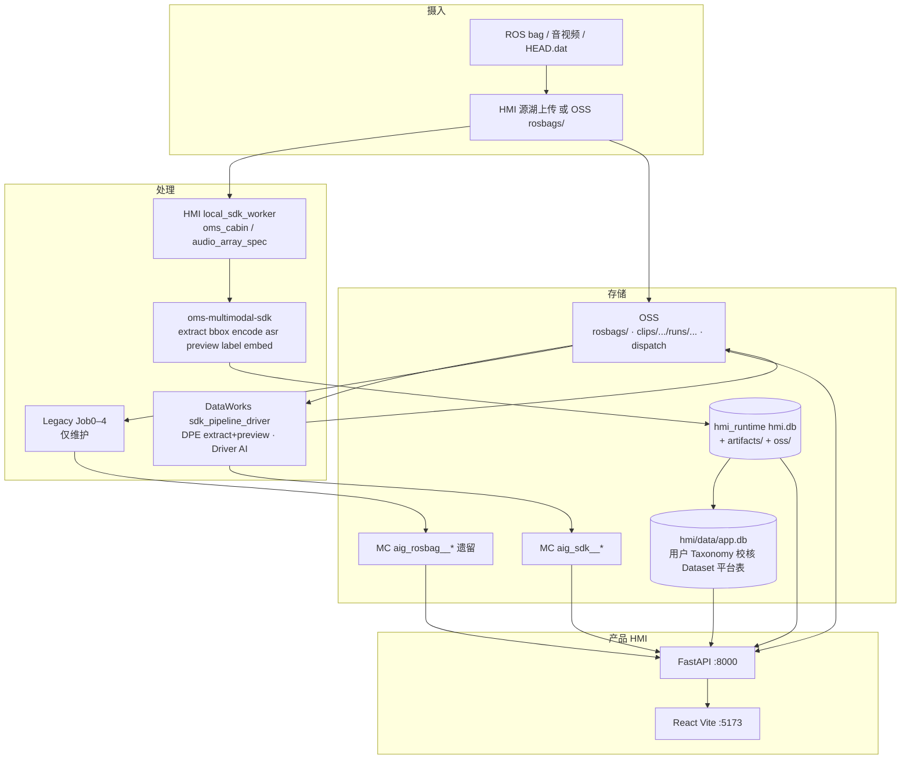
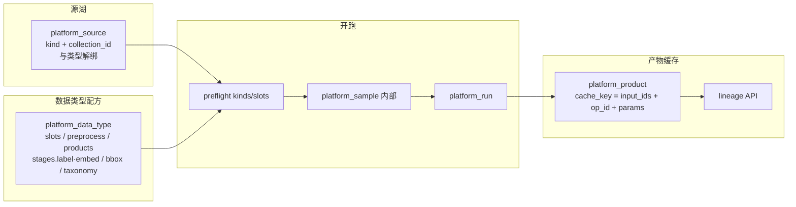
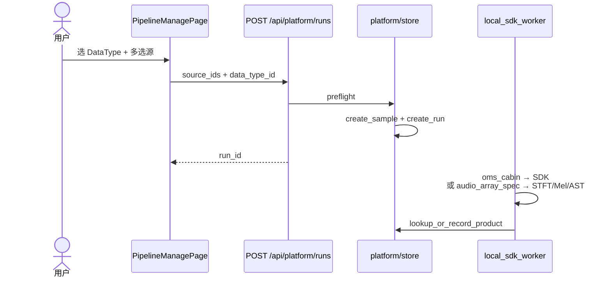
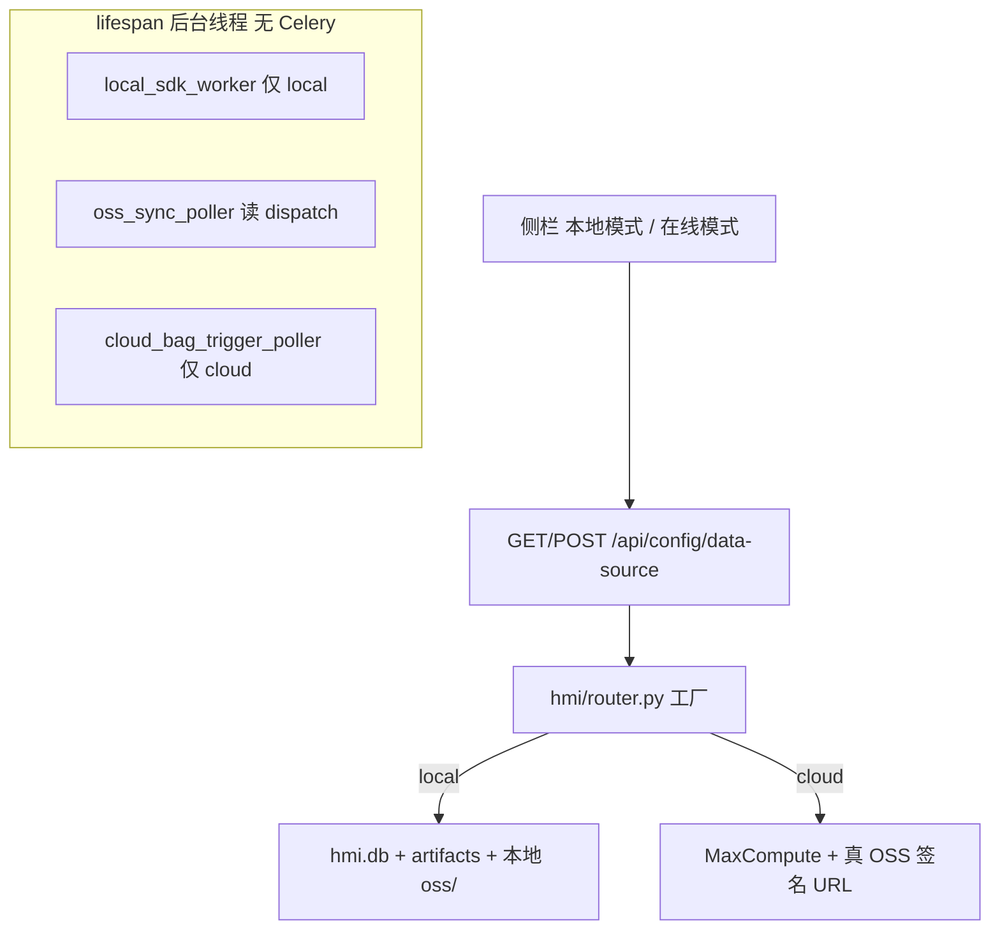
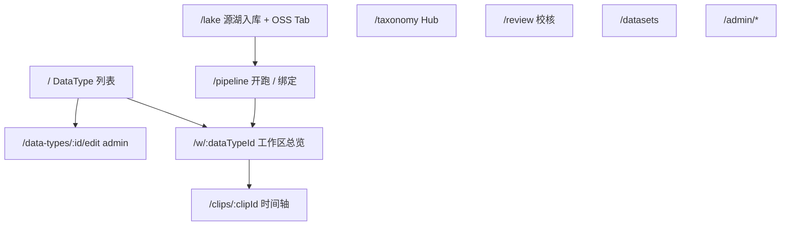
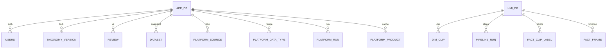
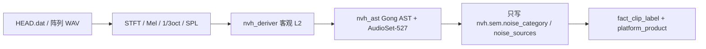
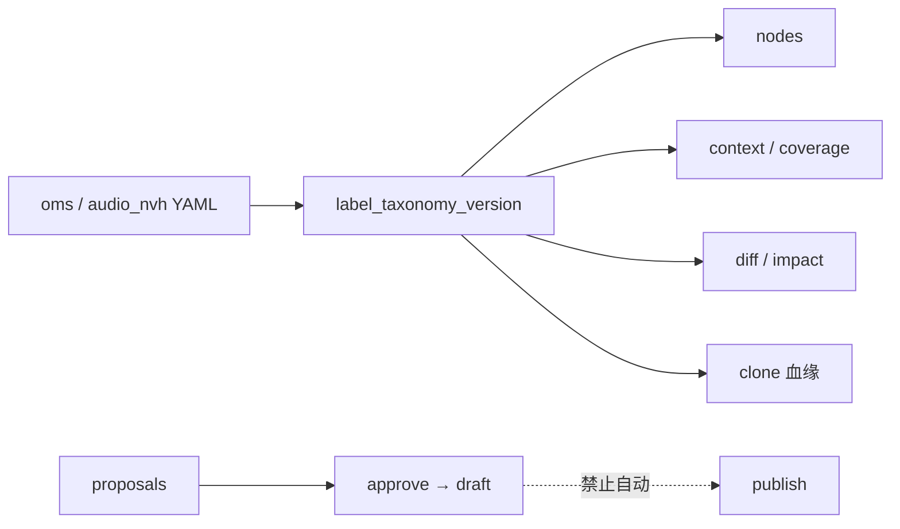
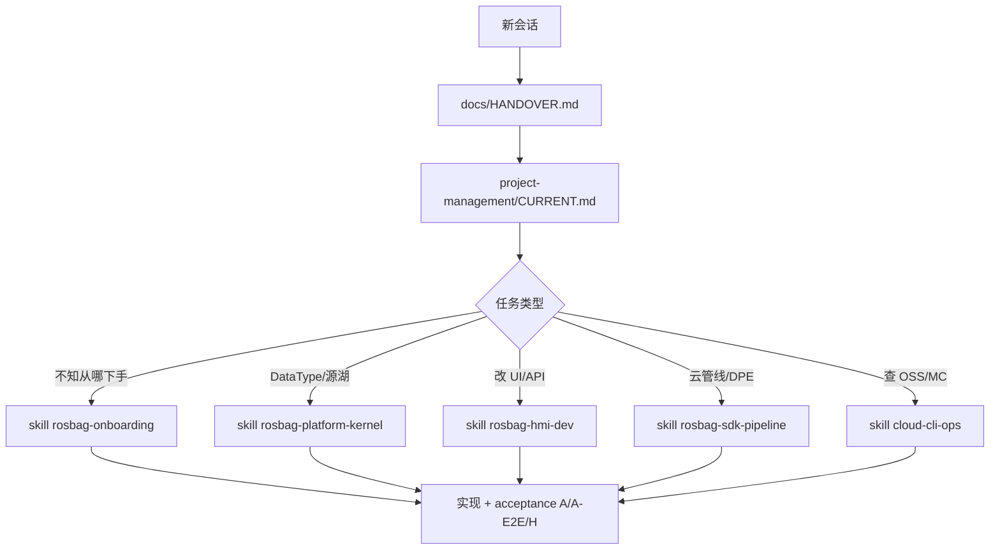

# 架构图全集

> 交接日：2026-08-25。与 [`HANDOVER.md`](HANDOVER.md)、[`WIKI.md`](WIKI.md) 配套。  
> 图中路径以仓库根为基准。实现以代码为准；冲突时以 PRD / CURRENT 为准。

---

## 1. 系统总览

平台分四层：**摄入 → 处理 → 存储 → 产品**。新数据默认走 SDK v1；HMI 用 DataType 配方把「舱内 OMS / 阵列 NVH / IVI 占位」隔开。



---

## 2. 平台内核（DataType）

三层底座 + 内部 Sample。UI 主路径：**源湖入库 → 管线管理多选开跑**（自动 `create_sample` + `create_run`），不手搓 Sample。



### 2.1 内置配方

| id | taxonomy | 总览视图 | label | 说明 |
|----|----------|----------|-------|------|
| `oms_cabin` | oms | cabin_timeline | SDK default | 真多模舱内 |
| `ivi_ui_stub` | ivi_ui_stub | frame_gallery_bbox | off | **占位**，勿宣称已完成 |
| `audio_array_spec` | audio_nvh（**draft** `audio_nvh-v2`） | audio_nvh_timeline | **nvh_sem_ast** | 阵列频谱 + AST L6 |

**勿 publish `audio_nvh-v2`。**

### 2.2 开跑绑定



代码：`hmi/backend/hmi/platform/`（`router.py` / `store.py` / `recipe.py` / `run_bind.py`）。

---

## 3. SDK v1 阶段与产物


OSS 树（**新 run 禁止** `parsed/` `aligned/` `ai/`）：

```text
clips/{clip_id}/runs/{run_id}/
├── run.json                 # layout_version: sdk_v1
├── labels.jsonl
├── fusion_embeddings.jsonl
├── clip_videos.jsonl
├── asr.jsonl
├── bboxes.jsonl             # 可选
├── preview/
│   ├── manifest.json
│   ├── clip_preview_camera*.mp4
│   └── audio.wav
└── _sdk_work/               # 中间态，非节点间 IPC
```

`clip_id = sha256:{bag 内容 hex}`（`shared/clip_id.py`）。`run_id` = UUID。

---

## 4. 云端：单 Driver hybrid（生产）

粘贴文件：`pipeline/dataworks/bundled/sdk_pipeline_driver_node.py`。

```mermaid
flowchart TB
  subgraph driver [Driver PyODPS 节点]
    DISC[discover 扫 rosbags/]
    HASH[DPE apply_chunk 算 bag hash]
    EXPV[DPE apply_chunk extract+preview]
    AI[MaxFrame AI asr/label/embed<br/>ai_media_mode=oss_url]
    WR[写 run.json + aig_sdk__ + dispatch]
  end

  subgraph dpe [DPE Worker 镜像]
    MOUNT[@with_fs_mount OSS]
    ROS[rosbags + ffmpeg + SDK dpe extra]
  end

  OSS_BAG[OSS rosbags/*.bag 原地读 不拷贝] --> HASH
  HASH --> EXPV
  EXPV --> AI
  AI --> WR
  WR --> OSS_RUN[OSS clips/.../runs/]
  WR --> MC[aig_sdk__*]
  WR --> MAN[pipeline/dispatch/latest.json]
  dpe --> EXPV
```

| 禁止 | 替代 |
|------|------|
| DPE UDF 里 `@dataclass` / 自定义 class | dict / list / 内置类型 |
| bag 从 incoming 拷到 clips/raw | `rosbags/` + `bag_oss_key` |
| PyODPS 节点输出参数传 clip_id | OSS dispatch manifest |
| 把业务 `.py` COPY 进镜像再 subprocess | 节点粘贴整文件 |
| 新功能走 Job1–4 多节点 SDK | 单 Driver；多节点仅应急 |

提交前：`py -3 pipeline/scripts/check_dpe_nodes.py`。

---

## 5. HMI 双数据源



| | local | cloud |
|--|-------|-------|
| Clip/检索 | SQLite `hmi.db` | MC |
| 媒体 | `artifacts/` + `oss/` | OSS |
| `POST /api/platform/sources` | 允许 | 拒绝 |
| `local_sdk_worker` | 默认开 | 关 |
| 源湖上传 | 本机 | 走云管线 |

测试开关：`HMI_TEST_MODE` 才允许 UI 切 local。

---

## 6. HMI 信息架构（前端路由）



检索必须先进入 `/w/:dataTypeId`，**禁止跨类型混合命中**。

---

## 7. 两套 SQLite



| 文件 | 路径 | 内容 |
|------|------|------|
| **app.db** | `hmi/data/app.db` | 用户、Taxonomy、校核、Dataset、**platform_*** |
| **hmi.db** | `hmi/data/hmi_runtime/`（或 hmi_local） | dim_clip、fact_*、pipeline_* |
| parse/timeline | `pipeline/data/*.db` | 本地 Job1 遗留，非 HMI 主库 |

---

## 8. NVH / AST（HMI worker，不在 SDK label 阶段）

SDK `label` = OMS Omni → `labels.jsonl`。阵列 L6 是 **HMI 配方阶段** `nvh_sem_ast`。



| 约束 | 说明 |
|------|------|
| 权重 | `hmi/data/models/ast/pytorch_model.bin` 或 `HMI_NVH_AST_WEIGHTS`（gitignore） |
| 禁止 | 把管线 64-bin Mel 直接喂 AST；Gong 源码 wget；未峰值归一化的 PCM |
| 回退 | 缺 torch / 权重 → `heuristic_fallback` |
| 下一工单 | UI-NVH-REVIEW-SAVE 人工写回 L6 |

---

## 9. Taxonomy Hub（M10）



提案合入 draft **不得自动 publish**。洞察只读，不得写回 clip 标签或批量重打标。

---

## 10. Agent / 文档入口



alwaysApply 规则：`project-progress-handoff.mdc` · `pipeline-architecture.mdc` · `maxframe-dpe-cloud.mdc`。

---

## 11. 域内部署（POC）


口令不入库。步骤见 [`deploy-intranet-cicd.md`](deploy-intranet-cicd.md)。
