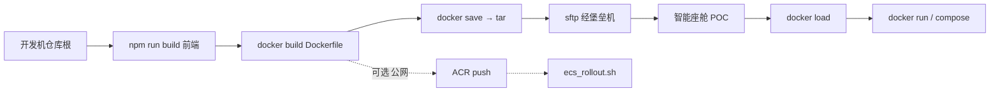

# 域内部署与 CI/CD（堡垒机 + 离线 tar）

> **交接文档**。依据《域内服务器连接使用指南》补充：开发机如何 `docker build` / `docker save`、Dockerfile 怎么写、经堡垒机登上 **智能座舱 POC** 后如何 `docker load` / `docker run`。  
> 口令、二次验证绑定手机/邮箱 **向交接人或 CI 索取**，**禁止**写入 git、Wiki 压缩包或聊天记录长期存放。

配套代码：

| 路径 | 作用 |
|------|------|
| `hmi/deploy/Dockerfile` | HMI 生产镜像（前端 dist + uvicorn） |
| `hmi/deploy/save-image.ps1` | 在**仓库根**一键 build + `docker save` |
| `hmi/deploy/compose.yaml` | ECS / 有 compose 时的运行方式 |
| `hmi/deploy/.env.runtime.example` | 运行时环境变量模板 |
| `hmi/deploy/offline/README.md` | 某次已打 tar 的加载示例（tag 会过期） |
| `hmi/deploy/push-acr.ps1` · `ecs_rollout.sh` | **公网 ACR 路径**（域内 POC 通常走 tar，不走这条） |

---

## 0. 两条发布路径（不要混）



| 路径 | 何时用 |
|------|--------|
| **A. 离线 tar + 堡垒机**（本文主路径） | 域内 POC：机器已装 Docker，**不能**或不必拉 ACR |
| **B. ACR + compose** | 公网 ECS（`47.116.180.173` 一类）；`push-acr.ps1` + `ecs_rollout.sh` |

域内 POC **默认走 A**。不要在 POC 上 `docker pull` 个人 ACR，除非 CI 已开通出网与仓库权限。

---

## 1. 经堡垒机登录 POC

在**已入域**的 Windows 开发机 PowerShell：

```powershell
ssh -p 60022 <堡垒机账号>@odnpgdcpiv.bastionhost.aliyuncs.com
```

| 项 | 说明 |
|----|------|
| 端口 | `60022`（不是 22） |
| 主机 | `odnpgdcpiv.bastionhost.aliyuncs.com`（阿里云堡垒机） |
| 账号 | 交接 Word 里现用手机号账号；**交接后向 CI 申请改绑**，不要继续用个人号 |
| 密码 | 粘贴后直接回车（终端不回显） |
| MFA | 短信 + 邮箱验证码，绑定人变更找 **CI** |

登录成功后用方向键选中 **智能座舱POC**，回车，才进入部署机 shell。

未选主机就执行 `docker`，多半还在堡垒机跳板，**不是** POC。

---

## 2. Dockerfile 怎么写（已定稿，勿另起炉灶）

文件：**`hmi/deploy/Dockerfile`**。  
**必须在仓库根构建**（注释第一行）：`docker build -f hmi/deploy/Dockerfile .`

设计要点：

| 层 | 做什么 | 为什么 |
|----|--------|--------|
| 基础镜像 | `python:3.12-slim`（DaoCloud 镜像 + digest） | 域内 Debian CDN 不稳定时仍可复用层 |
| apt | `curl` `ffmpeg` | healthcheck + SDK 预览编码 |
| pip | `piplinesdk/requirements.txt` + `hmi/backend/requirements.txt`，再 `-e piplinesdk` | 镜像内含 OMS SDK |
| **不要** | `pip install oms-multimodal-sdk[bbox]` / ultralytics | 会拉 CUDA/torch，撑爆约 40GB 盘 |
| COPY | `shared/`、`hmi/backend`、`hmi/scripts`、**已构建的** `hmi/frontend/dist` | 单容器同时提供 API + 静态页 |
| 进程 | `uvicorn hmi.main:app --host 0.0.0.0 --port 8000` | 对外 8000；宿主机映射 8012 |
| 健康检查 | `curl http://127.0.0.1:8000/api/health` | |

`ARG APP_REVISION` 只为打到 `/app/.build_revision`，改业务代码时用来戳 COPY 层，避免无意义重装 apt/pip。

前端 **不会**在镜像里 `npm build`。开发机必须先产出 `hmi/frontend/dist`，否则镜像里没有 UI。

---

## 3. 开发机：在项目目录 `docker save`

约定：以下命令的当前目录都是 **Git 仓库根**  
（例：`D:\cursor_project\rosbag_to_labels_pipline`）。

### 3.1 推荐：脚本一键

```powershell
cd D:\cursor_project\rosbag_to_labels_pipline
py -3 -c "print('ok')"   # 仅确认 Python；Docker 本身用 docker CLI

# 默认 TAG=当天日期-1，例如 20260827-1
powershell -File hmi\deploy\save-image.ps1 -Tag 20260827-1
```

脚本会：`npm run build` → `docker build -f hmi/deploy/Dockerfile .` →  
把 tar 写到 **`hmi\deploy\offline\rosbag-to-labels-hmi-<Tag>.tar`**（该目录 `*.tar` 已 gitignore）。

跳过前端（dist 已是新的）：

```powershell
powershell -File hmi\deploy\save-image.ps1 -Tag 20260827-1 -SkipFrontend
```

### 3.2 等价手打命令（理解用）

```powershell
cd D:\cursor_project\rosbag_to_labels_pipline

# 1) 前端
cd hmi\frontend
npm ci
npm run build
cd ..\..

# 2) 镜像（上下文必须是仓库根，才能 COPY piplinesdk / shared / hmi）
$TAG = "20260827-1"
docker build -f hmi/deploy/Dockerfile `
  --build-arg APP_REVISION=$TAG `
  -t rosbag-to-labels-hmi:$TAG `
  -t rosbag-to-labels-hmi:latest `
  .

# 3) 就在项目目录下 save（-o 相对仓库根）
New-Item -ItemType Directory -Force -Path hmi\deploy\offline | Out-Null
docker save `
  -o "hmi\deploy\offline\rosbag-to-labels-hmi-$TAG.tar" `
  "rosbag-to-labels-hmi:$TAG" `
  "rosbag-to-labels-hmi:latest"
```

| 注意 | |
|------|--|
| `docker save` 的 `-o` 要写在镜像名**前面** | `docker save -o file.tar NAME` |
| 一次 save 两个 tag | load 之后 `latest` 与日期 tag 都在 |
| 体积 | 通常数 GB；确认磁盘与 SFTP 超时 |
| 校验 | `Get-FileHash hmi\deploy\offline\rosbag-to-labels-hmi-$TAG.tar -Algorithm SHA256` |

---

## 4. 开发机：经堡垒机 SFTP 上传 tar

仍在开发机 PowerShell（**尚未** SSH 进 POC 也可以单独开一个窗口）：

```powershell
sftp -P 60022 <堡垒机账号>@odnpgdcpiv.bastionhost.aliyuncs.com
```

认证与 MFA 同 SSH。若出现主机列表，同样选 **智能座舱POC**，否则文件会传到跳板而不是部署机。

进入 `sftp>` 后：

```text
pwd
ls
lcd D:\cursor_project\rosbag_to_labels_pipline\hmi\deploy\offline
put rosbag-to-labels-hmi-20260827-1.tar
ls
bye
```

大文件用 `put` 即可；中断后重新 `put`（视服务器 sftp 是否支持续传）。  
上传目标一般是 POC 上该账号的 **home**（`~` / `/home/<user>/`）。

---

## 5. POC 上：`docker load` 与 `docker run`

先按 **§1 SSH** 进入 **智能座舱POC** 的 bash。

### 5.1 确认 Docker 与 tar

```bash
sudo docker info >/dev/null && echo docker_ok
ls -lh ~/rosbag-to-labels-hmi-20260827-1.tar   # 路径以 sftp pwd 为准
```

无 sudo 权限时：`sudo usermod -aG docker "$USER"` 后重新登录，或全程 `sudo docker`。

### 5.2 load

```bash
sudo docker load -i ~/rosbag-to-labels-hmi-20260827-1.tar
sudo docker images | grep rosbag-to-labels-hmi
```

应看到 `rosbag-to-labels-hmi` 的 `20260827-1` 与 `latest`。

`docker load` 是**导入镜像**，不是解压业务目录。不要 `tar xf` 这个文件当源码。

### 5.3 停掉旧容器（先看名字）

历史示例容器名是 `dataplatform`，compose 默认是 `rosbag-to-labels-hmi`。以现场为准：

```bash
sudo docker ps -a | grep -E 'dataplatform|rosbag-to-labels|8012'
sudo docker rm -f dataplatform          # 若旧名是这个
# sudo docker rm -f rosbag-to-labels-hmi
```

数据在 volume 里时，`rm -f` **容器**不会删 `~/hmi_runtime`。不要手删数据目录除非要重置。

### 5.4 `docker run` 参数（域内 POC · 本地模式 + 内网 aigw）

端口：**宿主机 8012 → 容器 8000**（与 nginx `proxy_pass 127.0.0.1:8012` 一致）。  
前端公共前缀：`HMI_PUBLIC_API_BASE=/tools/rosbag-labels/api`。

把 `20260827-1`、JWT、AIGW 密钥换成当次值。ODPS/OSS 在 **local** 模式可填占位，但进程启动仍会读这些变量：

```bash
mkdir -p ~/hmi_runtime ~/hmi_app_meta

sudo docker run -d \
  --name dataplatform \
  --restart unless-stopped \
  -p 8012:8000 \
  -e HMI_DATA_SOURCE=local \
  -e HMI_TEST_MODE=1 \
  -e HMI_JWT_SECRET='改成足够长的随机串' \
  -e HMI_RUNTIME_ROOT=/app/data/hmi_runtime \
  -e HMI_PUBLIC_API_BASE=/tools/rosbag-labels/api \
  -e HMI_LOCAL_SDK_POLL_ENABLED=1 \
  -e HMI_OSS_SYNC_POLL_ENABLED=0 \
  -e HMI_MIRROR_ARTIFACTS_TO_OSS=0 \
  -e ODPS_PROJECT=local_placeholder \
  -e ODPS_ENDPOINT=https://service.cn-shanghai.maxcompute.aliyun.com/api \
  -e ODPS_ACCESS_ID=local_placeholder \
  -e ODPS_ACCESS_KEY=local_placeholder \
  -e OSS_BUCKET=local-placeholder-bucket \
  -e OSS_ENDPOINT=https://oss-cn-shanghai.aliyuncs.com \
  -e CLOUD_REGION=cn_shanghai \
  -e LLM_PROVIDER=aigw \
  -e AIGW_BASE_URL=https://ali.aigw.csvw.com/model/ark/llm/master-agent/v1 \
  -e AIGW_API_KEY='向 CI 索取' \
  -e AIGW_MODEL=ep-20260804101318-bdd5v \
  -v ~/hmi_runtime:/app/data/hmi_runtime \
  -v ~/hmi_app_meta:/app/hmi/data \
  rosbag-to-labels-hmi:20260827-1
```

参数含义：

| 参数 | 含义 |
|------|------|
| `-d --name --restart` | 后台、固定名、崩溃拉起 |
| `-p 8012:8000` | 宿主机访问 `http://127.0.0.1:8012` |
| `HMI_DATA_SOURCE=local` | POC 用磁盘运行时，不打真 OSS 同步 |
| `HMI_TEST_MODE=1` | 允许 UI 切本地模式 |
| `HMI_OSS_SYNC_POLL_ENABLED=0` | 域内不要轮询云 dispatch |
| `-v ~/hmi_runtime` | clip / 本地 oss 模拟桶 |
| `-v ~/hmi_app_meta` | `app.db`（用户、taxonomy、平台表） |
| 镜像 tag | 必须与刚 `load` 出来的 tag 一致 |

也可用 compose（需把 tar load 后的 `IMAGE=` 写成 `rosbag-to-labels-hmi:20260827-1`，见 `.env.runtime.example`）。POC 若没有 compose，用上面的 `docker run` 即可。

### 5.5 验收

```bash
sudo docker logs dataplatform --tail 50
curl -fsS http://127.0.0.1:8012/api/health
curl -fsS http://127.0.0.1:8012/tools/rosbag-labels/api/health
sudo docker exec dataplatform python /app/hmi/scripts/bootstrap_admin.py
```

直连 `:8012` **不会**像 nginx 那样剥掉 `/tools/rosbag-labels`。生产前端的 JS/CSS 仍写这个前缀；**新镜像**里后端中间件 `strip_public_ui_prefix` 会剥掉后再找 `dist/assets`。旧镜像会把脚本请求回成 `index.html`，浏览器里只剩标题「多模数据管理平台」。

浏览器（视 nginx 是否已配）：

- 直连（须含前缀剥离的镜像）：`http://<POC内网IP>:8012/tools/rosbag-labels/`
- 经反代：`http://<入口>/tools/rosbag-labels/`

首次空库会建 admin；默认口令见脚本提示，**登录后立刻改密**。

---

## 6. 常见失败

| 现象 | 原因 | 处理 |
|------|------|------|
| `docker: command not found` | 还在堡垒机跳板 | 方向键选 **智能座舱POC** |
| `COPY hmi/frontend/dist` 失败 | 没在开发机构建前端 | 先 `npm run build` 或跑 `save-image.ps1` |
| 打开 `/tools/rosbag-labels/` 只有标题、JS 404 成 HTML | 直连 8012 未剥 UI 前缀（旧镜像） | **重新 save/load 含 `strip_public_ui_prefix` 的镜像**；或配 nginx 把前缀转到 `/` |
| `docker load` 后没有 tag | save 时只写了 id | save 时带上 `name:tag` |
| 8012 连不上 | 旧容器占用或防火墙 | `docker ps`；`ss -lntp \| grep 8012` |
| 盘满 | 打了 `[bbox]`/旧 dangling 镜像 | 不要 bbox extra；`docker image prune` |
| SFTP 上传后 POC 没有文件 | sftp 没选 POC 资产 | 重新 sftp 并选 **智能座舱POC** |

---

## 7. 与公网 ECS 路径的差异

- 公网：`hmi/deploy/push-acr.ps1` 推 `crpi-…/rosbag_to_labels_pipline_hmi:<tag>`，ECS 上 `ecs_rollout.sh` + compose `pull`。
- 域内 POC：不依赖 ACR，**save → sftp → load → run**。
- nginx 片段相同：`hmi/deploy/nginx-rosbag-labels-locations.conf`（`/tools/rosbag-labels/` → `127.0.0.1:8012`）。

---

## 8. 交接检查单

- [ ] CI 已把堡垒机账号从个人手机号改到接手人，MFA 邮箱已换  
- [ ] 接手人能 `ssh -p 60022` 并进入 **智能座舱POC**  
- [ ] 开发机能在仓库根跑通 `save-image.ps1`  
- [ ] POC 上 `docker load` + `docker run` 后 `/api/health` 成功  
- [ ] 仓库内**没有**堡垒机密码、AIGW key、JWT 明文  
