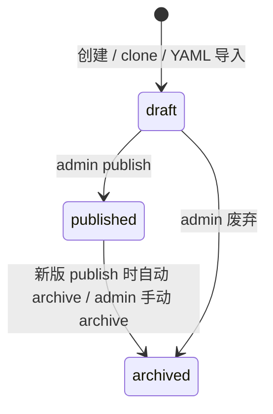

# M2 实现说明 — Taxonomy 版本树

| 字段 | 内容 |
|------|------|
| 版本 | v1.0 |
| 对应 PRD | v0.2 |
| 里程碑 | **M2** |
| 目标一句话 | DB 版本化标签树可编辑发布，Job3 可引用指定 taxonomy 版本 |
| 前置 | **M1 已出口**（`acceptance/M1.md`） |

---

## 1. 范围

### 1.1 必做（Done 定义）

| # | 能力 | 对应 PRD |
|---|------|----------|
| 1 | `label_taxonomy_version` / `label_taxonomy_node` 落库（`hmi/data/app.db`） | §5.1 |
| 2 | 从 `config/oms_label_taxonomy.yaml` 导入首版 | §9、R5 |
| 3 | Taxonomy REST API（versions / tree / nodes / publish / archive / clone） | §11.2 |
| 4 | `published` 不可原地编辑；修改须 clone→draft（R3） | §6.1 |
| 5 | HMI `/taxonomy` 版本列表 + 树编辑器（admin 写；其他只读） | §8 |
| 6 | `GET /api/label-taxonomy` 改读 DB 当前 **published** 版本（保持现有响应形状） | S2、现有检索页 |
| 7 | 发布时导出 YAML 到 OSS；dispatch manifest 增 `taxonomy_version_id` + `taxonomy_oss_key` | R5 |
| 8 | MC DDL：`fact_image_label.taxonomy_version_id` 列（迁移脚本，Job3 写入留 stub/下一迭代可填） | R5 |

### 1.2 明确不做（留给 M3+）

- Clip 校核队列、`clip_label_review`
- Dataset 快照
- `audit_log` 表（M3 与校核一并落地；M2 publish 可先 `print` 或简单日志）
- Job3 DPE 打标逻辑改造（VL 提示词重跑）；M2 只保证 **参数与 OSS 产物** 就绪
- 帧级 taxonomy 差异 UI
- 多 published 并存切换（M2 仅允许 **一个** `published`；新发版时自动 archive 旧 published）

### 1.3 已拍板决策

| # | 决策 |
|---|------|
| D1 | 同一时刻最多 **1** 个 `published` 版本；新 publish 时将旧 published → `archived` |
| D2 | 树层级：`level_code`（如 L1.1）为分组节点；叶子为 `label_id` 条目；与现 YAML 扁平 `labels[]` 一致导入 |
| D3 | `version_code` 人类可读（`v1`、`v2.1`），UUID 为内部 id |
| D4 | clone：`POST /taxonomy/versions/{id}/clone` 复制节点为新 `draft`，版本号后缀 `-draft` 或用户指定 |
| D5 | OSS 导出路径：`config/taxonomy/{version_code}.yaml`；manifest 字段 `taxonomy_oss_key` 指向该 key |
| D6 | manifest 同时写 `taxonomy_version_id`（UUID）供 HMI/审计；Job3 短期仍读 OSS YAML |
| D7 | 现有 `GET /api/label-taxonomy` **不破坏** LabelSearchPage；增加可选 `?version_id=` 供编辑器预览 draft |

### 1.4 本里程碑验收切片（PRD）

- [ ] **S2** 创建 vN+1 draft → 编辑 → publish；HMI Taxonomy 页可见；dispatch 可读新版本 key
- [ ] **C2**（附录 C，M2 部分）从 YAML 导入 v1；draft→publish 可点测
- [ ] **N3** 直接 PUT published 版本节点 → 409

---

## 2. 状态机



| 迁移 | 角色 |
|------|------|
| draft → published | admin |
| published → archived | admin；或新 publish 连带 |
| draft → archived | admin |

**非法：** 非 admin 写；PUT nodes on published；重复 `version_code`

---

## 3. 数据模型（本阶段落表）

在 `app_db.ensure_schema()` 追加：

### 3.1 `label_taxonomy_version`

```sql
CREATE TABLE label_taxonomy_version (
  id TEXT PRIMARY KEY,
  version_code TEXT NOT NULL UNIQUE,
  status TEXT NOT NULL CHECK (status IN ('draft','published','archived')),
  published_at TEXT,
  created_by TEXT REFERENCES app_user(id),
  source_import TEXT,
  created_at TEXT NOT NULL,
  updated_at TEXT NOT NULL
);
```

### 3.2 `label_taxonomy_node`

```sql
CREATE TABLE label_taxonomy_node (
  id TEXT PRIMARY KEY,
  taxonomy_version_id TEXT NOT NULL REFERENCES label_taxonomy_version(id),
  parent_id TEXT REFERENCES label_taxonomy_node(id),
  level_code TEXT NOT NULL,
  level_name TEXT,
  label_id TEXT NOT NULL,
  name TEXT NOT NULL,
  definition TEXT,
  dtype TEXT,
  value_schema_json TEXT,
  sort_order INTEGER NOT NULL DEFAULT 0,
  is_active INTEGER NOT NULL DEFAULT 1,
  UNIQUE(taxonomy_version_id, label_id)
);
```

索引：`idx_taxonomy_node_version ON (taxonomy_version_id, sort_order)`

### 3.3 模块划分

| 模块 | 路径 |
|------|------|
| DB 访问 | `hmi/backend/hmi/taxonomy_db.py` |
| 导入 | `hmi/backend/hmi/taxonomy_import.py` |
| API | `hmi/backend/hmi/taxonomy/router.py` |
| OSS 导出 | `hmi/backend/hmi/taxonomy/export.py` |
| 脚本 | `hmi/scripts/import_taxonomy_yaml.py` |

---

## 4. API 子集

Base: `/api/taxonomy`（JWT；写操作 admin）

| Method | Path | 说明 |
|--------|------|------|
| GET | `/versions` | 版本列表（含 status） |
| POST | `/versions` | 创建 draft；body 可选 `{ import_yaml: true, version_code }` |
| POST | `/versions/{id}/clone` | clone 为新 draft |
| GET | `/versions/{id}/tree` | 嵌套树或 flat+grouped |
| PUT | `/versions/{id}/nodes` | 批量 upsert（仅 draft） |
| POST | `/versions/{id}/publish` | draft→published |
| POST | `/versions/{id}/archive` | →archived |

### 4.1 改造现有端点

| 端点 | 变更 |
|------|------|
| `GET /api/label-taxonomy` | 默认读 published；`?version_id=` 预览指定版 |

### 4.2 明确不实现

- `/api/review/*`、`/api/datasets/*`

---

## 5. 前端页面

| 路由 | 组件 | 角色 |
|------|------|------|
| `/taxonomy` | `TaxonomyPage` | 已登录；admin 可编辑 draft |
| `/taxonomy/:versionId` | `TaxonomyEditorPage` 或同页 query | admin 编辑；其他只读 |

### 5.1 UI 最小集

- 版本表格：version_code、status、published_at、操作（查看 / 编辑 draft / 发布 / 克隆 / 归档）
- 树编辑器：按 level 分组展示；draft 可改 name、definition、value_schema（JSON  textarea）；published 只读
- 侧栏菜单：**admin** 可见「标签树」入口（`TeamOutlined` 或 `ApartmentOutlined`）

### 5.2 与 LabelSearchPage

- 继续调用 `GET /api/label-taxonomy`；后端切 DB 后无需改前端检索页（M2.4 验证）

---

## 6. Job3 / 管线集成

### 6.1 发布时

1. 节点序列化为 YAML（与 `oms_label_taxonomy.yaml` 同构）
2. 上传 OSS `config/taxonomy/{version_code}.yaml`
3. 更新内存/配置：`latest_published_taxonomy_version_id`（app meta 表或 json 文件 `data/app_meta.json`）

### 6.2 Dispatch manifest（`pipeline/dispatch/latest.json`）

新增字段（M2.6）：

```json
{
  "taxonomy_version_id": "uuid",
  "taxonomy_version_code": "v2",
  "taxonomy_oss_key": "config/taxonomy/v2.yaml"
}
```

修改：`pipeline/dataworks/pipeline_dispatch.py`（或 `job0_dispatch_node` 读 app 配置处）— 默认取最新 published。

### 6.3 MC DDL

`sql/maxcompute/migrate_fact_image_label_taxonomy.sql`：

```sql
ALTER TABLE aig_rosbag__fact_image_label ADD COLUMNS (
  taxonomy_version_id STRING COMMENT 'HMI taxonomy version UUID'
);
```

Job3 `job3_mc_write` 写入该列 — M2 可传 manifest 值；打标仍用 OSS taxonomy 内容。

---

## 7. 工单表

| ID | 名称 | 依赖 | 产出 |
|----|------|------|------|
| M2.1 | Taxonomy DB schema + taxonomy_db.py | DOC-M2 | 表 + CRUD |
| M2.2 | YAML 导入 + bootstrap 脚本 | M2.1 | `import_taxonomy_yaml.py`、首版 v1 |
| M2.3 | Taxonomy REST API | M2.1 | `/api/taxonomy/*` |
| M2.4 | label-taxonomy 切 DB + 兼容检索页 | M2.3 | `GET /api/label-taxonomy` |
| M2.5 | 前端 Taxonomy 页 + admin 菜单 | M2.3 | `/taxonomy` |
| M2.6 | 发布 OSS 导出 + dispatch 字段 + MC DDL | M2.3 | publish 流水线、迁移 SQL |
| M2.7 | M2 验收与加固 | M2.4–M2.6 | `acceptance/M2.md` |

---

## 8. 测试最低集

| 类型 | 内容 |
|------|------|
| API | 导入 v1；clone draft；PUT draft；publish；published PUT → 409 |
| API | `GET /label-taxonomy` 与 YAML 时代数一致（节点数） |
| 前端 | admin 编辑 draft；reviewer 只读或 403 写 |
| 集成 | publish 后 OSS key 存在（mock 或 dev bucket） |
| 脚本 | `hmi/backend/scripts/test_taxonomy_m2.py`（M2.7 编写） |

---

## 9. 完成口径

**M2 出口**：YAML 导入 v1 → admin 克隆 v2 draft 并改节点 → publish → `/taxonomy` 可见 v2 published → `GET /label-taxonomy` 返回 v2 → dispatch manifest 含新 `taxonomy_oss_key`。  
验收：`project-management/acceptance/M2.md`

---

## 10. 技术落点（现有代码）

| 区域 | 路径 |
|------|------|
| 现 YAML taxonomy | `config/oms_label_taxonomy.yaml` |
| 现 API | `hmi/backend/hmi/main.py` `GET /api/label-taxonomy` |
| 现分组逻辑 | `hmi/backend/hmi/services/search_local.py` `get_label_taxonomy()` |
| Job3 taxonomy 加载 | `pipeline/dataworks/job3_label_node.py` `label_taxonomy_oss_key` |
| Dispatch | `pipeline/dataworks/pipeline_dispatch.py` |
