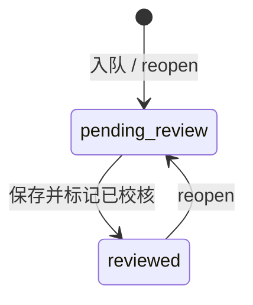

# M3 实现说明 — Clip 校核

| 字段 | 内容 |
|------|------|
| 版本 | v1.0 |
| 对应 PRD | v0.2 |
| 里程碑 | **M3** |
| 目标一句话 | clip 级校核队列可编辑、可标记 reviewed，审计可查；为 M4 dataset 提供 y |
| 前置 | **M2 已出口**（`acceptance/M2.md`） |

---

## 1. 范围

### 1.1 必做（Done 定义）

| # | 能力 | 对应 PRD |
|---|------|----------|
| 1 | `clip_label_review` + `audit_log` 落库（`hmi/data/app.db`） | §5.1、S3 |
| 2 | 入队：Job3 完成（或脚本）创建/更新 `pending_review`，初始 `labels_json` 来自 AI 聚合（R4） | §7.1、R4 |
| 3 | Review REST API（queue / detail / save / reopen） | §11.3 |
| 4 | 乐观锁 `updated_at`；并发保存 → 409（R9） | R9、N5 |
| 5 | HMI `/review` 队列 + clip 校核详情（admin/reviewer） | §8、S3 |
| 6 | 校核保存 / reopen 写 `audit_log` | §6、C4 |
| 7 | 校核页引用当前 **published** taxonomy（或记录上的 `taxonomy_version_id`） | R10 |
| 8 | model_trainer / dataset_manager 对 review 写操作 403 | N6 |

### 1.2 明确不做（留给 M4+）

- `dataset_snapshot` 表与 `/api/datasets/*`
- 帧级校核 UI、帧级 diff 可视化（G11）
- Job3 重跑 / 写回 MC `fact_image_label`
- taxonomy 升级自动打回已 reviewed clip（R10：仅 UI 提示版本差异）
- 大数据集异步导出（G12，M4）

### 1.3 已拍板决策

| # | 决策 |
|---|------|
| D1 | 训练 y 真相来源：`clip_label_review.labels_json`（`review_status=reviewed`），AI 帧标签只读（R2） |
| D2 | 唯一键 `(clip_id, run_id)`；默认 run = clip `active_run_id` |
| D3 | 入队时 `taxonomy_version_id` = 当前 published；已 reviewed 记录保留原 taxonomy 版本（R10） |
| D4 | R4 聚合：有 sync_group 取 `label_scope=sync_group` 行；否则抽样帧首条/众数简化 MVP |
| D5 | `ai_source_summary_json` 存 AI 聚合快照，供侧栏只读对比 |
| D6 | reopen：`reviewed` → `pending_review`，保留 `labels_json`，记 audit |
| D7 | 菜单「校核」：admin + reviewer；dataset_manager / model_trainer 不可见 |
| D8 | M3 入队触发：优先 **HMI 脚本/管理 API** + 可选 oss_sync_poller 挂钩；不改造 DataWorks Job3 节点 |

### 1.4 本里程碑验收切片（PRD）

- [ ] **S3** 队列 pending → 编辑 → reviewed；修改人/时间可查
- [ ] **C3** Job3 完成 clip 出现在队列（可用脚本模拟入队）
- [ ] **C4** reviewer 修改并标记已校核，`audit_log` 有记录
- [ ] **N5** 并发 PUT → 409
- [ ] **N6** model_trainer `PUT /review/clips/{id}` → 403

---

## 2. 状态机



| 迁移 | 角色 |
|------|------|
| → pending_review | 系统入队 / admin·reviewer reopen |
| pending_review → reviewed | admin, reviewer |
| reviewed → pending_review | admin, reviewer |

**非法：** model_trainer 写；无 `labels_json` 直接 reviewed；跳过乐观锁

---

## 3. 数据模型（本阶段落表）

在 `app_db.ensure_schema()` 追加（或 `review_db.ensure_review_schema()`）：

### 3.1 `clip_label_review`

```sql
CREATE TABLE clip_label_review (
  id TEXT PRIMARY KEY,
  clip_id TEXT NOT NULL,
  run_id TEXT NOT NULL,
  taxonomy_version_id TEXT REFERENCES label_taxonomy_version(id),
  labels_json TEXT NOT NULL,
  review_status TEXT NOT NULL CHECK (review_status IN ('pending_review','reviewed')),
  ai_source_summary_json TEXT,
  reviewer_id TEXT REFERENCES app_user(id),
  reviewed_at TEXT,
  created_at TEXT NOT NULL,
  updated_at TEXT NOT NULL,
  UNIQUE(clip_id, run_id)
);

CREATE INDEX idx_clip_label_review_status ON clip_label_review (review_status, updated_at DESC);
CREATE INDEX idx_clip_label_review_clip ON clip_label_review (clip_id);
```

### 3.2 `audit_log`

```sql
CREATE TABLE audit_log (
  id TEXT PRIMARY KEY,
  actor_id TEXT REFERENCES app_user(id),
  action TEXT NOT NULL,
  resource_type TEXT NOT NULL,
  resource_id TEXT NOT NULL,
  detail_json TEXT,
  created_at TEXT NOT NULL
);

CREATE INDEX idx_audit_log_resource ON audit_log (resource_type, resource_id, created_at DESC);
```

### 3.3 模块划分

| 模块 | 路径 |
|------|------|
| DB | `hmi/backend/hmi/review_db.py` |
| AI 聚合 | `hmi/backend/hmi/review/aggregate.py` |
| 入队 | `hmi/backend/hmi/review/enqueue.py` |
| API | `hmi/backend/hmi/review/router.py` |
| 审计 | `hmi/backend/hmi/audit.py` |
| 脚本 | `hmi/scripts/enqueue_review_clips.py` |

---

## 4. API 子集

Base: `/api/review`（JWT；写操作 admin + reviewer）

| Method | Path | 说明 |
|--------|------|------|
| GET | `/queue` | 分页；`status`=`pending_review`\|`reviewed`\|空=全部 |
| GET | `/clips/{clip_id}` | 详情；query `run_id` 可选 |
| PUT | `/clips/{clip_id}` | body: `labels_json`, `review_status`, `updated_at`（乐观锁） |
| POST | `/clips/{clip_id}/reopen` | reviewed → pending_review |
| POST | `/enqueue` | admin；按 clip_ids 或「全部 Job3 已完成未入队」批量入队（M3 可选） |

### 4.1 明确不实现

- `/api/datasets/*`
- audit 独立查询 API（M3 仅写库；列表 API 可 M3.6 或 M4 前补 GET `/audit` admin-only）

---

## 5. 前端页面

| 路由 | 组件 | 角色 |
|------|------|------|
| `/review` | `ReviewQueuePage` | admin, reviewer |
| `/review/:clipId` | `ReviewDetailPage` 或同页 query | admin, reviewer |

### 5.1 UI 最小集

- 队列表格：clip_id、run_id、status、reviewer、reviewed_at、updated_at
- 详情：taxonomy 树形表单编辑 `labels_json`（参照 `/taxonomy` 叶子字段）；侧栏 AI summary 只读
- 操作：保存草稿（仍 pending）、**标记已校核**（→ reviewed）、reopen
- 409 冲突：提示刷新后重试
- 侧栏菜单：**admin + reviewer** 可见「校核」（`AuditOutlined` 或 `CheckCircleOutlined`）

### 5.2 与 Clip 浏览

- Clip 时间轴仍只读 AI 帧标签；校核入口从队列进，不在 MVP 改 Explorer 主流程

---

## 6. 入队与管线集成

### 6.1 R4 聚合（`review/aggregate.py`）

1. 读 local `fact_image_label`（或 cloud MC）按 `clip_id` + `run_id`
2. 优先 `label_scope=sync_group` 且同 `sync_group_id` 一行
3. 无 sync_group：按 `frame_id` 去重取首条 labels_json（MVP）
4. 输出：`labels_json`（clip 级）、`ai_source_summary_json`（含帧数、来源说明）

### 6.2 触发入队

| 方式 | 说明 |
|------|------|
| `hmi/scripts/enqueue_review_clips.py` | CLI：指定 clip 或扫描「已 labeled、无 review 行」 |
| `POST /api/review/enqueue` | admin 批量 |
| 可选 | `oss_sync_poller` 在 sync 完成且 pipeline job3 完成后调用 enqueue |

### 6.3 不做

- 修改 Job3 DPE 打标逻辑
- 写回 MC `fact_image_label`

---

## 7. 工单表

| ID | 名称 | 依赖 | 产出 |
|----|------|------|------|
| M3.1 | Review DB + review_db.py + audit_log | DOC-M3 | 表 + CRUD |
| M3.2 | AI 聚合 + enqueue | M3.1 | `aggregate.py`, `enqueue.py`, CLI |
| M3.3 | Review REST API | M3.1, M3.2 | `/api/review/*` |
| M3.4 | 乐观锁 + audit 写入 | M3.3 | 409 + audit_log |
| M3.5 | 前端 Review 页 + 菜单 | M3.3 | `/review` |
| M3.6 | M3 验收与加固 | M3.4, M3.5 | `acceptance/M3.md`, `test_review_m3.py` |

---

## 8. 测试最低集

| 类型 | 内容 |
|------|------|
| API | 入队 → GET queue → PUT reviewed → GET detail |
| API | reopen；reviewer 403 写 taxonomy；trainer PUT review → 403 |
| API | 并发 PUT 不同 updated_at → 409 |
| API | audit_log 有 `clip.review` / `clip.reopen` |
| 前端 | reviewer 队列 → 详情 → 标记已校核 |
| 脚本 | `hmi/backend/scripts/test_review_m3.py`（M3.6） |

---

## 9. 完成口径

**M3 出口**：脚本入队 clip → reviewer 队列可见 pending → 编辑 labels → 标记 reviewed → audit 可查 → reopen 回 pending → `acceptance/M3.md` 全绿。

---

## 10. 技术落点（现有代码）

| 区域 | 路径 |
|------|------|
| 帧标签读 | `hmi/backend/hmi/services/clips_local.py`, `search_local.py` |
| sync_group | `hmi/backend/hmi/labels_sync.py` |
| labels 解析 | `hmi/backend/hmi/labels_util.py` |
| Taxonomy published | `hmi/backend/hmi/taxonomy_db.get_published_version()` |
| 管线完成判断 | `hmi/backend/hmi/services/pipeline_status.py` |
| 角色门禁 | `hmi/backend/hmi/auth/deps.py` → 新增 `require_reviewer` |
