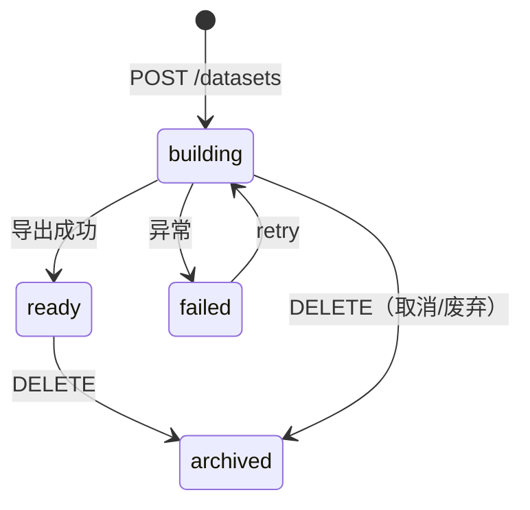

# M4 实现说明 — Dataset 快照

| 字段 | 内容 |
|------|------|
| 版本 | v1.0 |
| 对应 PRD | v0.2 |
| 里程碑 | **M4** |
| 目标一句话 | 从已校核 clip 组装 X/y 快照，异步 building→ready，OSS manifest + MC 表双通道导出；训练员只读 |
| 前置 | **M3 已出口**（`acceptance/M3.md`） |

---

## 1. 范围

### 1.1 必做（Done 定义）

| # | 能力 | 对应 PRD |
|---|------|----------|
| 1 | `dataset_snapshot` 落库（`hmi/data/app.db`） | §5.1、S4 |
| 2 | 创建快照：默认仅纳入 `review_status=reviewed`（R7）；X=同 run `fact_embedding`，y=`clip_label_review.labels_json`（R8） | §7.1、R7、R8 |
| 3 | 异步构建：`building` → `ready` \| `failed`；前端轮询状态（G12 MVP） | §6.3、G12 |
| 4 | OSS manifest：`datasets/{snapshot_id}/manifest.jsonl`（或等价 JSONL） | §9、S4 |
| 5 | MC 快照表写入（cloud 模式）：`aig_rosbag__dataset_snapshot_row` 或按 snapshot 分表 | §5.2、C6 |
| 6 | Dataset REST API（list / create / detail / download / delete） | §11.4 |
| 7 | HMI `/datasets` 列表 + 创建向导 + 详情下载（admin / dataset_manager 写；model_trainer 只读） | §8、S5 |
| 8 | 创建 / 删除写 `audit_log`（`dataset.create` / `dataset.delete`） | §6、C5 |
| 9 | model_trainer 无 dataset 写权限；无 review/taxonomy 写权限（S5、C7） | S5、C7 |

### 1.2 明确不做（留给 M5+）

- 训练 UI、在线训练任务调度
- Parquet 列式大文件分片（M4 MVP 用 JSONL manifest；>10k clip 提示分批）
- dataset 增量更新 / 自动定时重建
- 帧级 y 或帧级 X 单独导出
- audit_log 独立查询 API（可与 M5 一并补 GET `/audit` admin-only）
- Job3/Job4 管线改造

### 1.3 已拍板决策

| # | 决策 |
|---|------|
| D1 | **R7**：默认 `filter_json.review_status = "reviewed"`；`include_pending_review=true` 仅 **admin** 可传，且写 audit |
| D2 | **R8**：每条 snapshot row 的 `(clip_id, run_id)` 与 review 记录一致；y 来自该 run 的 `clip_label_review` |
| D3 | **X 组装 MVP**：clip+run 下所有 `fact_embedding`（`object_type=frame` 为主）聚合为 `x_json` 数组；无 embedding 的 clip **跳过**并记入 build 报告 |
| D4 | **异步构建**：`POST /datasets` 立即返回 `building`；后台线程/任务执行 assemble + 写 OSS/MC |
| D5 | OSS 路径：`datasets/{snapshot_id}/manifest.jsonl`；可选 `datasets/{snapshot_id}/meta.json` |
| D6 | **Local 模式**：读 local SQLite；OSS 仍写 dev bucket（与 taxonomy export 一致）；**跳过 MC 写**，`mc_table_name=null` |
| D7 | 单快照上限 **10k clip**（O2）；超出返回 422 或要求缩小 filter |
| D8 | 菜单「数据集」：**admin + dataset_manager + model_trainer**（trainer 只读）；reviewer 不可见 |
| D9 | DELETE 为软删：`status` → `archived` 或 `deleted_at` 字段（M4 用 `status=archived`） |
| D10 | building 失败保留 `error_message` 字段，允许 admin/dataset_manager **retry** → 再次 `building` |

### 1.4 本里程碑验收切片（PRD）

- [ ] **S4** dataset_manager 创建 dataset → building → ready；manifest 含 clip 数、run_id、taxonomy 版本
- [ ] **S5** model_trainer 可 list/detail/download；PUT review / POST taxonomy → 403
- [ ] **C5** 创建 dataset 仅含 reviewed clip
- [ ] **C6** ready 后 OSS 行数 = `clip_count`；MC 行数一致（cloud）；含 `x_json` / `y_json`
- [ ] **C7** model_trainer 下载 manifest；不能写校核或 taxonomy
- [ ] **N4** 默认创建不含 pending_review clip；admin 强行 include 需 audit

---

## 2. 状态机



| 迁移 | 角色 |
|------|------|
| → building | admin, dataset_manager |
| building → ready / failed | 系统 |
| failed → building | admin, dataset_manager（retry） |
| * → archived | admin, dataset_manager（DELETE） |

**非法：** model_trainer 创建/删除；building 中修改 filter；reviewer 访问写 API

---

## 3. 数据模型（本阶段落表）

在 `app_db.ensure_schema()` 追加（或 `dataset_db.ensure_dataset_schema()`）：

### 3.1 `dataset_snapshot`

```sql
CREATE TABLE dataset_snapshot (
  id TEXT PRIMARY KEY,
  name TEXT NOT NULL,
  description TEXT,
  status TEXT NOT NULL CHECK (status IN ('building','ready','failed','archived')),
  filter_json TEXT NOT NULL,
  clip_count INTEGER NOT NULL DEFAULT 0,
  feature_spec_json TEXT NOT NULL,
  target_spec_json TEXT NOT NULL,
  oss_manifest_uri TEXT,
  mc_table_name TEXT,
  error_message TEXT,
  created_by TEXT REFERENCES app_user(id),
  created_at TEXT NOT NULL,
  updated_at TEXT NOT NULL,
  ready_at TEXT
);

CREATE INDEX idx_dataset_snapshot_status ON dataset_snapshot (status, updated_at DESC);
```

**`filter_json` MVP 形状：**

```json
{
  "review_status": "reviewed",
  "include_pending_review": false,
  "clip_ids": null,
  "taxonomy_version_id": null
}
```

- `clip_ids` 非空：仅导出指定 clip（仍须满足 review 规则，除非 admin include_pending）
- `taxonomy_version_id` 非空：仅纳入该校验版本 reviewed 记录

### 3.2 MaxCompute（cloud）

`sql/maxcompute/migrate_dataset_snapshot_row.sql`：

```sql
CREATE TABLE IF NOT EXISTS aig_rosbag__dataset_snapshot_row (
  snapshot_id STRING,
  clip_id STRING,
  run_id STRING,
  x_json STRING,
  y_json STRING,
  taxonomy_version_id STRING,
  taxonomy_version_code STRING,
  ds STRING
)
PARTITIONED BY (snapshot_id STRING);
```

M4 MVP 也可先用 **单表 + snapshot_id 列** 过滤，避免按 snapshot 动态建表。

### 3.3 OSS manifest 行（JSONL）

每行一条 clip：

```json
{
  "snapshot_id": "uuid",
  "clip_id": "sha256:...",
  "run_id": "uuid",
  "x_json": [{"object_type":"frame","object_id":"cam0:0","vector":[...]}],
  "y_json": {"L1.1.day_period": "night"},
  "taxonomy_version_id": "uuid",
  "taxonomy_version_code": "v1"
}
```

### 3.4 模块划分

| 模块 | 路径 |
|------|------|
| DB | `hmi/backend/hmi/dataset_db.py` |
| 过滤与组装 | `hmi/backend/hmi/dataset/assemble.py` |
| OSS 导出 | `hmi/backend/hmi/dataset/export.py` |
| MC 写入 | `hmi/backend/hmi/dataset/mc_export.py` |
| 构建任务 | `hmi/backend/hmi/dataset/build.py` |
| API | `hmi/backend/hmi/dataset/router.py` |
| 脚本 | `hmi/scripts/build_dataset_snapshot.py` |
| DDL | `sql/maxcompute/migrate_dataset_snapshot_row.sql` |

---

## 4. API 子集

Base: `/api/datasets`（JWT）

| Method | Path | 角色 | 说明 |
|--------|------|------|------|
| GET | `/` | admin, dataset_manager, model_trainer | 分页列表 |
| POST | `/` | admin, dataset_manager | 创建 → `building` |
| GET | `/{id}` | 同上 | 详情 + status + clip_count + error |
| GET | `/{id}/download` | 同上 | OSS manifest 签名 URL |
| POST | `/{id}/retry` | admin, dataset_manager | failed → building |
| DELETE | `/{id}` | admin, dataset_manager | → archived |

### 4.1 明确不实现

- GET `/audit`（M5 或后续）
- 训练任务 API
- 修改已 ready 快照的 filter（须新建 snapshot）

---

## 5. 前端页面

| 路由 | 组件 | 角色 |
|------|------|------|
| `/datasets` | `DatasetListPage` | admin, dataset_manager, model_trainer |
| `/datasets/:id` | `DatasetDetailPage` | 同上 |

### 5.1 UI 最小集

- 列表：name、status、clip_count、created_at、created_by
- 创建向导：名称、描述；默认「仅已校核」；可选指定 clip_ids（admin 可勾选 include pending）
- 详情：building 轮询；ready 后显示 download；failed 显示 error + retry
- 侧栏菜单：**数据集**（`DatabaseOutlined` 或 `FolderOpenOutlined`）

### 5.2 与 Review 关系

- 创建页展示当前 **reviewed 数量**（只读统计，调 review queue count 或专用 stats API stub）
- 不在 Review 页嵌入 dataset 操作

---

## 6. 构建与导出流程

### 6.1 组装（`dataset/assemble.py`）

1. 解析 `filter_json` → 查询 `clip_label_review`（app.db）
2. 默认 `review_status=reviewed`；校验 R7
3. 对每个 `(clip_id, run_id)`：
   - 读 y：`labels_json`
   - 读 X：local `fact_embedding` 或 MC `fact_embedding` **同 run_id**
   - 无 embedding → skip + warning
4. 输出内存 rows + `clip_count`

### 6.2 触发构建

| 方式 | 说明 |
|------|------|
| `POST /api/datasets` | 创建记录后立即 `threading.Thread` 或 asyncio task |
| `hmi/scripts/build_dataset_snapshot.py` | CLI：`--snapshot-id` 重跑 failed |
| `POST /api/datasets/{id}/retry` | API 重试 |

### 6.3 写 OSS + MC

1. 流式写 JSONL 到 OSS
2. cloud：批量 INSERT MC（PyODPS）；local：跳过
3. 更新 snapshot：`status=ready`，`oss_manifest_uri`，`clip_count`，`ready_at`

### 6.4 不做

- 修改 Job4 embedding 逻辑
- 写回 `clip_label_review`

---

## 7. 工单表

| ID | 名称 | 依赖 | 产出 |
|----|------|------|------|
| M4.1 | Dataset DB + dataset_db.py | DOC-M4 | 表 + CRUD |
| M4.2 | 过滤 + X/y 组装 | M4.1, M3 | `assemble.py` |
| M4.3 | 异步 build + OSS export | M4.2 | `build.py`, `export.py`, CLI |
| M4.4 | MC 导出 + DDL | M4.3 | `mc_export.py`, migrate SQL |
| M4.5 | Dataset REST API | M4.1–M4.4 | `/api/datasets/*` |
| M4.6 | 前端 Datasets 页 + 菜单 | M4.5 | `/datasets` |
| M4.7 | M4 验收与加固 | M4.5, M4.6 | `acceptance/M4.md`, `test_dataset_m4.py` |

---

## 8. 测试最低集

| 类型 | 内容 |
|------|------|
| API | 创建（reviewed only）→ poll ready → download URL |
| API | pending clip 默认不包含；admin include_pending + audit |
| API | model_trainer POST /datasets → 403；GET → 200 |
| API | trainer PUT review → 403（回归 M3） |
| API | OSS manifest 行数 = clip_count |
| 前端 | dataset_manager 创建 → 详情 ready → 下载链接 |
| 脚本 | `hmi/backend/scripts/test_dataset_m4.py`（M4.7） |

---

## 9. 完成口径

**M4 出口**：存在 ≥1 条 reviewed clip → dataset_manager 创建 snapshot → building → ready → OSS manifest 可下载 → MC 行数一致（cloud）→ model_trainer 只读可见 → `acceptance/M4.md` 全绿。

---

## 10. 技术落点（现有代码）

| 区域 | 路径 |
|------|------|
| Review y 来源 | `hmi/backend/hmi/review_db.py` |
| Embedding 读 | `hmi/backend/hmi/services/search_local.py`, `search.py` |
| OSS 签名/上传 | `hmi/backend/hmi/oss_signer.py`, `services/oss_manage.py` |
| Taxonomy 版本 | `hmi/backend/hmi/taxonomy_db.py` |
| 角色门禁 | `hmi/backend/hmi/auth/deps.py` → 新增 `require_dataset_manager`, `require_dataset_read` |
| Local/MC 切换 | `hmi/backend/hmi/data_source.py` |
| Audit | `hmi/backend/hmi/audit.py` |
