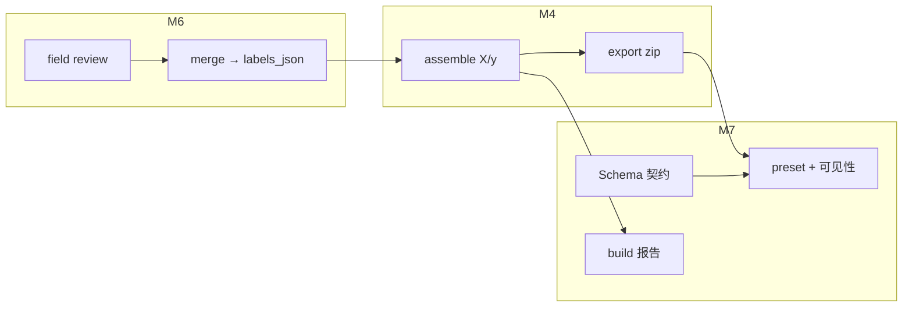

# M7 实现说明 — Dataset 交付加固

| 字段 | 内容 |
|------|------|
| 版本 | v1.0 |
| 对应 PRD | v0.2 §7.1、S4、G12；M6 R-M6-3（y 来源） |
| 里程碑 | **M7** |
| 目标一句话 | 在不越界训练框架的前提下，强化 dataset 快照的**契约可读、导出门禁可见、构建可审计、规模化可分批** |
| 前置 | **M6 已出口**（field review → `labels_json` → dataset y 全链验收） |

---

## 1. 范围

### 1.1 必做（Done 定义）

| # | 能力 | 对应 |
|---|------|------|
| 1 | **Dataset Schema 契约文档**（x_json / y_json / parsed / meta；版本号；缺失语义） | 交付边界 |
| 2 | **`meta.json` 加固**：`schema_version`、`package_version`、filter 快照、taxonomy/embedding 摘要、build 报告 | S4 |
| 3 | **构建校验报告**：skipped 原因分类（无 embedding、field review 未完成、taxonomy 不匹配等）；API 详情与 download 可读 | 治理 |
| 4 | **dataset_ready 可见性**：Review Overview + Dataset 创建向导展示「可导出 / 还差 N 个 label」 | M6 → M4 闭环 |
| 5 | **Export preset**：`minimal`（X+y+meta） vs `full`（含 parsed 二进制）；创建向导可选 | G12 MVP |
| 6 | **超 10k 分批指引**：创建前预估 clip 数；超出上限时 UI/API 明确提示分批策略 | O2 |
| 7 | **训练侧薄接入**：`examples/load_dataset_snapshot.py` + Dataset 详情页链到 Schema 文档 | 生态，非 SLA |
| 8 | **M7 验收**：pytest + Playwright + `acceptance/M7.md` | 出口 |

### 1.2 明确不做（越界 / backlog）

- PyTorch / TensorFlow `Dataset` 内置导出或平台内训练 UI
- 训练任务调度、实验追踪、label encoding 策略固化
- dataset 增量更新 / 定时自动重建
- 帧级 X/y 单独导出
- Parquet 分片（**M7.5 可选 P1**；未做不影响 M7 出口）
- GET `/audit` 独立 API（建议 **M8 治理加固**）
- PostgreSQL 迁移（建议 **M8 部署就绪**）
- Job0–Job4 管线改造

### 1.3 已拍板决策

| ID | 决策 |
|----|------|
| D-M7-1 | **契约优先于格式**：平台保证 JSON 字段语义与对齐规则；tensor 化在平台外 |
| D-M7-2 | **y 真相链不变**：dataset y 仍读 `clip_label_review.labels_json`（field review 合并后）；M7 只加强可见性与 build 报告 |
| D-M7-3 | **默认 preset = `minimal`**：不含 parsed 图像/音频二进制，减小 zip；`full` 显式勾选 |
| D-M7-4 | **`schema_version` 独立于 `package_version`**：`package_version` 指 zip 文件组成；`schema_version` 指 x/y/meta 字段契约 |
| D-M7-5 | **field review 门禁默认开启**：与 M4 R7 一致；`include_pending_review` 仍仅 admin + audit |
| D-M7-6 | **build 报告持久化**：写入 `dataset_snapshot` 新列或 `meta.json`；failed/ready 均可查 skipped |
| D-M7-7 | **示例脚本非 SLA**：`examples/` 仅参考实现，版本随 schema 文档维护 |

---

## 2. 数据契约（M7.1 交付物摘要）

文档路径：`docs/dataset-delivery-schema.md`

### 2.1 文件布局（`dataset.zip`）

| 文件 | preset | 说明 |
|------|--------|------|
| `特征.jsonl` | minimal, full | 每行 `{clip_id, run_id, x_json}` |
| `目标.jsonl` | minimal, full | 每行 `{clip_id, run_id, y_json, taxonomy_version_*}` |
| `meta.json` | minimal, full | 快照元数据 + build 报告 |
| `解析数据.jsonl` | full | 结构化 parsed 索引（frames/events/audio） |
| `clips/.../parsed/**` | full | Job1 解析产物（图像、音频等） |
| `README.txt` | minimal, full | 人类可读说明 |

### 2.2 `x_json` schema

| schema | 形状 | 来源 |
|--------|------|------|
| `clip_embedding_v1` | `{schema, vector[], model_version, dim, aggregation_method}` | clip 级 embedding（Job4 / clip native） |
| `frame_embeddings_v1` | `{schema, items[{object_type, object_id, timestamp_ns, vector[], ...}]}` | 帧/对象级 embedding 回退 |

### 2.3 `y_json`

- clip 级 taxonomy 扁平 dict：`{"L1.1.day_period": "night", ...}`
- 空值 / `human_doubtful` 语义在 Schema 文档中定义
- 必须与同 row 的 `(clip_id, run_id)` X 对齐（R8）

### 2.4 `meta.json`（M7 扩展）

```json
{
  "snapshot_id": "uuid",
  "schema_version": "1.0",
  "package_version": 2,
  "export_preset": "minimal",
  "filter_snapshot": { "review_status": "reviewed", "label_filters": null },
  "clip_count": 120,
  "line_count": 120,
  "taxonomy_summary": { "version_id": "...", "version_code": "v2" },
  "embedding_summary": { "schemas": ["clip_embedding_v1"], "model_versions": ["..."] },
  "build_report": {
    "skipped": [{ "clip_id": "...", "run_id": "...", "reason": "no_clip_embedding" }],
    "skipped_by_reason": { "no_clip_embedding": 3, "field_review_incomplete": 1 },
    "warnings": []
  }
}
```

---

## 3. API 变更

Base: `/api/datasets`（JWT，与 M4 一致）

### 3.1 扩展

| Method | Path | 变更 |
|--------|------|------|
| POST | `/` | body 增 `export_preset: "minimal" \| "full"`（默认 minimal） |
| GET | `/{id}` | 响应增 `build_report`、`export_preset`、`schema_version`、`eligible_preview`（可选） |
| POST | `/preview` | 响应增 `dataset_ready_count`、`skipped_preview`（前 N 条 skip 原因） |

### 3.2 新增（可选 M7.3）

| Method | Path | 角色 | 说明 |
|--------|------|------|------|
| GET | `/stats/eligibility` | admin, dataset_manager | 当前 pool 中 reviewed + dataset_ready 数量（供创建向导） |

### 3.3 明确不新增

- 训练相关 API
- 修改 ready 快照 filter 的 PATCH

---

## 4. 前端变更

| 页面 | 变更 |
|------|------|
| `DatasetListPage` | 列表可选展示 `export_preset` |
| `DatasetDetailPage` | ready 时展示 build 报告摘要；链到 Schema 文档；download 注明 preset |
| Dataset 创建向导 | preset 单选；clip 预估 + 超 10k 警告；`dataset_ready` / reviewed 计数 |
| Review Overview（若有） | clip 卡片复用 `dataset_ready` 徽章 |

---

## 5. 模块划分

| 模块 | 路径 | 工单 |
|------|------|------|
| Schema 文档 | `docs/dataset-delivery-schema.md` | M7.1 |
| meta / build 报告 | `hmi/backend/hmi/dataset/export.py`, `build.py` | M7.2 |
| assemble skip 分类 | `hmi/backend/hmi/dataset/assemble.py` | M7.2 |
| preset 过滤 | `hmi/backend/hmi/dataset/parsed_data.py`, `export.py` | M7.4 |
| DB 列（可选） | `hmi/backend/hmi/dataset_db.py` — `export_preset`, `build_report_json` | M7.2 |
| API | `hmi/backend/hmi/dataset/router.py` | M7.3 |
| 前端 | `DatasetListPage`, `DatasetDetailPage`, 创建向导组件 | M7.3 |
| 示例 | `examples/load_dataset_snapshot.py` | M7.6 |
| Parquet（P1） | `hmi/backend/hmi/dataset/parquet_export.py` | M7.5 |

---

## 6. 工单表

| ID | 名称 | 依赖 | 产出 |
|----|------|------|------|
| DOC-M7 | 本说明 + tracking | M6 | 本文档 |
| M7.1 | Dataset Schema 契约文档 | DOC-M7 | `docs/dataset-delivery-schema.md` |
| M7.2 | build 报告 + meta 加固 | M7.1, M6 | export/build/assemble；`build_report` 持久化 |
| M7.3 | API + UI 可见性 | M7.2 | preview stats、详情 build 报告、dataset_ready 展示 |
| M7.4 | export preset minimal/full | M7.2 | filter_json/export_preset；zip 体积差异 |
| M7.5 | Parquet 可选导出（P1） | M7.2 | `parquet_export.py`；meta 增 parquet keys |
| M7.6 | 训练侧示例 + 文档链 | M7.1 | `examples/load_dataset_snapshot.py`；详情页链接 |
| M7.7 | M7 验收 | M7.3;M7.4;M7.6 | `test_dataset_m7.py`, e2e, `acceptance/M7.md` |

**推荐实施顺序**：M7.1 → M7.2 → M7.4 → M7.3 → M7.6 → M7.7；M7.5 可并行或延后。

---

## 7. 测试最低集

### A 类

| 编号 | 内容 |
|------|------|
| A-1 | `test_dataset_m7.py`：minimal preset zip 不含 `clips/.../parsed` 二进制 |
| A-2 | full preset zip 含 parsed（有本地数据时） |
| A-3 | build_report.skipped_by_reason 与 assemble skipped 一致 |
| A-4 | meta.json 含 `schema_version`、`export_preset` |
| A-5 | field review 未完成 clip 默认不进 snapshot（回归 M6 + R7） |
| A-6 | POST preview 返回 `dataset_ready_count` |
| A-7 | `examples/load_dataset_snapshot.py` 对 minimal zip 可跑通 |
| A-8 | `npm run build` |

### A-E2E

| 编号 | 内容 |
|------|------|
| A-E2E-1 | dataset_manager 创建 minimal → ready → 详情见 build 报告 → 下载 |
| A-E2E-2 | 创建向导展示 reviewed / ready 计数；超 10k 时见警告 |

### H 类

| 编号 | 内容 |
|------|------|
| H-1 | cloud 模式 full preset + Parquet（若做 M7.5）OSS 体积与下载耗时 | 待 ECS 点测 |

---

## 8. 与 M6 / M4 的关系



- **M6 出口后** M7 才 START（field review 合并逻辑必须已验收）
- **M4 行为保持**：R7/R8 不改；M7 只增加透明度与导出选项

---

## 9. 完成口径

**M7 出口**：

1. `docs/dataset-delivery-schema.md` 发布且与代码 `schema_version` 一致  
2. dataset_manager 创建 **minimal** snapshot → ready → `meta.json` 含 build 报告 → trainer 可下载  
3. 创建向导可见 dataset_ready / reviewed 统计；超 10k 有明确提示  
4. `examples/load_dataset_snapshot.py` 可加载 minimal zip 并打印 X/y 形状摘要  
5. `acceptance/M7.md` A + A-E2E 全绿；H-1 仅在做 M7.5 时需要  

---

## 10. M9 预告（部署与治理，非 M8）

| 方向 | 说明 |
|------|------|
| GET `/audit` | admin 可读 audit_log |
| PostgreSQL | 多用户并发校核 / dataset 构建 |
| sdk_v1 全链 cloud 验收 | OSS = MC = HMI local sync |
| taxonomy 升级后的 dataset 影响说明 | R10 产品化 |

样本扩展见 **M8**：`docs/m8-implementation-notes.md`
