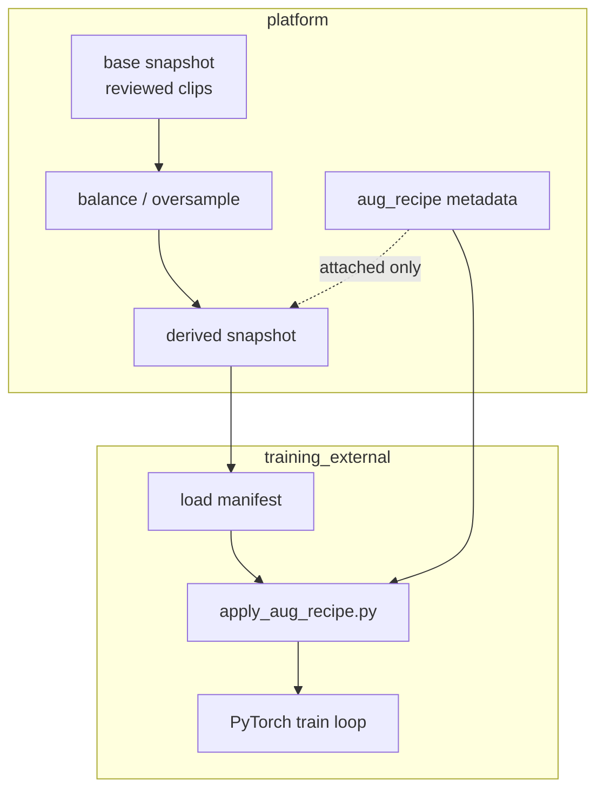

# M8 实现说明 — Dataset 样本扩展（扩增治理）

| 字段 | 内容 |
|------|------|
| 版本 | v1.0 |
| 对应 PRD | v0.2 §7.1、S4、R2、R7、R8；G12 扩展 |
| 里程碑 | **M8** |
| 目标一句话 | 在**不烘焙 transform、不改校核 y** 的前提下，通过**平衡采样、过采样、扩增 recipe 契约、派生快照 lineage**，缓解采集样本有限问题 |
| 前置 | **M7 已出口**（Schema 契约、build 报告、export preset） |

---

## 1. 范围

### 1.1 必做（Done 定义）

| # | 能力 | 说明 |
|---|------|------|
| 1 | **标签感知采样** | `filter_json` 扩展：`balance_by_label`、`min_per_class`、`max_per_class` |
| 2 | **过采样 / 虚拟行** | 同一 `(clip_id, run_id)` 可在 manifest 出现多次；`variant_id` + `aug_hint`；**y 与 source 相同** |
| 3 | **导出前分布报告** | preview / build 时输出 label 直方图、扩增后预估行数 |
| 4 | **`aug_recipe` 注册表** | 平台存 recipe（YAML/JSON）；挂到 snapshot meta；**不执行 transform** |
| 5 | **派生快照** | `POST /api/datasets/{id}/derive`；`parent_snapshot_id` + `derivation_json` lineage |
| 6 | **UI** | 创建/派导向导：类别平衡选项、recipe 选择、分布预览 |
| 7 | **训练侧执行器示例** | `examples/apply_aug_recipe.py`（读 recipe + full preset 路径，非 SLA） |
| 8 | **M8 验收** | pytest + Playwright + `acceptance/M8.md` |

### 1.2 明确不做（越界）

- 平台内执行 torchvision / audio transform 并写回 OSS
- 增强后自动修改 `y_json` 或跳过校核（违反 R2）
- 增强后自动触发 Job4 重嵌入任务
- GAN / 仿真 rosbag 合成
- 训练时 per-epoch 随机增强（训练侧职责）
- PyTorch Dataset / 训练 UI

### 1.3 已拍板决策

| ID | 决策 |
|----|------|
| D-M8-1 | **扩增分两层**：平台 = 样本编排 + recipe 契约 + lineage；训练侧 = transform 执行 |
| D-M8-2 | **y 不变**：过采样 / 虚拟行 / 派生快照均继承 source 的 `y_json`；禁止 aug 改标签 |
| D-M8-3 | **虚拟行不复制二进制**：`minimal` preset 下过采样仅重复 JSONL 行；`full` preset 仍指向同一 `artifact_relpath` |
| D-M8-4 | **派生快照不 mutate base**：base 保持 `ready`；derive 新建 snapshot 记录 |
| D-M8-5 | **recipe 版本化**：`aug_recipe` 表含 `recipe_code` + version；published recipe 不可原地改 |
| D-M8-6 | **`augmentation_mode`**：`none` \| `oversample_only` \| `recipe_attached`（meta 字段） |
| D-M8-7 | **10k 上限按物理 clip 计**：过采样后的 **manifest 行数** 可 > clip_count；UI/API 分别展示 `clip_count` vs `line_count` |
| D-M8-8 | **audit**：`dataset.derive`、`aug_recipe.create/publish` 写 audit_log |

---

## 2. 概念模型



| 概念 | 说明 |
|------|------|
| **物理 clip** | 唯一 `(clip_id, run_id)` |
| **manifest 行** | 导出 JSONL 一行；可含 `variant_id` |
| **aug_recipe** | 声明式 transform 列表；训练侧解释执行 |
| **派生快照** | 从 parent snapshot 或同等 filter + 扩展策略新建 |

---

## 3. 数据模型

### 3.1 `filter_json` 扩展（M8.1）

在 M4/M7 `filter_json` 基础上追加（均可选）：

```json
{
  "review_status": "reviewed",
  "label_filters": null,
  "sample_size": null,
  "balance_by_label": "L1.1.day_period",
  "min_per_class": 50,
  "max_per_class": 500,
  "oversample_policy": "duplicate_to_min",
  "oversample_max_multiplier": 10
}
```

| 字段 | 说明 |
|------|------|
| `balance_by_label` | taxonomy node_id；按该维分层 |
| `min_per_class` | 低于此值的类过采样到 min（duplicate） |
| `max_per_class` | 高于此值的类欠采样（random cap） |
| `oversample_policy` | `none` \| `duplicate_to_min` |
| `oversample_max_multiplier` | 单 clip 最多重复次数，防爆炸 |

### 3.2 manifest 行扩展（M8.2）

```json
{
  "clip_id": "sha256:…",
  "run_id": "uuid",
  "variant_id": "dup_2",
  "source_row_key": "sha256:…|uuid|base",
  "x_json": { },
  "y_json": { "L1.1.day_period": "night" },
  "aug_hint": {
    "type": "platform_oversample",
    "balance_by_label": "L1.1.day_period",
    "duplicate_index": 2
  }
}
```

- `variant_id` 缺省或 `base`：原始行
- `aug_hint.type = platform_oversample`：平台重复采样
- recipe 挂 snapshot 级，行级 `aug_hint` 可空

### 3.3 `aug_recipe` 表

```sql
CREATE TABLE aug_recipe (
  id TEXT PRIMARY KEY,
  recipe_code TEXT NOT NULL,
  version INTEGER NOT NULL,
  status TEXT NOT NULL CHECK (status IN ('draft','published','archived')),
  spec_json TEXT NOT NULL,
  created_by TEXT REFERENCES app_user(id),
  created_at TEXT NOT NULL,
  updated_at TEXT NOT NULL,
  UNIQUE (recipe_code, version)
);
```

`spec_json` 形状见 `docs/dataset-augmentation-recipe-schema.md`。

### 3.4 `dataset_snapshot` 扩展

| 列 | 说明 |
|----|------|
| `parent_snapshot_id` | 派生来源；base 为 NULL |
| `derivation_json` | `{balance_by_label, min_per_class, aug_recipe_id, ...}` |
| `augmentation_mode` | `none` \| `oversample_only` \| `recipe_attached` |
| `line_count` | manifest 行数（含虚拟行） |

### 3.5 `meta.json` 扩展

```json
{
  "augmentation_mode": "recipe_attached",
  "parent_snapshot_id": "uuid-or-null",
  "derivation": { "balance_by_label": "L1.1.day_period", "min_per_class": 50 },
  "aug_recipe": { "recipe_id": "...", "recipe_code": "multimodal_v1", "version": 1 },
  "distribution_report": {
    "before": { "night": 12, "day": 880 },
    "after": { "night": 50, "day": 500 }
  },
  "clip_count": 892,
  "line_count": 550
}
```

---

## 4. API

Base: `/api/datasets`（JWT）

### 4.1 扩展

| Method | Path | 变更 |
|--------|------|------|
| POST | `/preview` | 增 `distribution_before/after`、`estimated_line_count` |
| POST | `/` | body 可含 balance 字段 + `aug_recipe_id` |
| GET | `/{id}` | 增 lineage、distribution、line_count |

### 4.2 新增

| Method | Path | 角色 | 说明 |
|--------|------|------|------|
| POST | `/{id}/derive` | admin, dataset_manager | 从 ready parent 派生新 snapshot → building |
| GET | `/aug-recipes` | admin, dataset_manager, model_trainer | recipe 列表（trainer 只读） |
| POST | `/aug-recipes` | admin, dataset_manager | 创建 draft recipe |
| POST | `/aug-recipes/{id}/publish` | admin, dataset_manager | draft → published |

### 4.3 明确不新增

- POST `/aug-recipes/{id}/execute`（不在平台执行）
- 修改 ready base snapshot 的 filter

---

## 5. 组装流程（`assemble.py` 扩展）

1. M7 流程：query reviewed pool → field review gate → fetch X/y  
2. **M8 分布统计**：对 `balance_by_label` 维度计数 → `distribution_before`  
3. **欠采样**：`max_per_class` cap（random）  
4. **过采样**：`duplicate_to_min` 生成虚拟行（新 `variant_id`）  
5. **recipe 挂载**：仅写入 meta / snapshot 列，不改变行内容  
6. 输出 `line_count` ≠ `clip_count`（有过采样时）

---

## 6. 前端

| 页面 | 变更 |
|------|------|
| Dataset 创建向导 | 「类别平衡」折叠面板；选 label 维 + min/max；分布柱状预览 |
| Dataset 详情 | 展示 parent / derivation / recipe / before→after 分布 |
| 新页或 Tab | `AugRecipeListPage`（admin/dataset_manager 维护 recipe） |
| 派生按钮 | ready base snapshot 上「派生扩展快照」 |

---

## 7. 模块划分

| 模块 | 路径 | 工单 |
|------|------|------|
| Recipe Schema | `docs/dataset-augmentation-recipe-schema.md` | M8.1 |
| balance / oversample | `hmi/backend/hmi/dataset/balance.py` | M8.2 |
| aug_recipe DB + API | `hmi/backend/hmi/dataset/aug_recipe_db.py`, router | M8.3 |
| derive + lineage | `hmi/backend/hmi/dataset/derive.py`, `dataset_db.py` | M8.4 |
| distribution report | `hmi/backend/hmi/dataset/distribution.py` | M8.2 |
| 前端 | 创建向导、详情 lineage、AugRecipe 页 | M8.5 |
| 示例 | `examples/apply_aug_recipe.py` | M8.6 |
| Schema 更新 | `docs/dataset-delivery-schema.md` §variant | M8.1 |

---

## 8. 工单表

| ID | 名称 | 依赖 | 产出 |
|----|------|------|------|
| DOC-M8 | 本说明 + tracking | M7 | 本文档 |
| M8.1 | Recipe Schema + manifest variant 契约 | DOC-M8 | recipe schema doc；delivery schema 增补 |
| M8.2 | balance / oversample + distribution | M8.1, M7 | `balance.py`, `distribution.py`, assemble 集成 |
| M8.3 | aug_recipe CRUD + publish | M8.1 | DB + `/api/datasets/aug-recipes` |
| M8.4 | derive snapshot + lineage | M8.2, M8.3 | `derive.py`, `POST .../derive`, DB 列 |
| M8.5 | UI 平衡 + recipe + lineage | M8.4 | 向导、详情、AugRecipe 页 |
| M8.6 | apply_aug_recipe 示例 | M8.1 | `examples/apply_aug_recipe.py` |
| M8.7 | M8 acceptance | M8.5, M8.6 | `test_dataset_m8.py`, e2e, `acceptance/M8.md` |

**推荐顺序**：M8.1 → M8.2 → M8.3 → M8.4 → M8.5 → M8.6 → M8.7

---

## 9. 测试最低集

### A 类

| 编号 | 内容 |
|------|------|
| A-1 | `min_per_class=50` 且某类仅 5 条 → line_count 含 duplicate；clip_count 为物理 clip 数 |
| A-2 | 虚拟行 `y_json` 与 source 完全一致 |
| A-3 | `max_per_class` 欠采样后各类 ≤ cap |
| A-4 | derive 快照 `parent_snapshot_id` 正确；base 仍为 ready |
| A-5 | published recipe 不可编辑；仅 clone 新 version |
| A-6 | preview 返回 `distribution_before/after` |
| A-7 | `augmentation_mode=recipe_attached` 时 zip 不新增二进制文件 |
| A-8 | `examples/apply_aug_recipe.py` 对 mock recipe 可解析 |

### A-E2E

| 编号 | 内容 |
|------|------|
| A-E2E-1 | 创建带 balance 的 snapshot → 详情见分布报告 |
| A-E2E-2 | derive 派生 → 详情见 parent 链接 |

### H 类

| 编号 | 内容 |
|------|------|
| H-1 | 训练侧实际跑 recipe + full preset 端到端 | 平台外点测 |

---

## 10. 完成口径

**M8 出口**：

1. dataset_manager 可对少数类配置 `min_per_class` 并看到 before/after 分布  
2. 导出 manifest 含虚拟行且 y 不变；meta 含 lineage / augmentation_mode  
3. 可 attach published aug_recipe；平台不烘焙媒体  
4. 可从 base snapshot derive 新 snapshot  
5. `acceptance/M8.md` A + A-E2E 全绿  

---

## 11. M9 预告（部署与治理）

| 方向 | 说明 |
|------|------|
| GET `/audit` | admin 可读 audit_log |
| PostgreSQL | 多用户并发 |
| sdk_v1 cloud 全链验收 | OSS = MC = HMI |
| taxonomy 升级与 dataset 影响 | R10 产品化 |

---

## 12. 与 M7 的衔接

- M7 确立 `schema_version`、`build_report`、`export_preset`  
- M8 递增 `schema_version` → **1.1**（manifest variant + meta augmentation 块）  
- M7.7 未完成前 **禁止抢跑 M8**
