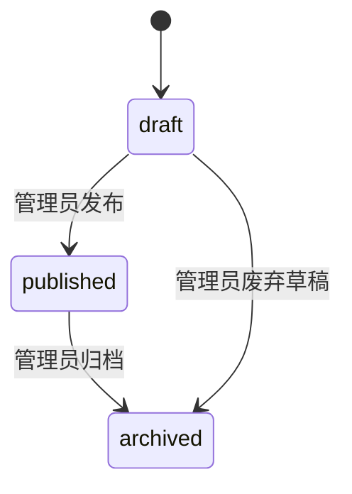
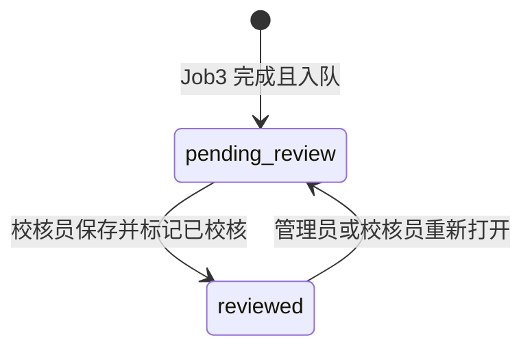
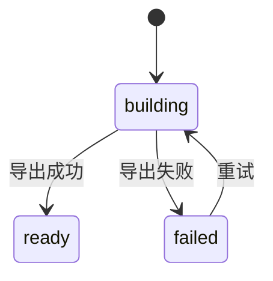

# PRD — Rosbag Labels Platform（HMI 扩展）

| 字段 | 内容 |
|------|------|
| 版本 | **v0.2**（缺口评审后） |
| 状态 | 待实施（P0=0，可进入里程碑切片） |
| 基线 | `docs/WIKI.md` + 现有 HMI/管线实现 |
| 决策依据 | 附录 A Q1–Q12；已关闭决议 R1–R10 |

---

## 1. 背景与目标

### 1.1 背景

**rosbag_to_labels_pipline** 已完成 Rosbag 解析 → 抽样/ASR → OMS 打标 → 向量化 的云端/本地管线，并提供 HMI 用于 Clip 浏览、标签检索、OSS 管理与管线进度监控（见 WIKI §8）。

当前缺口：

1. **无账号与角色** — 全员等同权限，无法分工与审计。
2. **标签 taxonomy 只读** — 来自 `config/oms_label_taxonomy.yaml`，无法在系统内版本化编辑。
3. **无人工校核** — Job3 AI 标签只能浏览，无法 clip 级修正与状态追踪。
4. **无数据集管理** — 无法将「多模向量 X + clip 结构化标签 y」打包交付模型训练角色。

### 1.2 产品目标

在现有 HMI 上扩展 **治理与交付层**：账号权限 → taxonomy 版本治理 → clip 校核队列 → 数据集快照导出，使管线产出可审计、可修正、可训练。

### 1.3 可观测成功标准

| ID | 标准 | 度量 |
|----|------|------|
| S1 | 四类角色登录后仅见授权菜单与 API | 越权请求返回 403；角色切换后菜单差异可点测 |
| S2 | Taxonomy 编辑后新版本可被 Job3 引用 | 创建 vN+1 后 dispatch 可指定 `taxonomy_version_id`；HMI 展示当前生效版本 |
| S3 | 校核员可完成 clip 级标签修正并标记已校核 | 队列中 clip 从 `pending_review` → `reviewed`；修改人/时间可查 |
| S4 | 数据集管理员可生成含 X/y 的快照 | 快照 manifest 含 clip 数、run_id、taxonomy 版本；OSS 文件 + MC 表均可读 |
| S5 | 模型训练员只读导出，不能改标签/ taxonomy | 训练员角色无写 API；可下载/查询 dataset 快照 |
| S6 | 现有浏览/检索/OSS 能力不退化 | 原 `/`、`/clips/:id`、`/search`、`/oss` 在登录后仍可用（按角色） |

---

## 2. 范围

### 2.1 In（MVP）

| # | 能力 | 说明 |
|---|------|------|
| 1 | 账号与角色 | 自建账号 + JWT Session；4 角色（见 §3） |
| 2 | Taxonomy 版本树 | DB 存储版本化标签树；可从现有 YAML 导入 v1；HMI 可视化编辑 |
| 3 | Clip 校核 | 待校核队列；clip 级结构化 OMS 标签编辑；简单状态流 |
| 4 | 数据集管理 | 选择 clip 集合 + run + 已校核标签 → 导出 X（embedding）+ y（clip 标签） |
| 5 | 交付双通道 | OSS（Parquet/JSONL manifest）+ MaxCompute dataset 快照表 |
| 6 | 审计 | 校核、taxonomy 变更、dataset 创建写 audit_log |

### 2.2 Out（明确不做）

| 项 | 原因 |
|----|------|
| 模型训练 UI / 训练任务调度 | 训练在独立系统；本项目只交付数据集 |
| 多租户 / 组织隔离 | MVP 单租户 |
| SSO / LDAP / OAuth | MVP 自建 JWT；后续里程碑再议 |
| 标签写回触发 Job3 重跑 | 校核结果存应用层 `clip_label_review`，不反向驱动 DPE 重打标 |
| 帧级校核 UI | MVP 仅 clip 级；帧级标签只读参考 |
| 开放自助注册 | 仅管理员创建账号 |

### 2.3 非目标

- 替换 MaxCompute 为唯一元数据存储（MC 仍为 clip/embedding 权威）
- 改造 Job0–Job4 核心解析逻辑（仅扩展 taxonomy 版本引用参数）

---

## 3. 角色与权限矩阵

| 能力 / 资源 | 管理员 | 标注校核员 | 数据集管理员 | 模型训练员 |
|-------------|:------:|:----------:|:------------:|:----------:|
| 用户 CRUD、角色授予 | ✓ | — | — | — |
| Taxonomy 版本 CRUD、发布 | ✓ | 只读 | 只读 | 只读 |
| Clip 浏览 / 检索 / OSS | ✓ | ✓ | ✓ | 只读 |
| 校核队列、编辑 clip 标签、标记已校核 | ✓ | ✓ | — | — |
| 创建/删除 dataset 快照 | ✓ | — | ✓ | — |
| 下载/查询 dataset 导出 | ✓ | — | ✓ | ✓ |
| 上传 bag / 触发管线 | ✓ | — | ✓ | — |
| audit_log 查看 | ✓ | 本人体校核记录 | 本人 dataset 操作 | — |

**账号治理（R6）**：仅管理员可创建/禁用用户；首次部署通过 bootstrap 脚本创建首个 admin；禁止开放注册。

---

## 4. 核心概念与真相来源

| 概念 | 权威来源 | 说明 |
|------|----------|------|
| Clip 元数据、帧、embedding | MaxCompute `aig_rosbag__*` + OSS | 与 WIKI 一致 |
| Job3 原始 AI 标签 | MC `fact_image_label` | 只读参考，校核不覆盖 |
| Taxonomy 定义 | **应用 DB** `label_taxonomy_version` + `label_taxonomy_node` | Job3 通过 `taxonomy_version_id` 引用；YAML 仅导入用 |
| Clip 校核后标签（y） | **应用 DB** `clip_label_review` | clip + run 维度；状态 `review_status` |
| 用户/角色/Session | **应用 DB** `app_user` 等 | HMI 后端托管 |
| Dataset 快照 | **应用 DB** 元数据 + OSS 文件 + MC `aig_rosbag__dataset_snapshot` | 三点一致，以 snapshot_id 为键 |

**冲突处理（R2）**：校核标签与 `fact_image_label` 不一致时，**以 `clip_label_review`（status=reviewed）为训练 y**；浏览页同时展示 AI 原始与校核版 diff。

---

## 5. 实体模型（MVP）

### 5.1 应用库（SQLite MVP → 可迁 PostgreSQL）

#### `app_user`

| 字段 | 类型 | 说明 |
|------|------|------|
| id | UUID PK | |
| username | TEXT UNIQUE | 登录名 |
| password_hash | TEXT | bcrypt |
| display_name | TEXT | |
| is_active | BOOL | 禁用=false |
| created_at / updated_at | ISO8601 | |

#### `app_user_role`

| 字段 | 类型 | 说明 |
|------|------|------|
| user_id | FK | |
| role | ENUM | `admin` \| `reviewer` \| `dataset_manager` \| `model_trainer` |

#### `label_taxonomy_version`

| 字段 | 类型 | 说明 |
|------|------|------|
| id | UUID PK | |
| version_code | TEXT UNIQUE | 如 `v1`, `v2.1` |
| status | ENUM | `draft` \| `published` \| `archived` |
| published_at | ISO8601 NULL | |
| created_by | FK user | |
| source_import | TEXT NULL | 如 `oms_label_taxonomy.yaml` |

#### `label_taxonomy_node`

| 字段 | 类型 | 说明 |
|------|------|------|
| id | UUID PK | |
| taxonomy_version_id | FK | |
| parent_id | FK NULL | 树结构 |
| level_code | TEXT | 如 L1.1 |
| label_id | TEXT | 如 L1.1.day_period |
| name | TEXT | |
| definition | TEXT | |
| dtype | TEXT | enum/bool/float/... |
| value_schema_json | TEXT | 与现 YAML value_schema 同构 |
| sort_order | INT | |
| is_active | BOOL | 软删=false |

#### `clip_label_review`

| 字段 | 类型 | 说明 |
|------|------|------|
| id | UUID PK | |
| clip_id | TEXT | sha256:... |
| run_id | TEXT | 对应 active_run 或指定 run |
| taxonomy_version_id | FK | 校核所依据 taxonomy |
| labels_json | TEXT | clip 级 OMS 结构化 JSON（与 frame labels_json 同 schema） |
| review_status | ENUM | `pending_review` \| `reviewed` |
| ai_source_summary_json | TEXT NULL | 从 fact_image_label 聚合的快照，只读参考 |
| reviewer_id | FK NULL | |
| reviewed_at | ISO8601 NULL | |
| updated_at | ISO8601 | |
| UNIQUE(clip_id, run_id) | | 每 clip+run 一条校核记录 |

#### `dataset_snapshot`

| 字段 | 类型 | 说明 |
|------|------|------|
| id | UUID PK | |
| name | TEXT | 人类可读 |
| description | TEXT | |
| status | ENUM | `building` \| `ready` \| `failed` |
| filter_json | TEXT | 纳入规则：clip_ids / 日期 / 仅 reviewed 等 |
| clip_count | INT | |
| feature_spec_json | TEXT | 默认 `{ "x": ["fact_embedding"] }` |
| target_spec_json | TEXT | 默认 `{ "y": ["clip_label_review.labels_json"] }` |
| oss_manifest_uri | TEXT NULL | |
| mc_table_name | TEXT NULL | `aig_rosbag__dataset_snapshot_{id}` |
| created_by | FK | |
| created_at | ISO8601 | |

#### `audit_log`

| 字段 | 类型 | 说明 |
|------|------|------|
| id | UUID PK | |
| actor_id | FK | |
| action | TEXT | 如 `taxonomy.publish`, `clip.review`, `dataset.create` |
| resource_type / resource_id | TEXT | |
| detail_json | TEXT | |
| created_at | ISO8601 | |

### 5.2 MaxCompute 扩展

#### `aig_rosbag__dataset_snapshot_row`（按 snapshot 分区或 snapshot_id 列）

| 字段 | 类型 | 说明 |
|------|------|------|
| snapshot_id | STRING | |
| clip_id | STRING | |
| run_id | STRING | |
| x_json | STRING | embedding 集合引用/内联 |
| y_json | STRING | clip 校核后 labels_json |
| taxonomy_version_code | STRING | |

---

## 6. 状态机

### 6.1 Taxonomy 版本

| 迁移 | 触发 | 角色 |
|------|------|------|
| draft → published | 发布 | admin |
| published → archived | 归档 | admin |

**非法操作**

- 非 admin 发布/归档
- 修改已 published 版本的节点（须 clone 为新 draft 版本，R3）
- 删除 published 版本（仅允许 archived）

### 6.2 Clip 校核

| 迁移 | 触发 | 角色 |
|------|------|------|
| → pending_review | 管线 Job3 完成 / 重新打开 | 系统 / admin / reviewer |
| pending_review → reviewed | 保存校核结果 | reviewer, admin |

**非法操作**

- model_trainer 修改校核标签
- dataset 纳入 `review_status != reviewed` 的 clip（R7）
- 跳过 pending 直接 reviewed 且无 labels_json 内容

### 6.3 Dataset 快照

---

## 7. 业务流程

### 7.1 主路径：从打标到训练数据

1. 管线 Job3 完成 → 系统为 clip+run 创建/更新 `clip_label_review(pending_review)`，并从 `fact_image_label` 生成 `ai_source_summary_json`（R4）。
2. 校核员在校核队列打开 clip → 编辑 clip 级 `labels_json`（参照 taxonomy 树）→ 标记 **已校核**。
3. 数据集管理员创建 dataset → 选择规则（默认：全部 `reviewed` clip）→ 后台组装 X（`fact_embedding`）+ y（`clip_label_review.labels_json`）→ 写 OSS + MC。
4. 模型训练员查看 dataset 列表 → 下载 OSS manifest 或查询 MC 表 → **在本系统外** 训练。

### 7.2 Taxonomy 编辑路径

1. 管理员从 YAML 导入或 clone 已发布版为 draft。
2. 在树编辑器增删改节点、调整层级与 value_schema。
3. 发布 → 新版本可供 Job3 dispatch 与校核页引用。
4. 已校核 clip 保留校核时 taxonomy 版本号（R3）。

### 7.3 Clip 级标签初始值（R4）

入队时 `labels_json` 初始值 = 按 `sync_group` 对齐组聚合 `fact_image_label`：同一 sync_group 取 `label_scope=sync_group` 行；无 sync_group 时取抽样帧众数/首帧。校核员可整体覆盖。

---

## 8. 页面与信息架构

| 路由 | 页面 | 角色 |
|------|------|------|
| `/login` | 登录 | 公开 |
| `/` | Clip 总览（现有，加登录门禁） | 全部已登录 |
| `/clips/:clipId` | 时间轴浏览（现有） | 全部已登录 |
| `/search` | 标签检索（现有） | 全部已登录 |
| `/oss` | OSS 管理（现有） | admin, dataset_manager |
| `/admin/users` | 用户与角色管理 | admin |
| `/taxonomy` | 标签树版本列表 + 编辑器 | admin 编辑；其他只读 |
| `/review` | 校核队列 + clip 校核详情 | admin, reviewer |
| `/datasets` | 数据集列表 + 创建向导 | admin, dataset_manager, model_trainer（只读） |
| `/datasets/:id` | 快照详情 + 导出下载 | 同上 |

**导航分组**：数据浏览 | 校核 | 数据集 | 治理（用户/Taxonomy）| 系统（OSS）

---

## 9. 集成与同步

| 集成 | 方向 | 说明 |
|------|------|------|
| MaxCompute | 读 + dataset 表写 | 现有 PyODPS；新增 snapshot 导出 job |
| OSS | 读 + dataset 文件写 | 现有 oss2；manifest 路径 `datasets/{snapshot_id}/` |
| Job3 dispatch | 出参扩展 | 增加 `taxonomy_version_id`（R5） |
| 现有 YAML | 一次性导入 | `scripts/import_taxonomy_yaml.py`（实施期） |

---

## 10. 非功能需求

| 项 | MVP 要求 |
|----|----------|
| 认证 | JWT access 30min + refresh 7d；httpOnly cookie 或 Authorization header |
| 密码 | bcrypt cost≥12；最少 8 位 |
| 性能 | 校核队列分页；dataset 构建异步（building 状态轮询） |
| 兼容 | 未登录访问除 `/login`、`/api/health` 外一律 401 |
| 部署 | 应用 DB 默认 SQLite `data/app.db`；生产可切 PostgreSQL |
| 审计 | 校核/taxonomy/dataset 写操作必记 audit_log |

---

## 11. API 能力清单（资源级）

Base: `/api`；除注明外需 JWT。

### 11.1 认证

| Method | Path | 角色 | 说明 |
|--------|------|------|------|
| POST | `/auth/login` | 公开 | 返回 token |
| POST | `/auth/logout` | 已登录 | |
| GET | `/auth/me` | 已登录 | 当前用户与角色 |
| POST | `/admin/users` | admin | 创建用户 |
| GET | `/admin/users` | admin | 列表 |
| PATCH | `/admin/users/{id}` | admin | 禁用/改角色 |

### 11.2 Taxonomy

| Method | Path | 角色 | 说明 |
|--------|------|------|------|
| GET | `/taxonomy/versions` | 已登录 | 版本列表 |
| POST | `/taxonomy/versions` | admin | 创建 draft（可 import_yaml） |
| GET | `/taxonomy/versions/{id}/tree` | 已登录 | 树形节点 |
| PUT | `/taxonomy/versions/{id}/nodes` | admin | 批量更新 draft 节点 |
| POST | `/taxonomy/versions/{id}/publish` | admin | draft→published |
| POST | `/taxonomy/versions/{id}/archive` | admin | published→archived |

### 11.3 校核

| Method | Path | 角色 | 说明 |
|--------|------|------|------|
| GET | `/review/queue` | admin, reviewer | 分页 pending/reviewed |
| GET | `/review/clips/{clipId}` | admin, reviewer | 详情含 AI 参考 |
| PUT | `/review/clips/{clipId}` | admin, reviewer | 保存 labels + status |
| POST | `/review/clips/{clipId}/reopen` | admin, reviewer | reviewed→pending |

### 11.4 Dataset

| Method | Path | 角色 | 说明 |
|--------|------|------|------|
| GET | `/datasets` | admin, dataset_manager, model_trainer | 列表 |
| POST | `/datasets` | admin, dataset_manager | 创建快照任务 |
| GET | `/datasets/{id}` | 同上 | 详情 + 状态 |
| GET | `/datasets/{id}/download` | 同上 | OSS manifest 签名 URL |
| DELETE | `/datasets/{id}` | admin, dataset_manager | 软删/标记废弃 |

### 11.5 现有 API

现有 `/api/clips/*`、`/api/search/*`、`/api/oss/*` 加 JWT 中间件；写操作按 §3 矩阵限制。

**稳定错误码**：`401_UNAUTHORIZED` | `403_FORBIDDEN` | `404_NOT_FOUND` | `409_CONFLICT`（如重复 publish）| `422_VALIDATION`（labels 不符合 value_schema）

---

## 12. 里程碑建议

| 里程碑 | 范围 | 出口 |
|--------|------|------|
| **M1** | 认证 + 用户管理 + 路由门禁 + 现有页迁移 | S1, S6 |
| **M2** | Taxonomy DB + 编辑器 + YAML 导入 + Job3 版本参数 | S2 |
| **M3** | Clip 校核队列 + 详情编辑 + audit | S3 |
| **M4** | Dataset 创建 + OSS/MC 导出 + 训练员只读 | S4, S5 |
| **M5** | 联调验收 + 文档 + 负向用例 | 附录 C 全通过 |

---

## 13. 缺口评审与已关闭决议

### 13.1 缺口表（评审日期：2026-07-21）

| ID | 严重度 | 领域 | 缺口 | 决议 |
|----|--------|------|------|------|
| G1 | P0 | 实体 | 仅有帧级 `fact_image_label`，无 clip 级 y | **R1** |
| G2 | P0 | 真相来源 | 校核结果与 AI 帧标签冲突时以谁为准 | **R2** |
| G3 | P0 | Taxonomy | 已发布版本能否原地改节点 | **R3** |
| G4 | P0 | 校核 | pending 时 labels_json 初始值从哪来 | **R4** |
| G5 | P0 | 集成 | Job3 如何获知 taxonomy 版本 | **R5** |
| G6 | P0 | 账号 | 谁可创建账号、如何 bootstrap | **R6** |
| G7 | P0 | Dataset | 未 reviewed 的 clip 能否入数据集 | **R7** |
| G8 | P1 | Dataset | X/y 必须同一 run_id 吗 | **R8** |
| G9 | P1 | 并发 | 两校核员同时编辑同一 clip | **R9** |
| G10 | P1 | Taxonomy | 校核后 taxonomy 升级是否强制重校 | **R10** |
| G11 | P2 | UI | 帧级 diff 可视化深度 | MVP 仅 clip 级表单 + AI summary 侧栏 |
| G12 | P2 | 性能 | 大数据集导出超时 | 异步 building + 分页导出 |
| G13 | P1 | Taxonomy | 数据洞察统计来源 | **R11**（M10） |
| G14 | P1 | Taxonomy | 场景挖掘提案能否自动改树 | **R12**（M10） |
| G15 | P1 | Dataset | 是否默认锁定 taxonomy 版本 | **R13**（M10） |
| G16 | P1 | Taxonomy | 重聚类是否在平台内算 | **R14**（M10） |
| G17 | P2 | Taxonomy | 版本 lineage 如何存储 | **R15**（M10） |

**P0 计数：0**（G1–G7 已关闭）

### 13.2 已关闭决议 R1–R10

- **R1**：新增应用实体 `clip_label_review`，clip+run 唯一；作为训练目标 y 的唯一写入面。
- **R2**：训练与 dataset 导出以 `clip_label_review`（reviewed）为准；AI 帧标签只读展示。
- **R3**：`published` taxonomy 不可原地编辑；修改须 clone 为新 `draft` 版本再发布。
- **R4**：入队时从 `fact_image_label` 按 sync_group 规则聚合生成初始 `labels_json` 与 `ai_source_summary_json`。
- **R5**：Job3 dispatch/manifest 增加 `taxonomy_version_id`；MC `fact_image_label` 增列 `taxonomy_version_id`（实施 DDL）。
- **R6**：仅 admin 创建用户；提供 `scripts/bootstrap_admin.py` 初始化首个 admin。
- **R7**：dataset 默认过滤器 `review_status=reviewed`；强行包含未校核 clip 需 admin 显式勾选并记 audit。
- **R8**：dataset 中 X（embedding）与 y（clip 标签）必须使用同一 `run_id`；创建向导默认 clip 的 `active_run_id`。
- **R9**：校核保存采用乐观锁（`updated_at`）；409 冲突时提示刷新。
- **R10**：taxonomy 升级不自动打回已 reviewed clip；校核记录保留原 `taxonomy_version_id`；UI 提示版本差异。
- **R11**（M10）：Taxonomy 数据洞察（覆盖率、缺口、提案）为**只读观察层**；不得自动写 clip y 或 published 节点。
- **R12**（M10）：`taxonomy_proposal` 合并路径为人工编辑 **draft** 后 publish（R3）；禁止自动 merge 到 published。
- **R13**（M10）：Dataset 默认保持 R10（不锁定 taxonomy、允许多版本混导）；创建向导提供**显式锁定** `taxonomy_version_id` 选项。
- **R14**（M10）：舱内场景**重挖掘**在平台外执行；平台提供提案 ingest API + 展示；第一层覆盖率为平台内统计。
- **R15**（M10）：Taxonomy 版本 lineage 优先解析 `source_import=clone:{id}`；可增 `parent_version_id` 列。

---

## 14. 开放问题

| ID | 问题 | 状态 |
|----|------|------|
| O1 | 生产环境应用 DB 是否直接上 PostgreSQL | 待定；M1 默认 SQLite |
| O2 | dataset 单快照上限 clip 数 | 待定；M4 默认 10k，超出分批 |
| O3 | JWT 走 cookie 还是纯 header | 待定；M1 优先 httpOnly cookie |

---

## 附录 A — 澄清 Q 表

| ID | 问题 | 结论 |
|----|------|------|
| Q1 | 交付阶段 | PRD + 缺口评审 + R 写回 |
| Q2 | PRD 基线 | WIKI + 现有实现 |
| Q3 | 角色 | 4 角色：admin / reviewer / dataset_manager / model_trainer |
| Q4 | 登录 | 自建 JWT，无 SSO |
| Q5 | Taxonomy | DB 版本树，Job3 引用指定版本 |
| Q6 | 校核粒度 | clip 级 |
| Q7 | 特征 X | Job4 多模 embedding |
| Q8 | 目标 y | clip 级结构化 OMS 标签 |
| Q9 | 导出 | OSS 文件 + MC 快照表 |
| Q10 | 校核流 | 待校核 → 校核 → 已校核 → 可纳入 dataset |
| Q11 | Out | 不做训练 UI、多租户、SSO、Job3 重跑 |
| Q12 | 帧级校核 | MVP 不做 |

---

## 附录 B — 术语表

| 术语 | 含义 |
|------|------|
| Clip | 内容寻址单元，`clip_id = sha256:...` |
| Run | 管线一次执行的版本 UUID |
| Taxonomy | OMS 标签树定义（68+ 项） |
| 校核 | 人工修正 clip 级 labels 并标记 reviewed |
| Dataset 快照 | 一组 clip 的 X/y 导出单元 |

---

## 附录 C — 验收清单

### 正向

- [ ] **C1** admin 登录后可创建 reviewer 账号，新用户可登录且仅见授权菜单
- [ ] **C2** 从 YAML 导入 taxonomy v1，编辑 draft 并发布为 v2，校核页可选 v2
- [ ] **C3** Job3 完成后 clip 出现在校核队列（pending_review），初始标签来自 AI 聚合
- [ ] **C4** reviewer 修改 clip 标签并标记已校核，audit_log 有记录
- [ ] **C5** dataset_manager 创建 dataset，仅含 reviewed clip，building→ready
- [ ] **C6** ready 后 OSS manifest 与 MC 表行数 = clip_count，且含 x_json/y_json
- [ ] **C7** model_trainer 可下载/查询 dataset，但不能 PUT 校核或 taxonomy
- [ ] **C8** 现有 Clip 浏览/检索在登录后正常

### 负向 / 非法

- [ ] **N1** 未登录访问 `/api/clips` 返回 401
- [ ] **N2** reviewer 调用 `POST /admin/users` 返回 403
- [ ] **N3** 直接修改 published taxonomy 节点返回 409，提示 clone 新版本
- [ ] **N4** dataset 默认创建含 pending_review clip 时被拒绝或自动过滤
- [ ] **N5** 两用户并发校核，后提交者收到 409 冲突
- [ ] **N6** model_trainer 调用 `PUT /review/clips/{id}` 返回 403
