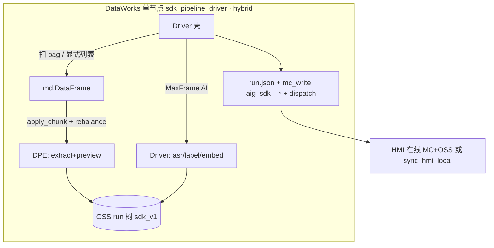

# SDK v1 上云全链 E2E Runbook（M9.3）

> **目标**：一次 DataWorks 运行后，OSS `clips/{clip_id}/runs/{run_id}/`（sdk_v1）、MaxCompute `aig_sdk__*`、`pipeline/dispatch/latest.json` 与 HMI（在线直读或 local sync）一致。  
> **验数脚本**：`pipeline/scripts/verify_sdk_v1_run.py`  
> **生产节点**：`pipeline/dataworks/bundled/sdk_pipeline_driver_node.py`（**hybrid**：DPE extract/preview + Driver AI）

---

## 1. 链路概览

**生产主路径（hybrid，2026-08-10 P2 已验证）**：一个 PyODPS3 节点 `sdk_pipeline_driver`。

| 层 | 职责 | 关键参数 |
|----|------|----------|
| DPE `apply_chunk` | `extract` + `preview`（无嵌套 MaxFrame AI） | `dpe_parallel`（如 4）+ `batch_rows=1` |
| Driver bare MaxFrame AI | `asr` / `label` / `embed` | `ai_media_mode=oss_url`、`asr_parallel_partitions` 等 |
| Driver 收尾 | 写回 jsonl、**`run.json`**、`mc_write`、`dispatch` | `stages` 含 `mc_write,dispatch`（upload 可选） |



**`stages` 约定**（逗号分隔）：`discover` | `extract` | `asr` | `preview` | `label` | `embed` | `upload` | `mc_write` | `dispatch`。  
全链示例：`stages=extract,preview,asr,label,embed,mc_write,dispatch`（见 `workflow-params-sdk-pipeline-p0.example`）。

> **冻结**：多节点 `sdk_extract` / `sdk_asr` / … 工作流仅紧急回退。见 `pipeline/dataworks/WORKFLOW.md`。

---

## 2. 前置

1. **DDL**：`py -3 pipeline/scripts/apply_mc_ddl.py`（`aig_sdk__` 表集，见 `pipeline/sql/maxcompute/aig_sdk__ddl.sql`）
2. **凭证**：仓库根 `.env`（OSS + ODPS）；`py -3 pipeline/scripts/sync_cloud_cli_config.py`
3. **预检**：`py -3 pipeline/scripts/e2e_precheck.py`
4. **DPE 镜像**：必装 `pip install 'oms-multimodal-sdk[mc]>=0.3.2'` + rosbags + ossfs2（见 `pipeline/docker/custom-dpe-image.md`）
5. **Bag**：OSS `rosbags/.../*.bag` 已存在，或由 Driver `discover` 扫描

---

## 3. DataWorks 工作流参数

节点代码：**整文件粘贴** 打包产物（含 helpers，勿只贴源文件）：

```powershell
py -3 pipeline\scripts\bundle_sdk_pipeline_driver.py
# → pipeline/dataworks/bundled/sdk_pipeline_driver_node.py
```

P0 参数模板：`pipeline/dataworks/workflow-params-sdk-pipeline-p0.example`。

### 3.1 必填 / 通用

| 参数 | 示例 | 说明 |
|------|------|------|
| `oss_bucket` | `rosbag-labels-bucket` | 业务桶 |
| `dpe_image` | `rosbag_sdk_dpe` | MC 登记的 DPE 镜像（含 `[mc]` SDK） |
| `oss_ram_role_arn` | `acs:ram::…:role/…` | `@with_fs_mount` |
| `stages` | （空=全开） | 逗号 stage 开关；见 §1 |
| `batch_rows` | `1` | `apply_chunk` 每 chunk 行数；**mc 探针建议 1** |
| `ds` | `20260803` | MC 分区 yyyyMMdd |
| `mount_path` | `/mnt/oss` | OSS 挂载点 |
| `cloud_region` | `cn_shanghai` | OSS/MC 区域 |

### 3.2 发现 / 调试

| 参数 | 说明 |
|------|------|
| `rosbags_prefix` | 默认 `rosbags/`；Driver 扫描 `**/*.bag` |
| `max_bags` | 发现上限；P1 建议 `1` |
| `bag_oss_key` + `clip_id` + `run_id` | 三者齐给则跳过扫描，只跑一行 |
| `bag_oss_keys` | 换行/逗号分隔 key 列表（骨架发现） |
| `force_rerun` | `true` 忽略「已有成功 run」跳过 |

### 3.3 模型与 extract

| 参数 | 默认 | 说明 |
|------|------|------|
| `model_backend` | `mc` | 主路径 MaxFrame modelset；探针失败可降级 `api` |
| `mc_modelset_project` | `bigdata_public_modelset` | |
| `mc_image_mode` | `base64` | UDF 内本地帧/音频 |
| `asr_model` / `omni_model` / `embedding_model` | 与本地联调一致 | |
| `embedding_dimension` | `1024` | embed `params.dimension` |
| `clip_min_sec` / `clip_max_sec` / `sample_fps` | `15` / `20` / `1` | extract |
| `dpe_cpu` / `dpe_memory_gb` | `4` / `16` | DPE 资源 |
| `cleanup_work` | `false` | 是否清理 `_sdk_work` |

### 3.4 `model_backend=api`（百炼降级）

| 参数 / Secret | 说明 |
|---------------|------|
| `model_backend=api` | DashScope ASR + Omni + embedding |
| `DASHSCOPE_API_KEY` | 节点 Secret |
| `DASHSCOPE_WORKSPACE_ID` | Omni MaaS 空间 |

### 3.5 `model_backend=mc`（推荐）

| 参数 | 说明 |
|------|------|
| `model_backend=mc` | UDF 内 `MODEL_BACKEND=mc`，嵌套 MaxFrame AI（**maxframe≥2.8.0**） |
| `odps_catalog_endpoint` | 可选；默认 Driver 调 `o.get_catalog_host()`，否则从 ODPS service endpoint 推导 |
| `mc_omni_fallback_model` | Omni 未上架前可选 VL 兜底，如 `qwen3.6-plus` |
| `MC_OMNI_NATIVE_MEDIA` | 默认 `true`；Omni：`cp.video` + `cp.audio` + `cp.text`（含 ASR） |
| `total_rpm_limit` / `request_timeout` | AI running_options（可选） |

Driver 日志关键字：`DISCOVERED_ROWS_JSON`、`Logview:`、`BATCH_SUMMARY_JSON`。

---

## 4. 探针与验收（smoke / P0 / P1 / P2）

设计来源：`docs/superpowers/specs/2026-08-04-sdk-single-driver-apply-chunk-design.md` §7。

| 层 | 配置 | 通过标准 | 耗时 |
|----|------|----------|------|
| **fast（推荐先做）** | `sdk_driver_fast_probe_node.py` + `workflow-params-sdk-fast.example` | `FAST_PROBE_RESULT` 含 `ok=true`；bag HeadObject 成功 | **约 30s–2 min** |
| **DPE smoke** | `sdk_dpe_smoke_node.py` | DPE 内 SDK import + 挂载读 bag | **常 5–15 min+**（冷启动） |
| **本机 DPE 探针** | `py -3.11 pipeline/scripts/probe_dpe_image_sdk.py --image rosbag_sdk_dpe` | `PROBE_RESULT ok=true` | 5–15 min |
| **P0 探针** | `sdk_pipeline_driver`：`stages=extract,asr` | OSS 有 `asr.jsonl` | **20–40+ min** |
| **P1 全链缩批** | stages 全开，`max_bags=1` | sdk_v1 run 树齐全；`verify_sdk_v1_run.py` exit 0 | 更长 |
| **P2 批量** | 多 bag，`dpe_parallel`≥行数；hybrid AI | 行级隔离；`BATCH_SUMMARY_JSON`；dispatch `items[]`；**2026-08-10 4-bag verify 18/18** | — |
| P3 HMI | 在线读 MC 或 sync | 总览/标签可用；preview 主观（H-2） | — |

**建议顺序**：**fast** →（可选本机或 DPE smoke 验镜像）→ **P0** extract+preview（或 extract+asr）→ **P1/P2 hybrid 全链**。

**P0/P2 混合路径要点**：`ai_submitter=driver`；Driver 写出 **`run.json`**（不必依赖 upload stage）；`ai_media_mode=oss_url`（需 `oss_vl_*`）；粘贴 **`pipeline/dataworks/bundled/sdk_pipeline_driver_node.py`**。

**P0 必过门禁（历史 mc-in-DPE 探针）**：若 stages 在 DPE 内跑 AI，需嵌套 MaxFrame + Catalog 内网 endpoint。**生产已改 hybrid**：AI 在 Driver，DPE 只做 extract/preview。

---

## 5. 本机验数（DataWorks 完成后）

```powershell
cd pipeline

# 全链 OSS + dispatch + MC
py -3 scripts\verify_sdk_v1_run.py `
  --clip-id sha256:YOUR_HEX `
  --run-id YOUR_RUN_UUID `
  --ds 20260803 `
  --json-report verify_sdk_v1_report.json

# 仅 OSS
py -3 scripts\verify_sdk_v1_run.py --clip-id ... --run-id ... --oss-only

# 同步 HMI local
py -3 hmi\scripts\sync_hmi_local.py --clip-id sha256:... --run-id ... --ds 20260803
```

**通过标准**：`verify_sdk_v1_run.py` exit 0；摘要行 `Summary: N/N passed`。

**MaxFrame 2.8 本机预检**（打 DPE 镜像前，无需 DataWorks）：

```powershell
cd pipeline/local_sdk_mc_test
py -3.11 run_mc_oss_verify.py              # SDK mc 阶段
py -3.11 run_mc_oss_verify.py --cloud-only # OSS + MC ingest + verify 18/18
```

期望 `asr.jsonl` → `mc_mode=content_part_audio`；`labels.jsonl` → `mc_mode=omni_native` 且 `mc_has_asr_in_text=true`。

### 检查项摘要

| 域 | 检查 |
|----|------|
| OSS | `run.json`、`labels.jsonl`、`fusion_embeddings.jsonl`、`clip_videos.jsonl`、`preview/audio.wav`、≥1 路 MP4 |
| dispatch | `latest.json` 的 clip_id/run_id/layout_version、items |
| MC | `dim_clip.active_run_id`、`pipeline_run`、五步 `pipeline_step`、`fact_clip_label/embedding`、`clip_parse_summary` |

---

## 6. HMI 确认（H-2）

**推荐：在线模式直读**（无需 A-C-3 sync）

1. 仓库根 `.env`：`OSS_BUCKET=rosbag-labels-pipeline-bucket2` + ODPS 凭证；`shared/config.yaml` → `cloud.maxcompute.table_prefix=aig_sdk__`
2. 启动：`cd hmi/backend && python run.py` · `cd hmi/frontend && npm run dev`
3. 侧栏点 **在线**（或 `HMI_DATA_SOURCE=cloud` 后重启）
4. 数据总览找 clip1：`sha256:9a4ac3a2704dd052630c9b3cd320760b9214febc22c53cf14b41b0806f4d81ed` / run `bb319286-3cad-4b56-93f9-32cc25329bb9`
5. 确认标签/ASR；preview MP4 主观 OK → 签 H-2

可选 sync 路径：`py -3 hmi/scripts/sync_hmi_local.py --clip-id … --run-id … --ds 20260810` 后用本地模式播放。

---

## 7. 故障排查

| 现象 | 方向 |
|------|------|
| P0 mc ASR 失败 | 查 DPE Logview；改 `model_backend=api` 或设 `MC_OMNI_FALLBACK_MODEL` |
| `apply_chunk` pickle 错 | UDF 禁止 `@dataclass`/自定义 class；跑 `check_dpe_nodes.py` |
| OSS preview MP4 缺失 | `stages` 含 `preview`；查 `_sdk_work` 与 `CLIP_VIDEO_ENABLED` |
| MC step 缺 `sdk_*` | Driver `mc_write` 未开或行 `ok=false`；查 ds 分区 |
| dispatch 不匹配 | 重跑含 `dispatch` stage；或 `publish_sdk_dispatch.py` |
| HMI 无标签 | `sync_hmi_local` + `ingest_sdk_run_local`；查 `labels.jsonl` |

---

## 8. 相关文档

- `docs/superpowers/specs/2026-08-04-sdk-single-driver-apply-chunk-design.md` — 单 Driver 设计
- `docs/sdk-first-pipeline-design.md` — OSS/MC 契约
- `pipeline/docker/custom-dpe-image.md` — DPE 镜像（`oms-multimodal-sdk[mc]`）
- `.cursor/skills/cloud-cli-ops/SKILL.md` — ossutil/odpscmd
- `project-management/acceptance/M9.3.md` — 验收表
