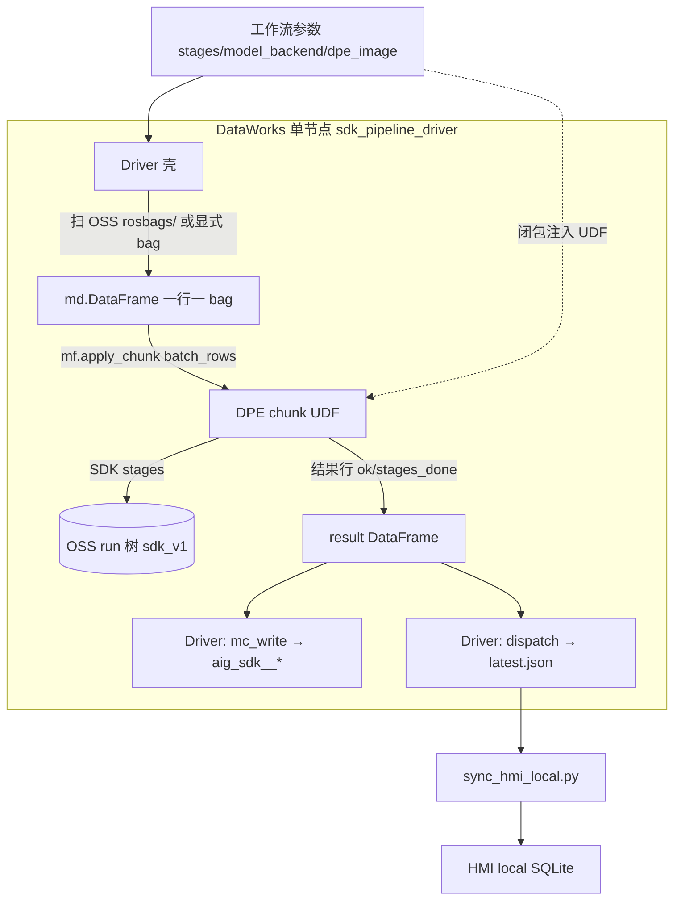

# SDK v1 上云全链 E2E Runbook（M9.3）

> **目标**：一次 DataWorks 运行后，OSS `clips/{clip_id}/runs/{run_id}/`（sdk_v1）、MaxCompute `aig_sdk__*`、`pipeline/dispatch/latest.json` 与 HMI local 一致。  
> **验数脚本**：`pipeline/scripts/verify_sdk_v1_run.py`  
> **推荐节点**：`pipeline/dataworks/sdk_pipeline_driver_node.py`（单 Driver + DPE `apply_chunk`）

---

## 1. 链路概览

**主路径**：一个 PyODPS3 节点 `sdk_pipeline_driver`。Driver 扫 bag → `mf.apply_chunk`（`batch_rows`）拉起 DPE chunk UDF → SDK 按 `stages` 写 OSS run 树 → Driver 收尾 `mc_write` + `dispatch`。



| 层 | 职责 | 产物 |
|----|------|------|
| Driver `discover` | 列举 bag、算 `clip_id`/`run_id`、建输入 DataFrame | `DISCOVERED_ROWS_JSON`（日志） |
| DPE UDF | 按 `stages` 调 SDK（extract/asr/preview/label/embed/upload） | OSS run 树、`asr.jsonl`、`labels.jsonl` 等 |
| Driver `mc_write` | 消费 `ok=true` 行，读 OSS jsonl 入库 | `aig_sdk__fact_*`、`pipeline_run`、`pipeline_step` |
| Driver `dispatch` | 写调度 manifest | `pipeline/dispatch/latest.json` |

**`stages` 约定**（逗号分隔，默认全开）：`discover` | `extract` | `asr` | `preview` | `label` | `embed` | `upload` | `mc_write` | `dispatch`。  
缩阶探针示例：`stages=extract,asr`（跳过 preview/label/embed 及 Driver 收尾）。

> **冻结**：多节点 `sdk_extract` / `sdk_asr` / … / `sdk_dispatch` 工作流仅作参考/紧急回退，新 run 勿再编排。见 `pipeline/dataworks/WORKFLOW.md`。

---

## 2. 前置

1. **DDL**：`py -3 pipeline/scripts/apply_mc_ddl.py`（`aig_sdk__` 表集，见 `pipeline/sql/maxcompute/aig_sdk__ddl.sql`）
2. **凭证**：仓库根 `.env`（OSS + ODPS）；`py -3 pipeline/scripts/sync_cloud_cli_config.py`
3. **预检**：`py -3 pipeline/scripts/e2e_precheck.py`
4. **DPE 镜像**：必装 `pip install 'oms-multimodal-sdk[mc]>=0.3.2'` + rosbags + ossfs2（见 `pipeline/docker/custom-dpe-image.md`）
5. **Bag**：OSS `rosbags/.../*.bag` 已存在，或由 Driver `discover` 扫描

---

## 3. DataWorks 工作流参数

节点代码：**整文件粘贴** `pipeline/dataworks/sdk_pipeline_driver_node.py`。

### 3.1 必填 / 通用

| 参数 | 示例 | 说明 |
|------|------|------|
| `oss_bucket` | `rosbag-labels-bucket` | 业务桶 |
| `dpe_image` | `rosbag_sdk_dpe` | MC 登记的 DPE 镜像（含 `[mc]` SDK） |
| `oss_ram_role_arn` | `acs:ram::…:role/…` | `@with_fs_mount` |
| `stages` | （空=全开） | 逗号 stage 开关；见 §1 |
| `batch_rows` | `1` | `apply_chunk` 每 chunk 行数；**mc 探针建议 1** |
| `ds` | `20260803` | MC 分区 yyyyMMdd |
| `mount_path` | `/mnt/oss` | OSS 挂载点 |
| `cloud_region` | `cn_shanghai` | OSS/MC 区域 |

### 3.2 发现 / 调试

| 参数 | 说明 |
|------|------|
| `rosbags_prefix` | 默认 `rosbags/`；Driver 扫描 `**/*.bag` |
| `max_bags` | 发现上限；P1 建议 `1` |
| `bag_oss_key` + `clip_id` + `run_id` | 三者齐给则跳过扫描，只跑一行 |
| `bag_oss_keys` | 换行/逗号分隔 key 列表（骨架发现） |
| `force_rerun` | `true` 忽略「已有成功 run」跳过 |

### 3.3 模型与 extract

| 参数 | 默认 | 说明 |
|------|------|------|
| `model_backend` | `mc` | 主路径 MaxFrame modelset；探针失败可降级 `api` |
| `mc_modelset_project` | `bigdata_public_modelset` | |
| `mc_image_mode` | `base64` | UDF 内本地帧/音频 |
| `asr_model` / `omni_model` / `embedding_model` | 与本地联调一致 | |
| `embedding_dimension` | `1024` | embed `params.dimension` |
| `clip_min_sec` / `clip_max_sec` / `sample_fps` | `15` / `20` / `1` | extract |
| `dpe_cpu` / `dpe_memory_gb` | `4` / `16` | DPE 资源 |
| `cleanup_work` | `false` | 是否清理 `_sdk_work` |

### 3.4 `model_backend=api`（百炼降级）

| 参数 / Secret | 说明 |
|---------------|------|
| `model_backend=api` | DashScope ASR + Omni + embedding |
| `DASHSCOPE_API_KEY` | 节点 Secret |
| `DASHSCOPE_WORKSPACE_ID` | Omni MaaS 空间 |

### 3.5 `model_backend=mc`（推荐）

| 参数 | 说明 |
|------|------|
| `model_backend=mc` | UDF 内 `MODEL_BACKEND=mc`，嵌套 MaxFrame AI |
| `mc_omni_fallback_model` | Omni 未上架前必填，如 `qwen3.6-plus` |
| `total_rpm_limit` / `request_timeout` | AI running_options（可选） |

Driver 日志关键字：`DISCOVERED_ROWS_JSON`、`Logview:`、`BATCH_SUMMARY_JSON`。

---

## 4. 探针与验收（P0 / P1 / P2）

设计来源：`docs/superpowers/specs/2026-08-04-sdk-single-driver-apply-chunk-design.md` §7。

| 层 | 配置 | 通过标准 |
|----|------|----------|
| **P0 探针** | `stages=extract,asr`，`batch_rows=1`，1 bag | UDF 内 mc ASR 成功；OSS 有 `asr.jsonl` |
| **P1 全链缩批** | stages 全开，`max_bags=1` | sdk_v1 run 树齐全；`verify_sdk_v1_run.py` exit 0 |
| **P2 批量** | 多 bag，`batch_rows`≥1 | 行级隔离（单 bag 失败不拖垮批）；`BATCH_SUMMARY_JSON` 计数正确；dispatch 含 `items[]` |
| P3 HMI | P1/P2 后 sync | 时间轴 / 标签 / 相似可用（H-2） |

**P0 必过门禁**：DPE Worker 内嵌套 MaxFrame AI（`MODEL_BACKEND=mc`）。失败时同节点改 `model_backend=api`，不回退多节点工作流。

---

## 5. 本机验数（DataWorks 完成后）

```powershell
cd pipeline

# 全链 OSS + dispatch + MC
py -3 scripts\verify_sdk_v1_run.py `
  --clip-id sha256:YOUR_HEX `
  --run-id YOUR_RUN_UUID `
  --ds 20260803 `
  --json-report verify_sdk_v1_report.json

# 仅 OSS
py -3 scripts\verify_sdk_v1_run.py --clip-id ... --run-id ... --oss-only

# 同步 HMI local
py -3 hmi\scripts\sync_hmi_local.py --clip-id sha256:... --run-id ... --ds 20260803
```

**通过标准**：`verify_sdk_v1_run.py` exit 0；摘要行 `Summary: N/N passed`。

### 检查项摘要

| 域 | 检查 |
|----|------|
| OSS | `run.json`、`labels.jsonl`、`fusion_embeddings.jsonl`、`clip_videos.jsonl`、`preview/audio.wav`、≥1 路 MP4 |
| dispatch | `latest.json` 的 clip_id/run_id/layout_version、items |
| MC | `dim_clip.active_run_id`、`pipeline_run`、五步 `pipeline_step`、`fact_clip_label/embedding`、`clip_parse_summary` |

---

## 6. HMI 人工确认（H-2）

1. 启动 HMI local：`hmi/` 栈按 `hmi-web-stack.mdc`
2. 打开对应 clip 时间轴：preview 可播、标签/ASR 可见
3. 管线总览五步均为 success/completed

---

## 7. 故障排查

| 现象 | 方向 |
|------|------|
| P0 mc ASR 失败 | 查 DPE Logview；改 `model_backend=api` 或设 `MC_OMNI_FALLBACK_MODEL` |
| `apply_chunk` pickle 错 | UDF 禁止 `@dataclass`/自定义 class；跑 `check_dpe_nodes.py` |
| OSS preview MP4 缺失 | `stages` 含 `preview`；查 `_sdk_work` 与 `CLIP_VIDEO_ENABLED` |
| MC step 缺 `sdk_*` | Driver `mc_write` 未开或行 `ok=false`；查 ds 分区 |
| dispatch 不匹配 | 重跑含 `dispatch` stage；或 `publish_sdk_dispatch.py` |
| HMI 无标签 | `sync_hmi_local` + `ingest_sdk_run_local`；查 `labels.jsonl` |

---

## 8. 相关文档

- `docs/superpowers/specs/2026-08-04-sdk-single-driver-apply-chunk-design.md` — 单 Driver 设计
- `docs/sdk-first-pipeline-design.md` — OSS/MC 契约
- `pipeline/docker/custom-dpe-image.md` — DPE 镜像（`oms-multimodal-sdk[mc]`）
- `.cursor/skills/cloud-cli-ops/SKILL.md` — ossutil/odpscmd
- `project-management/acceptance/M9.3.md` — 验收表
