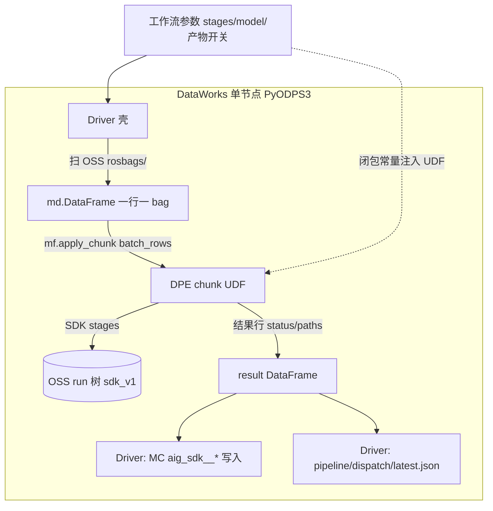

# Design: SDK 单 Driver + DPE `apply_chunk` 全链

> 日期：2026-08-04  
> 状态：draft（待实现计划）  
> 取代：多节点 `sdk_*` / `sdk_*_dpe` 工作流编排作为**推荐主路径**

---

## 1. 背景与目标

### 1.1 问题

当前 DataWorks 侧按能力拆成多个 PyODPS 节点（extract / asr / preview / label / embed / upload / mc_write / dispatch），依赖 OSS/JSON **节点间中间产物**传参。运维成本高，且与「SDK 已具备原子能力 + `MODEL_BACKEND=mc`」重复。

### 1.2 目标

| 项 | 约定 |
|----|------|
| DataWorks | **仅一个** PyODPS3 节点作为 Driver 壳 |
| 计算 | Driver `new_session` → `DataFrame.mf.apply_chunk` 拉起 DPE |
| 业务 | Chunk UDF 内用 **OMS Multimodal SDK** 执行管线 |
| 模型 | UDF 内 `MODEL_BACKEND=mc`（MaxFrame AI / public modelset） |
| 终点 | OSS sdk_v1 run 树 + MC `aig_sdk__*` + `pipeline/dispatch/latest.json` |
| 传参 | Driver 工作流参数 → 闭包注入 UDF；**无**多节点 staging JSON 依赖 |
| 可控 | `stages=` 逗号开关，缩阶探针与排障 |

### 1.3 非目标

- 多 PyODPS 节点工作流作为主路径
- 节点间用 PyODPS 输出参数传递 `clip_id` / `run_id`
- clip-omni v2 / `aig_rosbag__` 新写入
- 默认在 UDF 内写 MaxCompute（Driver 收尾写 MC；若后续探针证明可行可后移）

---

## 2. 决策摘要

| 决策点 | 选择 |
|--------|------|
| 交付范围 | **C**：OSS + MC + dispatch |
| 输入规模 | **C**：Driver 扫 OSS 发现 bag，再 `apply_chunk` 批跑 |
| Chunk API | MaxFrame `df.mf.apply_chunk`（显式 `batch_rows` / `dtypes` / `output_type`） |
| AI 位置 | **B**：UDF 内 `MODEL_BACKEND=mc`（嵌套 MaxFrame AI，需探针） |
| 落地形态 | **C**：完整 Driver 壳 + `stages` 可开关 |
| 编排形态 | **方案 1**：一行一 bag，单次（逻辑上）`apply_chunk` 调 SDK |

参考文档：[MaxFrame apply_chunk 用法实践](https://www.alibabacloud.com/help/zh/maxcompute/user-guide/maxframe-apply-chunk-operator-usage-practice)

---

## 3. 总体架构



### 3.1 职责切分

| 层 | 做什么 | 不做什么 |
|----|--------|----------|
| **Driver** | 读 `args`；发现 bag→算 `clip_id`/`run_id`；`new_session`；`apply_chunk`；按结果写 MC + dispatch；打印摘要 | 不跑重解析/AI；不依赖多节点 staging JSON |
| **Chunk UDF** | 挂载读 bag；按 `stages` 调 SDK；写 OSS run 产物；返回轻量状态行 | 不定义 dataclass；不跨 chunk 传大文件 |
| **SDK** | extract/asr/preview/label/embed/upload；`OutputConfig` 控制文件；`MODEL_BACKEND=mc` | 不感知 DataWorks 节点拓扑 |

### 3.2 `stages` 约定

逗号分隔，大小写不敏感。合法值：

`discover` | `extract` | `asr` | `preview` | `label` | `embed` | `upload` | `mc_write` | `dispatch`

| Stage | 执行位置 |
|-------|----------|
| `discover` | Driver only |
| `extract` … `upload` | DPE chunk UDF + SDK |
| `mc_write` / `dispatch` | Driver only（消费 UDF 结果行） |

默认：全部开启。缩阶示例：`stages=extract,asr`。

---

## 4. Driver 参数契约

### 4.1 工作流参数

| 参数 | 必填 | 默认 | 说明 |
|------|------|------|------|
| `oss_bucket` | 是 | — | 业务桶 |
| `cloud_region` | 否 | `cn_shanghai` | OSS/MC 区域 |
| `dpe_image` | 是 | — | DPE 镜像（含 `oms-multimodal-sdk[mc]` + rosbags） |
| `oss_ram_role_arn` | 是 | — | `@with_fs_mount` |
| `mount_path` | 否 | `/mnt/oss` | 挂载点 |
| `rosbags_prefix` | 否 | `rosbags/` | 发现扫描前缀 |
| `stages` | 否 | 全开 | 见 §3.2 |
| `batch_rows` | 否 | `1` | `apply_chunk` 每 chunk 最大行数（mc 建议先 1） |
| `model_backend` | 否 | `mc` | 主路径 `mc`；探针失败可降级 `api` |
| `mc_modelset_project` | 否 | `bigdata_public_modelset` | |
| `mc_image_mode` | 否 | `base64` | UDF 内本地帧/音频 |
| `asr_model` / `omni_model` / `embedding_model` | 否 | 与本地联调一致 | |
| `embedding_dimension` | 否 | `1024` | embed `params.dimension` |
| `clip_min_sec` / `clip_max_sec` / `sample_fps` | 否 | `15` / `20` / `1` | extract |
| `ds` | 否 | 当天 UTC `yyyyMMdd` | MC 分区 |
| `max_bags` | 否 | 空=不限 | 发现上限 |
| `force_rerun` | 否 | `false` | 忽略「已有成功 run」跳过 |
| `cleanup_work` | 否 | `false` | 是否清理 `_sdk_work` |

### 4.2 发现规则（Driver）

1. 列举 `oss://{bucket}/{rosbags_prefix}**/*.bag`（含 `uploads/{upload_run_id}/`）。
2. 对每个 bag：内容 hash → `clip_id=sha256:{hex}`；记录 `bag_oss_key`；生成 `run_id=uuid4`。
3. `force_rerun=false` 时：若 MC `aig_sdk__dim_clip` 已有且对应 active run 已完成 → 跳过。
4. 调试捷径：args 直接提供 `bag_oss_key` + `clip_id` + `run_id` → 跳过扫描，只跑一行。

发现结果进入内存 `md.DataFrame`。可选写 OSS `pipeline/discover/latest.json` **仅审计**，下游不得依赖该文件。

### 4.3 `apply_chunk` 输入列

| 列 | 类型 | 含义 |
|----|------|------|
| `clip_id` | string | `sha256:…` |
| `run_id` | string | 本 run |
| `bag_oss_key` | string | 桶内相对 key |
| `run_relpath` | string | `clips/{clip_id}/runs/{run_id}` |
| `ds` | string | 分区日 |

`stages`、模型名、`mount_path` 等经 **闭包常量** 注入 UDF，不进 DataFrame。

### 4.4 `apply_chunk` 输出列

| 列 | 类型 | 含义 |
|----|------|------|
| `clip_id` / `run_id` / `bag_oss_key` | string | 回传 |
| `ok` | bool | 本行是否成功 |
| `error` | string | 失败信息（截断） |
| `stages_done` | string | 实际完成的 stage 列表 |
| `run_relpath` | string | OSS run 前缀 |
| `labels_relpath` / `embeddings_relpath` / `videos_relpath` | string | 供 Driver `mc_write` |
| `preview_ok` | bool | preview 是否落盘 |

调用约定：

- `output_type="dataframe"`
- 显式 `dtypes`（`.copy()` 或新建，勿原地改坏输入 dtypes）
- `skip_infer=True`
- UDF 只返回内置类型；**禁止** `@dataclass` / 自定义 class（DPE pickle）

### 4.5 Driver 收尾

1. 过滤 `ok=true`。
2. 读 OSS jsonl（挂载或 SDK 读）→ 写 `aig_sdk__*`、`pipeline_run`、`pipeline_step`。
3. 写 `pipeline/dispatch/latest.json`（可含本批 `items[]`，兼容 HMI sync）。
4. 打印 `BATCH_SUMMARY_JSON={...}`。

---

## 5. UDF 内 SDK 行为

### 5.1 Stage 顺序

```text
mount 读 bag
  → extract   → clips_index / _sdk_work / clip_videos.jsonl
  → asr       → asr.jsonl
  → preview   → preview/*.mp4 + audio.wav
  → label     → labels.jsonl
  → embed     → fusion_embeddings.jsonl
  → upload    → run 树确认落盘 + run.json
  → return 状态行
```

实现：优先复用原子 API（`extract_clips` / `transcribe_clips` / `materialize_preview` / `label_clips` / `embed_clips`）。全开时可包 `run_stages(ctx, bag, stages=…)`；`process_bag` / `infer_full` 可作为「全开」快捷路径，但必须能被 `stages` 切开。

### 5.2 OSS 产物（sdk_v1）

路径：`clips/{clip_id}/runs/{run_id}/`

| 文件 | Stage |
|------|--------|
| `clips_index.jsonl` | extract（内部） |
| `clip_videos.jsonl` | extract |
| `asr.jsonl` | asr |
| `labels.jsonl` | label |
| `fusion_embeddings.jsonl` | embed |
| `preview/*` | preview |
| `run.json` | upload（`layout_version=sdk_v1`） |

`_sdk_work/` 可留在挂载盘；**不是**节点间传参介质。

### 5.3 `MODEL_BACKEND=mc` 嵌套约束

| 约束 | 要求 |
|------|------|
| Session | 每行 `client.close()`；`finally` 必达 |
| 媒体 | `mc_image_mode=base64` |
| ASR | `qwen3-asr-flash` → `read_odps_model`（public modelset） |
| Label | JSON prompt 花括号转义为 `{{` / `}}` |
| Embed | `params={enable_fusion: true, dimension: N}` |
| Pickle | 闭包仅 str/int/float/dict/list |
| 资源 | `@with_running_options`；默认 `batch_rows=1` |

**已知风险**：DPE Worker 内再调 MaxFrame AI 尚未生产验证。失败时同节点降级 `model_backend=api`，不回退多节点工作流。

### 5.4 失败与重试

| 策略 | 行为 |
|------|------|
| 行级隔离 | 单 bag 异常 → `ok=false` + `error`，同 chunk 其他行继续 |
| 入库门禁 | `mc_write` / `dispatch` 只处理 `ok=true` |
| 重跑 | 新 `run_id`，或 `force_rerun=true` |
| 可观测 | UDF `print(..., flush=True)`；Driver `BATCH_SUMMARY_JSON` |

---

## 6. SDK / 仓库改动面

| 项 | 说明 |
|----|------|
| `pipeline/dataworks/sdk_pipeline_driver_node.py` | **唯一**推荐云上业务节点 |
| SDK `run_stages`（或等价） | 按 stages 编排原子能力 |
| SDK `write_run_json` | sdk_v1 元数据 |
| DPE 镜像文档 | 必装 `oms-multimodal-sdk[mc]` + rosbags |
| `docs/sdk-v1-cloud-e2e-runbook.md` | 改写为单节点 + stages |
| `verify_sdk_v1_run.py` | 继续作验数，不绑旧节点名 |

### 6.1 旧资产处置

| 资产 | 处置 |
|------|------|
| `sdk_extract/asr/preview/label/embed(_dpe)_node.py` | 冻结：参考 / 紧急回退 |
| `sdk_infer_node.py` | 保留无 DPE 对照；云上主路径改为本 Driver |
| Job0–4 / `aig_rosbag__` | 不改；新 run 只走 `aig_sdk__` + sdk_v1 |
| `pipeline/dispatch/latest.json` | 保留，兼容 HMI |

---

## 7. 测试与验收

| 层 | 内容 | 通过标准 |
|----|------|----------|
| P0 探针 | `stages=extract,asr`，`batch_rows=1`，1 bag | UDF 内 mc ASR 成功；`asr.jsonl` 在 OSS |
| P1 全链缩批 | stages 全开，`max_bags=1` | sdk_v1 齐全；`verify_sdk_v1_run.py` pass |
| P2 批量 | 多 bag | 行级隔离；summary 计数对；dispatch 含 items |
| P3 HMI | sync 后打开 | 时间轴 / 标签 / 相似可用 |

本机 `pipeline/local_sdk_mc_test`：继续回归 SDK/mc 客户端，**不**替代 DPE 嵌套探针。

### 7.1 成功定义

一个 DataWorks PyODPS3 节点：发现 bag → `apply_chunk`（UDF + SDK + mc）→ OSS sdk_v1 → Driver 写 MC + dispatch；`stages` 可缩阶；验数脚本与 HMI 可消费。

---

## 8. 实现顺序（建议）

1. SDK：`run_stages` + `write_run_json`（本地可测）
2. Driver 骨架：discover → 空 UDF echo → summary
3. P0：UDF 内 extract + mc asr
4. 补齐 preview/label/embed/upload
5. Driver `mc_write` + `dispatch`
6. 更新 runbook + P1/P2 验数
7. 冻结旧多节点文档入口

---

## 9. 开放风险

1. **mc-in-DPE**：Worker 内 MaxFrame AI session/引擎是否接受——P0 必过门禁。
2. **每行 session 成本**：若过重，需探索 Worker 内复用 ODPS/session（以探针为准）。
3. **镜像体积**：`[mc]` + rosbags + 依赖需固化进 DPE 镜像，与 Driver 镜像分离。

---

## 10. 批准记录

| 章节 | 状态 |
|------|------|
| §1 架构 | 已确认（会话 2026-08-04） |
| §2 参数 / 发现 / chunk I/O | 已确认 |
| §3 UDF / mc / 失败 | 已确认 |
| §4 测试 / 旧链路 | 已确认 |
| 本文档 | 待用户审阅后进入 writing-plans |
