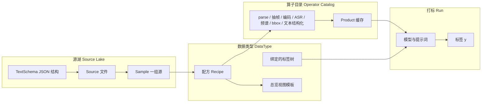

# Design: 平台底座 · 数据类型内核

> 日期：2026-08-18（修订 2026-08-20 · Sample 内部化 / 槽位 / 开跑多选 / 血缘）  
> 状态：implemented-slice-1 + DOC-DTYPE-SLOTS / PLAT-LAKE-RUN-BIND / PLAT-PRODUCT-LINEAGE  
> 定位：平台从「舱内 OMS 专用管线」升级为「可注册数据类型的数据管理 + 预处理 + AI 打标底座」  
> 第一切片：**源湖 + 算子/产物缓存 + 数据类型配方**；用现有 **OMS/DMS** 做真配方，用 **车机 UI** 做占位配方证明可插拔（占位不要求业务跑通）

---

## 1. 背景与目标

### 1.1 问题

当前产品能力围着 **一条舱内多模管线** 转：rosbag（及后来补上的 video/audio/text）→ CapabilityPlanner 按「有没有这种模态」门控 → OMS 标签树 → clip 检索/校核。

缺的不是某个检测器，而是：

1. **源** 与 **用途** 绑死。同一批文件不能先入库、再按不同业务类型各打一遍。
2. **数据类型** 不是一等公民。舱内 OMS 写在代码和页面里，车机 UI + bbox 这类新场景无法「注册配方」接入。
3. **预处理** 由模态有无决定，而不是由「这个类型需要产物做到哪一步」决定。
4. **标签树** 是平台真值，但没有「一类型一棵树」的硬绑定；检索也未按类型分频道。

### 1.2 目标

平台提供底座能力，业务以 **数据类型（DataType）** 做模块化扩展：

| 层 | 能力 |
|----|------|
| 导入 | rosbag / 视频 / 图片 / 音频 / 文本 自由组合进入 **源湖**（与类型无关） |
| 预处理 | 按 **算子目录** 执行；产物入缓存，下游仍视为数据源 |
| 类型 | 用配方描述：用途、负责人、需要哪些产物及预处理深度、绑定的标签树、管线编排、总览展示 |
| 打标 | 选类型 → 配模型/提示词等 → 对已入库源做预处理 + AI 打标 |
| 检索/展示 | **进入某个数据类型工作区** 后再检索；不与其他类型混结果 |
| 校核 | 仍在类型工作区内，对应该类型绑定的标签树 |

### 1.3 非目标（本设计 / 第一切片）

- 用百炼 VL 替代 OpenCV / YOLO COCO 打 bbox
- 第一切片实现完整「车机 UI」业务（只注册占位配方）
- 新预处理算子（CAN/LIN 专用解析器、自定义热加载 Python 插件）
- 改写 DataWorks / MaxFrame 云端节点（第一切片本地 HMI + SDK）
- 多租户、SSO
- 训练任务调度

---

## 2. 已拍板决策

| ID | 决策点 | 选择 |
|----|--------|------|
| D1 | 第一验证切片 | 底座内核 + 第二个类型一起证明可插拔；第二类型先占位 |
| D2 | 可插拔层级 | **算子用代码注册**；**数据类型是配方**（JSON/库表）。新类型只组合已有算子则不发版；新算子才发版 |
| D3 | 源与类型何时绑定 | **源先进湖**；打标时再选类型；同一批源可被多种类型各跑一遍 |
| D4 | 标签树 | **一种数据类型绑定一棵标签树**（树可版本升级）；该类型的打标/校核/检索的 y 都以这棵树为准 |
| D5 | 落地架构 | **三层**：源湖 + 算子/产物缓存 + 数据类型配方。Sample = 湖里一组源的**内部实例**（开跑时由多选自动创建；UI 不手搓「组 Sample」） |
| D9 | 源列表展示 | **按 `collection_id`（采集批/上传会话）分组展示**；同批**不**自动绑定为 Sample |
| D10 | 开跑绑定 | 选 published DataType → 按配方槽位/kinds **筛合格源** → 用户**多选** → 服务端自动 `create_sample` + `create_run` |
| D11 | 产物血缘 | Product 记录 `input_ids`（source 或上游 product）+ `op_id` + params；提供 lineage 查询 API |
| D6 | 检索 IA | **数据类型工作区**：总览 + 检索 + 校核都在该类型下；换类型 = 换频道 |
| D7 | BBox 产品路径 | OpenCV Haar + YOLO COCO；配方里声明需不需要 bbox、用哪个已注册检测算子 |
| D8 | 第一切片范围 | 配方结构 + 校验 + OMS 真映射 + IVI 占位配方（能看、能开跑预检；不要求业务效果） |

---

## 3. 总体架构



### 3.1 三层职责

| 层 | 做什么 | 不做什么 |
|----|--------|----------|
| **源湖** | 存原始文件、kind、内容哈希、文本结构 id；把文件组成 Sample | 不假设用途；不写 OMS 专用字段当主键 |
| **算子 + 产物** | 对源（或上游产物）做预处理；按 `(inputs, op, params)` 缓存 | 不读 DataType 业务含义；失败只报算子错误 |
| **数据类型配方** | 声明需要哪些源/产物、预处理深度、管线阶段、bbox、标签树、工作区视图 | 不内嵌新 Python；不能引用未注册算子或未注册视图 |

### 3.2 核心实体

| 实体 | 含义 | 标识 |
|------|------|------|
| **Source** | 一条原始文件 | `source_id = sha256(content)`；`kind ∈ {rosbag, video, image, audio, text}` |
| **TextSchema** | 文本「真实类型」的 JSON 结构（CAN、LIN、控制器日志、通用 JSON…） | `schema_id`；第一切片只要求文本落成 JSON + 挂 schema，不做专用解析器 |
| **Sample** | 一次多模样本：湖中一组 Source 的引用 | `sample_id`（新建 UUID）；**同一 Source 可属于多个 Sample** |
| **Product** | 算子输出（帧、wav、asr.jsonl、mel 矩阵、bboxes.jsonl、preview.mp4…） | `product_id`；缓存键 `hash(input_ids + op_id + canonical_params)` |
| **Operator** | 代码注册的预处理/检测能力 | `op_id`；带输入 kind、输出产物类型、参数 schema |
| **DataType** | 抽象数据组合 + 治理信息 + 配方 | `data_type_id`；绑定恰好一棵 taxonomy |
| **Run** | 对一批 Sample 应用某 DataType + AI 参数 | `run_id`；产出 y 挂 `data_type_id` + `taxonomy_version_id` |
| **ViewTemplate** | 工作区总览的展示模板（代码注册，配方只填 id） | 如 `cabin_timeline`、`frame_gallery_bbox`、`audio_spec_asr`、`json_tree` |

现有 **clip** 的兼容含义：一条「单 rosbag 的 Sample」，`sample_id` 对外仍可等于历史上的 `clip_id`（bag 内容哈希）。多源样本使用新 UUID，不伪造 bag hash。

---

## 4. 数据类型配方

配方是平台扩展的唯一配置面（管理员可写 JSON / 表单，后端校验后入库）。

### 4.1 描述信息

| 字段 | 说明 |
|------|------|
| `id` / `title` | 稳定 id + 展示名 |
| `purpose` | 这批数据用来做什么 |
| `owner` | 负责人（账号 id 或显示名；第一切片可字符串） |
| `taxonomy_id` | 绑定的标签树（一类型一棵；发布版本在 run 上钉死 `taxonomy_version_id`） |
| `overview_view` | `ViewTemplate` id |
| `status` | `draft` \| `published`；仅 published 可开打标 |

### 4.2 输入与预处理深度

配方声明 **需要哪些输入** 以及 **每种输入要做到哪一步**。校验器对照算子目录，禁止引用未知 `op_id`。

语义：

- `required`：缺了则 **预检失败，不能开跑**
- `optional`：没有对应源则 **跳过该算子**，不失败
- 产物既可以被后续算子消费，也可以作为工作区展示输入

第一切片内置算子（均已有或可薄封装现有 SDK 能力）：

| `op_id` | 输入 | 产物 | 备注 |
|---------|------|------|------|
| `parse_bag` | rosbag | 帧、音频、topic 文本等 | 现有 extract |
| `extract_frames` | video | 帧 | 现有 ingest/抽帧 |
| `encode_preview` | 连续帧 / 图 | preview mp4 | 现有 encode；已有成片则跳过 |
| `transcribe` | audio | asr.jsonl | 现有 ASR；无人声策略由参数决定，默认仍跑 |
| `mel_spectrogram` | audio | 频谱图 + 矩阵文本 | 现有 SDK 能力，配方可选 |
| `text_to_json` | text | 结构化 JSON | 第一切片：已是 JSON 则校验 schema；否则包一层 `{raw: ...}` |
| `detect_bbox` | 帧 | bboxes.jsonl | OpenCV 或 YOLO COCO，由配方/run 参数选后端 |

### 4.3 管线编排

在预处理之后的 AI 阶段也由配方声明，run 时只允许改 **参数**（模型名、提示词、阈值），不能改配方没开放的阶段。

| 字段 | 说明 |
|------|------|
| `stages.label` | 是否打标；提示词模板 key、默认模型 |
| `stages.embed` | 是否向量化 |
| `bbox.enabled` | 是否需要 bbox |
| `bbox.detector` | `opencv` \| `yolo`（不得出现 `vl`） |
| `bbox.yolo_classes` | YOLO 时的 COCO 类别约束（可空 = 全部） |

`CapabilityPlanner` 的职责变为：**把「配方 + 本 Sample 实际源形状 + run 参数」编译成已排序算子列表**。模态有无仍作安全网（无音频绝不 ASR），但 **主开关是配方，不是「检测到有视频」**。

### 4.4 内置两条配方

**`oms_cabin`（真类型）**

- 用途：舱内 OMS/DMS 多模场景
- 输入：优先 rosbag；或 video+audio 组合；文本可选
- 预处理：parse 或抽帧 + 预览编码 + ASR（有音频时）+ 可选 bbox + 可选梅尔
- 打标/向量：现有 Omni + embed
- 标签树：现有 OMS taxonomy
- 视图：`cabin_timeline`（当前 Explorer）

**`ivi_ui_stub`（占位类型）**

- 用途：车机 UI 带 bbox 的占位，证明第二类型可注册、可预检、可进独立工作区
- 输入：`video` 或 `image` 至少一种为 required；rosbag/音频非必须
- 预处理：抽帧或用已有帧 + `detect_bbox`（默认 opencv 或 yolo，产品默认仍 opencv）
- 打标：配方可声明 `label` 为 optional/stub；第一切片允许预检通过后只跑预处理+bbox，label 可关
- 标签树：单独一棵占位树（不得复用 OMS 树，以满足 D4）
- 视图：`frame_gallery_bbox`

---

## 5. 主流程

### 5.1 入库（无类型）

1. 用户上传任意组合的源文件 → Source Lake（按内容哈希去重）。
2. 同一次「入湖」写入相同 `collection_id`（采集批）；列表按批分组展示，**不因同批自动绑 Sample**。
3. `kind=text` 时必须选择 `TextSchema`（第一切片提供 `generic_json` 与 `generic_text`）。
4. **Sample 不是用户主路径**：仅作为开跑时服务端自动创建的绑定实体（仍可多对多；单 bag 兼容 `sample_id = clip_id`）。

### 5.2 开打标（此时才选类型）

1. 选择 **published** DataType。
2. 系统按配方 `slots` / `require_any_kinds` 筛出合格源（仍按 `collection_id` 分组展示）。
3. 用户**多选**合格源 → 预检（缺槽位则失败，不静默）→ 服务端自动 `create_sample` + `create_run`。
4. 用户配置该配方开放的 AI/检测参数（若有）。
5. 执行：
   - 对每个算子查 Product 缓存；命中则跳过
   - 未命中则跑算子，写入产物（含血缘：`input_ids` → `op_id` → product）
   - 按配方跑 label/embed
6. y 写入 `(sample_id, run_id, data_type_id, taxonomy_version_id)`。同一批源换成 `ivi_ui_stub` 再跑，是 **另一条 Run**，不覆盖 OMS 的 y。

### 5.2.1 配方槽位（`slots`）

配方除 `require_any_kinds`（兼容预检）外声明 `slots`：

| 字段 | 说明 |
|------|------|
| `id` | 槽位 id（如 `audio_primary`） |
| `kinds` | 可填入该槽的 source kind 列表（槽内 OR） |
| `cardinality_min` / `cardinality_max` | 数量约束 |
| `role` | 可选角色标签 |
| `required` | 缺则预检失败 |

种子：`audio_array_spec` 单槽 audio；`ivi_ui_stub` 单槽 video\|image；`oms_cabin` 多候选槽对齐 `require_any_kinds`。

完整「新建 DataType」可视化编辑器（UI-DTYPE-EDITOR）后置；种子配方写死 slots。

### 5.3 工作区（总览 / 检索 / 校核）

进入平台后先选 **数据类型**，之后：

- 总览用该类型的 `overview_view`
- 检索只查该类型下的 Sample/Run/标签（**禁止跨类型混合命中**）
- 校核只编辑该类型绑定树上的 y

换类型 = 换工作区，不是在同一页加筛选项。

### 5.4 失败与缓存

| 情况 | 行为 |
|------|------|
| 保存配方引用未知算子/视图/树 | 拒绝保存 |
| 开跑预检失败 | 不创建执行中的 Run（可留 draft 任务） |
| 某算子失败 | Run = failed，记录 `op_id` + 错误；已成功产物保留可复用 |
| 源文件被替换 | 新 `source_id`；旧产物缓存键不命中，自动重算 |
| 标签树升级 | 新 Run 钉新 `taxonomy_version_id`；已校核记录保留原版本（沿用现 PRD R10 精神） |

---

## 6. 与现有系统兼容

| 现有概念 | 新模型中的位置 |
|----------|----------------|
| 上传 .bag / 原始媒体 | Source Lake |
| `clip_id`（bag hash） | 单 bag Sample 的 `sample_id` |
| `run_id` + sdk_v1 产物目录 | Run + Product 缓存（可仍落在 `clips/{id}/runs/{run_id}/` 作为物理布局） |
| `CapabilityPlanner` + `source_manifest` | 配方编译器的实现细节；manifest 可继续作为 Sample 的源清单 |
| OMS taxonomy Hub | `oms_cabin.taxonomy_id` |
| Explorer / 校核 / Dataset | **OMS 工作区**内保留；Dataset 后续导出带 `data_type_id` |
| HMI pipeline settings | 归属「开跑参数」，且必须先有 DataType；设置项按配方过滤 |
| 云端 `aig_sdk__*` | 第一切片不改表；后续加 `data_type_id` 再迁 |

明确不做：把所有历史检索入口改成「全局混合搜」。旧 `/search` 在过渡期可重定向到 `oms_cabin` 工作区检索。

---

## 7. 第一切片范围

### 7.1 In

- Source / Sample / DataType / Run 的本地持久化（HMI 应用库）
- 算子目录 API（列出已注册 op + 参数 schema）
- 配方 JSON 校验 + 两条种子：`oms_cabin`、`ivi_ui_stub`
- 占位标签树 `ivi_ui_stub`（最小节点即可）
- 开跑预检 + 产物缓存键
- 数据类型工作区壳：进入类型 → 总览模板切换 + 检索隔离（OMS 接现有检索；IVI 可空结果）
- 管线执行：OMS 走现有 SDK；IVI 占位跑通预检，执行路径允许「只预处理+bbox / 关 label」

### 7.2 Out

- IVI 真实业务标签与专用检测模型
- 文本专用解析器、运营侧「零发版」新算子
- 云端 DataWorks 改造
- VL bbox
- 为每个类型手写一套全新检索后端（第一切片：隔离查询维度 + 工作区路由；OMS 复用现索引）

### 7.3 验收切片（方向，计划阶段再拆工单）

| ID | 标准 |
|----|------|
| A1 | 管理员可发布 `ivi_ui_stub` 配方；引用未知算子被拒 |
| A2 | 同一组源可先 OMS 跑、再 IVI 预检/跑，两条 Run、两棵树、互不覆盖 y |
| A3 | 缺 required 源时 IVI 或 OMS 预检失败且提示明确 |
| A4 | 进入 IVI 工作区检索不到 OMS 标签；进入 OMS 工作区行为与现网一致（不退化） |
| A5 | Product 缓存命中时第二跑跳过已完成算子（日志或计数可观察） |

---

## 8. 测试最低集

- 配方 schema：缺 `taxonomy_id` / 非法 `op_id` / 非法 `overview_view` 失败
- 预检：仅文本 Sample 开 `oms_cabin` 失败；仅图片 Sample 开 `ivi_ui_stub` 通过
- 双类型：同一 Sample 两次 Run，y 分库/分文档且带不同 `data_type_id`
- 工作区：API 不带 `data_type_id` 不得返回跨类型检索命中
- 回归：现有 `tests.test_planner` 与 OMS 本地 bbox/settings 用例在 `oms_cabin` 映射下仍通过

---

## 9. 开放问题（不阻塞第一切片）

| ID | 问题 | 默认（未另拍板则按此） |
|----|------|------------------------|
| O1 | Sample 是否允许跨用户共享源 | 单租户，全部可见 |
| O2 | 工作区顶栏是类型下拉还是列表页再进入 | 先列表再进入工作区 |
| O3 | 云端表加 `data_type_id` 的里程碑 | 本地内核之后单独工单 |
| O4 | 连续图片「是否编码视频」默认 | 由配方 `encode_preview` required/optional 决定 |

---

## 10. 权威关系

后续实现说明与工单服从：

```text
本 spec + 未来平台 PRD 修订  >  docs/mN-implementation-notes.md  >  CURRENT.md
```

现有 `docs/prd-rosbag-labels.md` 仍约束账号/校核/Dataset；**数据类型内核**是底座增量。若与「平台仅 OMS clip」的隐含假设冲突，以本 spec 的 D3/D4/D6 为准，并在修订 PRD 时写回。
