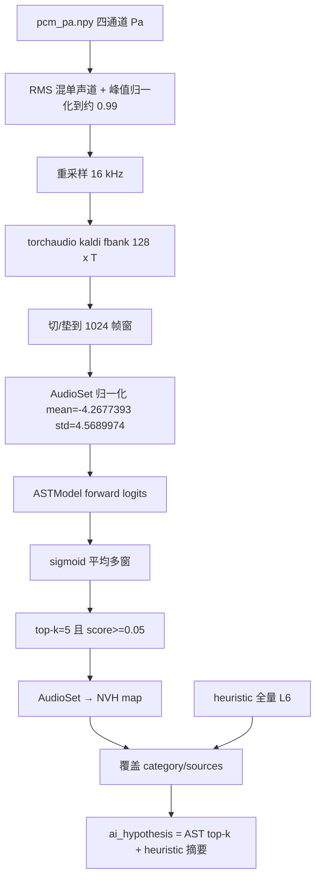

# Design: 麦克风阵列 L6 语义 · AST AudioSet 预训练推理

> 日期：2026-08-21  
> 状态：implemented  
> 工单：`PLAT-AUDIO-AST-LABEL`  
> 参考： [YuanGongND/ast](https://github.com/YuanGongND/ast)（Interspeech 2021 AST）；现有权重 `pytorch_model.bin`（HF 键名，527 类 AudioSet 头）

---

## 1. 背景与目标

麦克风阵列类型 `audio_array_spec` 的 L6 语义目前由 `nvh_sem_heuristic`（规则）填写，可选 `nvh_sem_vl`（DashScope）。用户提供的本地权重是 MIT AST / AudioSet-527 预训练模型（约 86.6M，分类头 `classifier.dense` = 527）。

**目标：** 用这份预训练权重做本地推理，把 AudioSet top-k 事件映射到 `nvh.sem.noise_category` / `nvh.sem.noise_sources`；`quality_grade` / annoyance / spec_* 仍走 heuristic；`ai_hypothesis` 写出事件名和分数。

### 1.1 非目标

- 微调 / 训练 AST
- 用 AST 替换客观 deriver（SPL / 1/3 倍频程 / tonality）
- 用 AST 填 `quality_grade`、`spec_compliance`、烦扰度
- 打开 `stages.embed` 或改 DataWorks
- **publish** `audio_nvh-v2`
- 把 330MB 权重复制进 git

---

## 2. 决策摘要

| ID | 决策点 | 选择 |
|----|--------|------|
| D1 | 模型实现 | Vendor Gong `ASTModel` 架构与 forward（cls+dist 平均 → mlp_head）；**不**走 `ASTForAudioClassification` 推理路径 |
| D2 | 权重 | 使用现有 HF 格式 `pytorch_model.bin`，加载前 remap 成 Gong / timm DeiT 键名（含 q/k/v → fused `qkv`） |
| D3 | 预处理 | 照抄 `dataloader.py`：16 kHz、Kaldi fbank 128 bin、25 ms / 10 ms、pad/cut 1024、`(x - mean) / (std * 2)`，AudioSet mean/std |
| D4 | 四通道 | v1 混成单声道（RMS 平均）后再推理 |
| D5 | 长录音 | 非重叠 10.24 s 窗，sigmoid 概率对窗平均 |
| D6 | L6 写入 | AST 只覆盖 `noise_category` + `noise_sources`；其余语义字段用 heuristic；hypothesis 合并两边 |
| D7 | 失败 | 缺 torch / timm / 权重 / 推理异常 → 整段回退 heuristic（`ai_mode=heuristic_fallback`） |
| D8 | 配方 | `audio_array_spec.stages.label.model = nvh_sem_ast` |
| D9 | 权重落盘 | `HMI_NVH_AST_WEIGHTS` 或默认 `hmi/data/models/ast/pytorch_model.bin`（gitignore） |

---

## 3. 数据流



PCM 是声压（Pa），AudioSet 训练波形约在 `[-1, 1]`。混音后必须峰值归一化，再送 Kaldi fbank；禁止把本管线 64-bin Mel 矩阵直接喂 AST。

---

## 4. 权重键 remap

HF 键（本文件实测）→ Gong `ASTModel`（无 `DataParallel` 前缀）：

| HF | Gong / timm |
|----|-------------|
| `audio_spectrogram_transformer.embeddings.cls_token` | `v.cls_token` |
| `...distillation_token` | `v.dist_token` |
| `...position_embeddings` | `v.pos_embed` |
| `...patch_embeddings.projection.{weight,bias}` | `v.patch_embed.proj.{weight,bias}` |
| `...encoder.layer.i.layernorm_before` | `v.blocks.i.norm1` |
| `...attention.attention.{query,key,value}` | concat dim0 → `v.blocks.i.attn.qkv` |
| `...attention.output.dense` | `v.blocks.i.attn.proj` |
| `...layernorm_after` | `v.blocks.i.norm2` |
| `...intermediate.dense` | `v.blocks.i.mlp.fc1` |
| `...output.dense`（encoder 层） | `v.blocks.i.mlp.fc2` |
| `audio_spectrogram_transformer.layernorm` | `v.norm` |
| `classifier.layernorm` | `mlp_head.0` |
| `classifier.dense` | `mlp_head.1` |

加载：`ASTModel(label_dim=527, fstride=10, tstride=10, input_fdim=128, input_tdim=1024, imagenet_pretrain=False, audioset_pretrain=False)`，再 `load_state_dict(remapped, strict=True)`。禁止走 Gong 源码里的 Dropbox `wget` 下载。

`timm==0.4.5` 与 `torchaudio` 放在可选依赖 `hmi/backend/requirements-nvh-ast.txt`，不写入默认 `hmi/backend/requirements.txt`。未安装时回退 heuristic。

---

## 5. AudioSet → NVH 映射

`noise_category` 取 top-k 中 **分数最高且已映射** 的一类（叶 id，与 heuristic 相同：可用 `engine` 而非必须 `powertrain`）。

`noise_sources` 为闭集多选：`engine | tire | aero | fan | compressor | bearing | panel_rattle | road_texture | exhaust | inverter | other`。由 top-k 映射并去重；若空则保留 heuristic 的 sources。

阈值：sigmoid ≥ 0.05，k = 5。若无一映射类过阈 → category 用 heuristic，hypothesis 仍写出 AST top-k。

### 5.1 category 映射（按 AudioSet display_name）

| NVH category | AudioSet 名称（含子串匹配的以表为准，精确名优先） |
|--------------|--------------------------------------------------|
| engine | Engine; Light engine (high frequency); Medium engine (mid frequency); Heavy engine (low frequency); Engine knocking; Engine starting; Idling; Accelerating, revving, vroom |
| road | Traffic noise, roadway noise; Tire squeal; Skidding; Car passing by; Car; Motor vehicle (road); Truck; Motorcycle; Bus |
| wind | Wind; Wind noise (microphone); Rustling leaves; Whoosh, swoosh, swish |
| brake | Air brake |
| hvac | Air conditioning; Mechanical fan; Hair dryer |
| electrical | Mains hum; Hum; Beep, bleep; Buzzer; Static; Distortion |
| structure | Gears; Mechanisms; Creak; Squeak; Clatter; Rattle; Vibration; Scratch; Scrape |
| impulse | Slam; Bang; Thump, thud; Boom; Knock; Burst, pop; Breaking; Shatter |
| speech | Speech; Male speech, man speaking; Female speech, woman speaking; Child speech, kid speaking; Conversation; Narration, monologue; Whispering; Shout |
| media | Music; Radio; Television; Singing; Soundtrack music; Background music |
| tonal | Sine wave; Harmonic; Whistle; Siren; Alarm |
| broadband | Noise; Environmental noise; White noise; Pink noise; Cacophony |

未列出的 527 类不参与 category 竞争（仍可出现在 hypothesis）。

### 5.2 sources 映射

| NVH source | AudioSet 名称 |
|------------|----------------|
| engine | 同 category=engine 的类 |
| tire | Tire squeal; Skidding |
| road_texture | Traffic noise, roadway noise; Car passing by |
| aero | Wind; Wind noise (microphone); Whoosh, swoosh, swish |
| fan | Mechanical fan; Air conditioning; Hair dryer |
| panel_rattle | Rattle; Creak; Squeak; Vibration; Clatter |
| inverter | Mains hum; Hum |
| other | Speech / Music / 其它已映射 category 但无专用 source 的类 |

---

## 6. `ai_hypothesis` 格式

单行可检索摘要，例如：

```text
ast:nvh_sem_ast top5: Engine=0.81; Idling=0.44; Vehicle=0.31 → category=engine sources=[engine] | heuristic: leq=94.5dB quality=C
```

`_meta.ai_model=nvh_sem_ast`，`_meta.ai_mode=ast`（成功）或 `heuristic_fallback`。

---

## 7. 模块边界

| 单元 | 职责 |
|------|------|
| `hmi/backend/hmi/local/nvh_ast/labels.py` | 527 display_name；AudioSet→NVH map；top-k → semantic patch |
| `hmi/backend/hmi/local/nvh_ast/remap.py` | HF state_dict → ASTModel keys |
| `hmi/backend/hmi/local/nvh_ast/model.py` | 加载权重、vendor ASTModel、无下载 |
| `hmi/backend/hmi/local/nvh_ast/infer.py` | PCM→fbank→logits→probs |
| `nvh_ai_label.fill_nvh_semantic_labels` | `model=nvh_sem_ast` 时调用；失败回退 |

客观键仍由现有 `merge_nvh_semantic_labels` 保护。

---

## 8. 测试与验收

- 纯函数：映射表、top-k patch、hypothesis 字符串；不覆盖 `nvh.clip.*`
- remap：用合成 HF 风格小 dict 或真实 bin 的 key 集合，断言目标键含 `v.cls_token` / `v.blocks.0.attn.qkv.weight` / `mlp_head.1.weight`，qkv 第一维=2304
- `fill_nvh_semantic_labels(..., model="nvh_sem_ast")`：mock 推理，category/sources 来自 AST，quality_grade 来自 heuristic
- 无权重时回退 heuristic，不抛
- 配方 seed `model=nvh_sem_ast`
- 不要求 Playwright（无新 UI）；A-E2E 可省略或标 N/A

---

## 9. 约束

- 本地 HMI worker only；不改 DataWorks / MC
- 勿 publish `audio_nvh-v2`
- 权重 gitignore；文档说明从 Downloads 拷贝
- 默认 HMI 依赖不强制 torchaudio/timm
