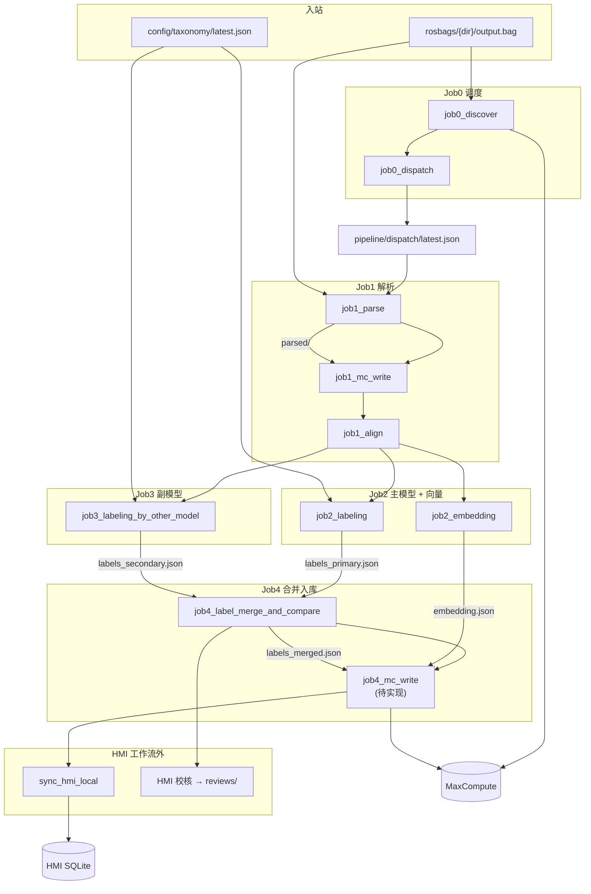
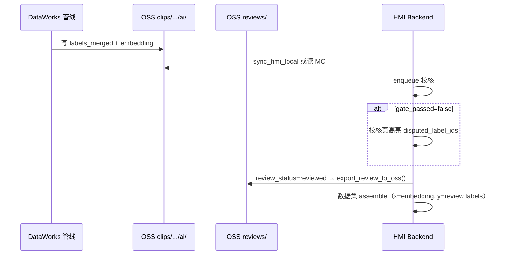

# Rosbag → Labels 管线开发手册（clip-omni v2）

> **读者**：DataWorks / MaxFrame 管线开发、联调、运维同事  
> **版本**：clip-omni v2 · 2026-07  
> **仓库路径**：monorepo 根 · 本文件位于 `pipeline/dataworks/`

---

## 目录

1. [30 秒速览](#1-30-秒速览)
2. [设计目标与约束](#2-设计目标与约束)
3. [架构总览](#3-架构总览)
4. [节点清单（开发必读）](#4-节点清单开发必读)
5. [OSS 存储约定](#5-oss-存储约定)
6. [MaxCompute 表](#6-maxcompute-表)
7. [调度与参数传递](#7-调度与参数传递)
8. [双模型合并逻辑（job4）](#8-双模型合并逻辑job4)
9. [DataWorks 部署指南](#9-dataworks-部署指南)
10. [工作流参数模板](#10-工作流参数模板)
11. [本地开发与 Mock](#11-本地开发与-mock)
12. [验收与排错](#12-验收与排错)
13. [与 HMI 的边界](#13-与-hmi-的边界)
14. [实现状态与待办](#14-实现状态与待办)
15. [代码地图](#15-代码地图)
16. [附录：Legacy 十节点](#16-附录legacy-十节点)

---

## 1. 30 秒速览

| 项 | 值 |
|----|-----|
| 管线版本 | `clip_omni_v2` |
| OSS 桶 | `rosbag-labels-pipeline-bucket2` |
| MC 项目 | `rogbag_label_pipline` |
| 表前缀 | `aig_rosbag__` |
| 节点数 | 10（9 已实现 stub/骨架 + 1 待实现 mc_write） |
| dispatch 完成判定 | 6 个 `pipeline_step` 均为 `completed` |
| 运行时 | MaxFrame + 自定义 DPE 镜像 + PyODPS3 粘贴节点 |

**一句话**：扫描 OSS bag → 解析对齐 → **主/副两路 AI 打标** → 比对合并 → 写向量 →（待实现）写 MC → HMI 人工校核 export 到 `reviews/`。

---

## 2. 设计目标与约束

### 2.1 目标

将车载/机器人 **ROS bag** 批处理为 **clip 级** 训练资产：

- **解析**：四路相机、音频、事件 → 统一时间轴
- **AI**：双模型整 clip 打标 + clip 向量
- **合并**：一致率门控；争议字段留空待人工
- **校核**：HMI 修订后 export，作为训练 **标签（y）**；embedding 作为 **特征（x）**

### 2.2 硬约束（违反会导致 HMI/导出异常）

| 约束 | 说明 |
|------|------|
| **内容寻址** | `clip_id = sha256:{hex}`，由 bag 内容 hash 决定，与目录名无关 |
| **Run 版本化** | 每次 pipeline 一个 UUID `run_id`；`dim_clip.active_run_id` 指向生效 run |
| **AI / 人工分离** | 管线 **只写** `clips/.../ai/`；人工 **只写** 顶层 `reviews/clips/.../` |
| **OSS 为算子总线** | 节点间通过 OSS 文件交换；MC 存索引与 clip 级事实 |
| **Dispatch 桥接** | 定时任务不写节点上下文；用 `pipeline/dispatch/latest.json` 传 `clip_id`/`run_id` |
| **MaxFrame 强制** | DPE 节点必须走 MaxFrame + 登记镜像；见 `.cursor/rules/maxframe-dpe-cloud.mdc` |

### 2.3 v2 相对 v1（`job2_clip_omni`）的变化

| v1（已废弃） | v2（当前） |
|--------------|------------|
| 单体 `job2_clip_omni` 一次出 labels + embedding | 拆为 `job2_labeling` + `job2_embedding` + `job3` + `job4` |
| 单文件 `ai/labels.json` | `labels_primary/secondary/merged.json` + `consensus_meta.json` |
| dispatch 3 步 | dispatch **6 步** |
| 无模型间比对 | job4 双模型 merge + `gate_passed` |

`job2_clip_omni_node.py` 已 deprecated，调用会直接 exit。

---

## 3. 架构总览

### 3.1 端到端流程



### 3.2 并行与串行

| 关系 | 节点 |
|------|------|
| **可并行**（前提：`aligned/` 已存在） | `job2_labeling` ∥ `job2_embedding` ∥ `job3_labeling_by_other_model` |
| **必须串行** | `job4_label_merge_and_compare` 需等 **两个打标** 完成 |
| **必须串行** | `job4_mc_write` 需等 **job4 合并 + embedding** |

**首次联调推荐全串行**（便于看日志）：

```
job0_discover → job0_dispatch
  → job1_parse → job1_mc_write → job1_align
  → job2_labeling → job2_embedding → job3_labeling_by_other_model
  → job4_label_merge_and_compare → job4_mc_write
```

---

## 4. 节点清单（开发必读）

### 4.1 总表

| 节点 | 引擎 | 源文件 | 读 | 写 OSS | 写 MC |
|------|------|--------|-----|--------|-------|
| `job0_discover` | DPE | `job0_discover_node.py` | `rosbags/` | — | `dim_clip` |
| `job0_dispatch` | Driver | `job0_dispatch_node.py` | MC | `pipeline/dispatch/latest.json` | — |
| `job1_parse` | DPE | `job1_parse_node.py` | bag | `parsed/` | — |
| `job1_mc_write` | Driver+DPE | `job1_mc_write_node.py` | `parsed/job1_mc_payload.json` | — | frame/audio/event + `pipeline_step(job1_parse)` |
| `job1_align` | Driver/DPE | `job1_align_node.py` | `parsed/` | `aligned/timeline.json`, `sync_manifest.jsonl` | `pipeline_step(job1_align)` |
| `job2_labeling` | DPE+AI | `job2_labeling_node.py` | `aligned/` + taxonomy | `ai/labels_primary.json` | `pipeline_step(job2_labeling)` |
| `job2_embedding` | DPE+AI | `job2_embedding_node.py` | `aligned/` | `ai/embedding.json` | `pipeline_step(job2_embedding)` |
| `job3_labeling_by_other_model` | DPE+AI | `job3_labeling_by_other_model_node.py` | `aligned/` + taxonomy | `ai/labels_secondary.json` | `pipeline_step(job3_labeling_by_other_model)` |
| `job4_label_merge_and_compare` | Driver | `job4_label_merge_and_compare_node.py` | primary + secondary | merged + consensus + labels 别名 | `pipeline_step(job4_label_merge_and_compare)` |
| `job4_mc_write` | Driver | **待实现 v2** | `ai/labels_merged.json`, `embedding.json` | — | `fact_clip_label`, `fact_clip_embedding` |

> ⚠️ 仓库内现有 `job4_mc_write_node.py` 是 **Legacy 帧级 embed** 写 MC，**不能**直接用于 v2。

### 4.2 dispatch 六步（`REQUIRED_PIPELINE_STEPS`）

定义于 `pipeline/dataworks/pipeline_dispatch.py`：

```
job1_parse
job1_align
job2_labeling
job2_embedding
job3_labeling_by_other_model
job4_label_merge_and_compare
```

六步均为 `completed` 时，`job0_dispatch` 跳过该 clip 的 `active_run_id`。

### 4.3 各节点执行前提

| 节点 | 前提 |
|------|------|
| job0_discover | OSS `rosbags/` 有新 `.bag`；clip 未入库或需重新发现 |
| job0_dispatch | discover 完成；MC 有待处理 clip |
| job1_parse | dispatch `action=run` **或** 节点手写 `clip_id`+`run_id` |
| job1_mc_write | `job1_parse` 成功，`parsed/job1_mc_payload.json` 存在 |
| job1_align | `parsed/` 存在 |
| job2_labeling / job2_embedding / job3 | `aligned/` 存在 |
| job4_label_merge_and_compare | `labels_primary.json` **且** `labels_secondary.json` 均存在 |
| job4_mc_write | job4 合并 + embedding 均完成 |

### 4.4 idle 行为

- `job0_dispatch` 无待处理 clip → 写 manifest `action=idle`
- 下游节点调用 `exit_if_pipeline_idle()` → **no-op 成功退出**（非失败）
- 日志关键字：`PIPELINE_IDLE`

---

## 5. OSS 存储约定

### 5.1 目录树

```
rosbag-labels-pipeline-bucket2/
├── rosbags/{clip_dir_name}/output.bag       ← Job0 扫描 / Job1 读（不拷贝）
├── config/taxonomy/
│   ├── latest.json                          ← dispatch 附带指针
│   └── v*.yaml                              ← HMI 发布的 taxonomy
├── pipeline/dispatch/latest.json            ← Job0 dispatch 写，Job1~4 读
├── clips/{clip_id}/runs/{run_id}/
│   ├── parsed/                              ← Job1 parse
│   │   ├── manifest.json
│   │   ├── events.jsonl
│   │   ├── output/images/...
│   │   └── job1_mc_payload.json
│   ├── aligned/                             ← Job1 align
│   │   ├── timeline.json
│   │   └── sync_manifest.jsonl
│   └── ai/                                  ← Job2~4（管线专属，禁止写 reviews）
│       ├── labels_primary.json              ← job2_labeling
│       ├── labels_secondary.json            ← job3
│       ├── labels_merged.json               ← job4（HMI 主读）
│       ├── consensus_meta.json              ← job4 争议元数据
│       ├── labels.json                      ← job4 别名（内容同 merged）
│       └── embedding.json                   ← job2_embedding
├── reviews/clips/{clip_id}/runs/{run_id}/   ← **仅 HMI 写**（桶顶层）
│   ├── labels.json
│   └── meta.json
├── datasets/{snapshot_id}/                  ← 训练集 export
└── legacy/                                  ← 旧版 job2/3/4 归档
```

`clip_id` 中的 `:` 在 `reviews/` 路径中替换为 `__`（见 `hmi/backend/hmi/oss_layout.py` → `review_labels_key()`）。

### 5.2 关键 JSON 结构

#### `ai/labels_primary.json` / `labels_secondary.json`

```json
{
  "clip_id": "sha256:...",
  "run_id": "00000000-0001-4000-8000-000000000001",
  "label_source": "ai",
  "label_role": "primary",
  "model_version": "stub-v1",
  "labels_json": {
    "L1.1.day_period": "morning",
    "L1.1.is_holiday": false
  },
  "created_at": "2026-07-22T07:00:00+00:00"
}
```

`labels_json` 也支持 OMS 嵌套格式 `{ "values": { "L1.1.xxx": { "value": ... } } }`，合并逻辑会自动 flatten。

#### `ai/labels_merged.json`

```json
{
  "clip_id": "sha256:...",
  "run_id": "...",
  "label_source": "ai_merged",
  "labels_json": { "L1.1.day_period": "morning" },
  "multi_ai_meta": { "...": "见 §8" },
  "gate_passed": false,
  "clip_agreement": 0.5,
  "agreement_threshold": 0.7,
  "created_at": "..."
}
```

#### `ai/embedding.json`

```json
{
  "clip_id": "sha256:...",
  "run_id": "...",
  "dim": 768,
  "model_version": "stub-v1",
  "aggregation_method": "clip_omni",
  "vector": [0.1, 0.2, ...],
  "created_at": "..."
}
```

#### `pipeline/dispatch/latest.json`

```json
{
  "action": "run",
  "reason": "new_run",
  "clip_id": "sha256:...",
  "run_id": "00000000-0001-4000-8000-000000000001",
  "clip_dir_name": "demo_morning_city",
  "bag_oss_key": "rosbags/demo_morning_city/output.bag",
  "pipeline_version": "clip_omni_v2",
  "taxonomy_version_id": "...",
  "taxonomy_oss_key": "config/taxonomy/latest.json",
  "dispatched_at": "2026-07-22T07:00:00Z"
}
```

---

## 6. MaxCompute 表

**项目**：`rogbag_label_pipline` · **DDL**：`pipeline/sql/maxcompute/aig_rosbag__ddl.sql` · **分区**：`ds=yyyyMMdd`

| 表 | 写入方 | 用途 |
|----|--------|------|
| `dim_clip` | Job0 discover / Job1 mc_write | clip 维度、`bag_oss_key`、`active_run_id` |
| `pipeline_run` | Job1 mc_write | run 生命周期 |
| `pipeline_step` | 各 step 节点 | v2 六步状态（dispatch 去重） |
| `fact_frame` | Job1 mc_write | 解析帧 |
| `fact_audio_chunk` | Job1 mc_write | 音频块 |
| `fact_event` | Job1 mc_write | 事件 |
| `fact_clip_label` | job4_mc_write（待实现） | clip 级 AI/合并标签 |
| `fact_clip_embedding` | job4_mc_write（待实现） | clip 级向量 |

### dim_clip 状态机

| `active_run_id` | 含义 |
|-----------------|------|
| `NULL` | Job0 已发现，待 Job1 |
| 非空 UUID | Job1 mc_write 完成，当前生效 run |

### 验收 SQL

```sql
SELECT step_id, status
FROM aig_rosbag__pipeline_step
WHERE run_id = '<uuid>' AND ds = '${bizdate}'
ORDER BY step_id;

-- 期望六步：
-- job1_parse, job1_align, job2_labeling, job2_embedding,
-- job3_labeling_by_other_model, job4_label_merge_and_compare
```

---

## 7. 调度与参数传递

### 7.1 为什么用 OSS manifest

PyODPS3 **无法**把运行时计算的 `clip_id` 写到「本节点输出参数」；下游 `SKYNET_TASK_INPUT` 会一直是 `${clip_id}` 字面量。  
因此全版本 DataWorks 统一用 OSS `pipeline/dispatch/latest.json` 桥接。

### 7.2 参数来源优先级

所有节点 `get_arg(name)` 合并顺序：

1. DataWorks **节点参数**（PyODPS `args` 字典）
2. `SKYNET_ARGS` / 环境变量
3. 代码内 `_PROJECT_DEFAULTS`

### 7.3 clip_id / run_id 解析流程

函数：`resolve_pipeline_context()`（`pipeline/dataworks/pipeline_dispatch.py`）

```
节点启动
  → 节点参数 action=idle? → 跳过
  → 节点参数有 clip_id?   → 用手写参数（单 clip 调试）
  → 否则读 OSS dispatch/latest.json
      → action=run  → 继续
      → action=idle → PIPELINE_IDLE 退出
```

### 7.4 两种运行模式

| 模式 | 配置 | 适用 |
|------|------|------|
| **定时任务（推荐）** | 工作流级 `clip_id`/`run_id` **留空** | 生产调度 |
| **单 clip 调试** | 节点参数手写 `clip_id`/`run_id`/`bag_oss_key` | 联调 / 补数据 |

### 7.5 dispatch 去重逻辑

`pick_dispatch_target()` 遍历 `dim_clip`：

- 若 `active_run_id` 对应 run 的 v2 **六步**均已 `completed` → 跳过
- 否则 `action=run`，`reason=new_run` 或 `resume_incomplete`

---

## 8. 双模型合并逻辑（job4）

**实现**：`pipeline/dataworks/label_merge.py`（HMI 侧镜像：`hmi/backend/hmi/label_merge.py`）  
**配置**：`shared/shared/config.yaml` → `cloud.job4_label_merge_and_compare.agreement_threshold`（默认 `0.7`）

### 8.1 规则

```
clip_agreement = 一致字段数 / 可比对字段数

gate_passed = (clip_agreement >= threshold)

对每个 label_id：
  - 两模型一致           → merged 取该值，status=unanimous
  - 不一致 + gate_passed → merged 取 primary（job2），status=majority
  - 不一致 + gate_failed → merged 留空（None），status=split，needs_review=true
```

冲突优先级：**primary（job2_labeling）> secondary（job3）**，但仅当 gate 通过时才会写入冲突值。

### 8.2 输出字段

| 文件 | 关键字段 |
|------|----------|
| `labels_merged.json` | `labels_json`, `gate_passed`, `clip_agreement`, `multi_ai_meta` |
| `consensus_meta.json` | `disputed_label_ids`, `gate_passed`, `multi_ai_meta` |

### 8.3 Demo 场景（mock 脚本内置）

| clip | gate | 行为 |
|------|------|------|
| `demo_morning_city` | ❌ fail | primary=morning, secondary=afternoon → `day_period` 留空 |
| `demo_holiday_mall` | ❌ fail | `is_holiday` 分歧 → 该字段留空 |
| `demo_afternoon_park` | ✅ pass | 双模型完全一致 |
| `demo_night_highway` | ✅ pass | 已人工校核 |
| `demo_unlabeled` | n/a | 仅 `parsed/` + `aligned/`，无 `ai/` |

---

## 9. DataWorks 部署指南

### 9.1 工作流连线

```
job0_discover → job0_dispatch
  → job1_parse → job1_mc_write → job1_align
  → job2_labeling ──┐
  → job2_embedding ─┼→ job4_label_merge_and_compare → job4_mc_write
  → job3_labeling_by_other_model ─┘
```

### 9.2 生成粘贴包

```bash
# 全部 bundled 节点
py -3 pipeline/scripts/bundle_all_dataworks.py

# 含 dispatch 依赖的节点（推荐）
py -3 pipeline/scripts/bundle_pipeline_dispatch.py dataworks/job0_dispatch_node.py
py -3 pipeline/scripts/bundle_pipeline_dispatch.py dataworks/job1_align_node.py
py -3 pipeline/scripts/bundle_pipeline_dispatch.py dataworks/job2_labeling_node.py
py -3 pipeline/scripts/bundle_pipeline_dispatch.py dataworks/job2_embedding_node.py
py -3 pipeline/scripts/bundle_pipeline_dispatch.py dataworks/job3_labeling_by_other_model_node.py
py -3 pipeline/scripts/bundle_pipeline_dispatch.py dataworks/job4_label_merge_and_compare_node.py
```

粘贴 **`pipeline/dataworks/bundled/`** 下对应整文件到 PyODPS3 节点。

### 9.3 镜像与 RAM

| 项 | 值 |
|----|-----|
| DPE 镜像 | `sq_maxframe`（MC 镜像管理登记名） |
| RAM 角色 | `acs:ram::<账号ID>:role/<角色名>`，信任 `odps.aliyuncs.com` |
| 挂载路径 | `/mnt/oss`（默认） |
| 推荐资源 | Job1 解析：4C/16G；写 MC：1C/4G |

### 9.4 工作流参数必配项

若日志出现 `SKYNET_ARGS=` 为空且报 `Missing required parameter: oss_bucket`，说明节点未收到工作流参数。

| 参数名 | 参数值 |
|--------|--------|
| `oss_bucket` | `rosbag-labels-pipeline-bucket2` |
| `cloud_region` | `cn_shanghai` |
| `pipeline_version` | `clip_omni_v2` |
| `table_prefix` | `aig_rosbag__` |
| `scan_prefix` | `rosbags/` |
| `oss_ram_role_arn` | 你的 RAM role ARN |
| `ds` | `${bizdate}` |

完整模板见 [§10](#10-工作流参数模板) 或 `pipeline/dataworks/workflow-params.example`。

### 9.5 不要做的事

- ❌ 配置 job0_dispatch「本节点输出参数」传 clip_id
- ❌ 在 AI 节点写 `reviews/`
- ❌ 使用 deprecated 的 `job2_clip_omni_node.py`
- ❌ 把 legacy 的 `job4_mc_write_node.py` 当 v2 终点节点

---

## 10. 工作流参数模板

复制到 DataWorks 工作流「参数」面板（参数名 / 参数值分两列）：

```properties
# === 全局 ===
oss_bucket=rosbag-labels-pipeline-bucket2
cloud_region=cn_shanghai
table_prefix=aig_rosbag__
pipeline_version=clip_omni_v2
dispatch_oss_key=pipeline/dispatch/latest.json
scan_prefix=rosbags/
clip_id_format=sha256:{hex}
oss_ram_role_arn=acs:ram::<账号ID>:role/<角色名>
oss_mount_prefix=
oss_prefix_template=clips/{clip_id}/
oss_runs_subdir=runs/{run_id}/
dpe_image=sq_maxframe
dpe_mount_path=/mnt/oss
dpe_cpu=4
dpe_memory_gb=16
ds=${bizdate}

# === Job2 主模型 ===
label_taxonomy_oss_key=config/taxonomy/latest.json
primary_model=
primary_model_version=

# === Job2 向量 ===
embed_model=
embed_model_version=
embedding_dim=768

# === Job3 副模型 ===
secondary_model=
secondary_model_version=

# === Job4 合并 ===
agreement_threshold=0.7

# === MaxFrame AI（模型非空时生效）===
ai_modelset_project=bigdata_public_modelset
ai_cu_quota_name=
ai_gu_quota_name=
ai_parallel_partitions=4
ai_memory=8G
total_rpm_limit=12000
request_timeout=300
```

**单 clip 调试**时在 job1 节点追加：

```properties
clip_id=sha256:3cd012197d1f2112f51c7414500bb9770a143d1bbd1e1a2aaa84d9eccb51fc7b
clip_dir_name=2026-06-05_13-27-07
bag_oss_key=rosbags/2026-06-05_13-27-07/output.bag
run_id=
```

---

## 11. 本地开发与 Mock

### 11.1 目录与配置

| 路径 | 用途 |
|------|------|
| `shared/config.yaml` | 管线步骤、OSS 布局、阈值等 |
| `hmi/data/hmi_local/` | 本地 HMI SQLite + `artifacts/` |
| `data/mock_pipeline/` | mock fixtures（`--export-fixtures` 导出） |
| `.env` | `OSS_BUCKET`, `HMI_JWT_SECRET`, `ODPS_*` 等 |

### 11.2 常用命令

```bash
# 初始化 OSS 目录 marker
py -3 pipeline/scripts/init_oss_layout.py

# 生成全套 demo 数据（OSS 本地缓存 + HMI SQLite）
py -3 archive/legacy-scripts/mock_pipeline_artifacts.py --all --reset
py -3 pipeline/scripts/seed_demo_clip_data.py --reset

# 导出 fixtures 到 data/mock_pipeline/
py -3 archive/legacy-scripts/mock_pipeline_artifacts.py --export-fixtures

# v2 全链验收（OSS + MC）
py -3 pipeline/scripts/verify_pipeline_run.py --clip-id sha256:demo_morning_city --run-id 00000000-0001-4000-8000-000000000001

# HMI 本地同步
py -3 pipeline/scripts/sync_hmi_local.py --clip-id sha256:demo_morning_city --run-id 00000000-0001-4000-8000-000000000001

# Legacy 十节点验收
py -3 pipeline/scripts/verify_pipeline_run.py --legacy --clip-id sha256:... --run-id <uuid>
```

### 11.3 本地 HMI 联调

```bash
# 后端 8002 + 前端 5174
cd backend && uvicorn hmi.main:app --port 8002 --reload
cd frontend && npm run dev   # VITE_DEV_PORT=5174
```

登录：`admin` / `admin123`

Walkthrough：数据总览 → 校核（看 `gate_passed=false` 争议高亮）→ 数据集导出

### 11.4 Stub 行为说明

当前 Job2/Job3 节点在 `primary_model`/`secondary_model`/`embed_model` **留空**时：

- 写出 **结构正确** 的 JSON 文件
- 标签值为 mock / 空；向量为零向量或 demo 向量
- 用于验证 OSS 路径、dispatch、合并逻辑、HMI  ingest

上云真实推理需接入 MaxFrame AI Function（见 `pipeline/dataworks/mf_ai_function.py`、`MAXFRAME_AI_FUNCTION.md`）。

---

## 12. 验收与排错

### 12.1 成功日志关键字

| 阶段 | 日志 |
|------|------|
| discover | `DISCOVERED clip_id=` |
| dispatch | `Job0 dispatch OSS manifest:` 或 `PIPELINE_IDLE` |
| 下游 | `resolve_pipeline_context: loaded dispatch from OSS (action=run)` |
| align | `aligned/timeline.json` 写入 OSS |
| labeling | `ai/labels_primary.json` 存在 |
| merge | `ai/labels_merged.json` + `consensus_meta.json` 存在 |

### 12.2 OSS 必检文件（v2）

`pipeline/scripts/verify_pipeline_run.py` 默认检查：

```
parsed/job1_mc_payload.json
aligned/timeline.json
aligned/sync_manifest.jsonl
ai/labels_primary.json
ai/labels_secondary.json
ai/labels_merged.json
ai/consensus_meta.json
ai/embedding.json
```

### 12.3 常见问题

| 现象 | 原因 | 处理 |
|------|------|------|
| `Missing required parameter: oss_bucket` | 工作流未配参数 | 按 §10 补全 |
| `Dispatch OSS manifest missing` | 未先跑 dispatch | 同实例从 job0_dispatch 起跑 |
| dispatch idle 但想重跑 | 六步已完成 | 新 `run_id` 或 reset pipeline_step |
| Job1 找不到 bag | `bag_oss_key` 错 / RAM 无权限 | 查 dim_clip + OSS 路径 |
| job4 失败 | primary/secondary 缺一 | 确认 job2 + job3 均成功 |
| 校核页无争议高亮 | 缺 consensus_meta | 查 `gate_passed=false` |
| HMI 无标签 | 未 sync / 无 fact_clip_label | 跑 sync_hmi_local 或实现 job4_mc_write |
| AI 标签出现在 reviews/ | 管线误写 | **仅 HMI** 写 reviews/ |

---

## 13. 与 HMI 的边界



| 职责 | 负责方 |
|------|--------|
| 写 `ai/*` | DataWorks 管线 |
| 写 `reviews/*` | HMI（校核 save） |
| 读 `labels_merged.json` 入队 | HMI `clip_facts` / `ai_artifacts` |
| 合并算法 | 共用 `label_merge.py` |
| 训练集 export | HMI dataset assemble |

---

## 14. 实现状态与待办

| 模块 | 状态 | 说明 |
|------|------|------|
| OSS v2 布局 | ✅ | `oss_layout.py`, `init_oss_layout.py` |
| dispatch 六步 | ✅ | `pipeline_dispatch.py` |
| Job1 parse/mc_write | ✅ | 生产可用 |
| Job1 align | 🟡 stub | `write_aligned_artifacts()` 结构正确，待完整 DPE |
| Job2 labeling | 🟡 stub | 待 MaxFrame Omni/VL 接入 |
| Job2 embedding | 🟡 stub | 待真实 embed 模型 |
| Job3 secondary | 🟡 stub | 同 job2 |
| Job4 merge | ✅ | Driver 逻辑完整 |
| Job4 mc_write v2 | ❌ 待实现 | 读 `ai/` → `fact_clip_label` + `fact_clip_embedding` |
| HMI 争议高亮 | ✅ | `ReviewDetailPage` + consensus_meta |
| Mock / 验收脚本 | ✅ | `mock_pipeline_artifacts.py`, `verify_pipeline_run.py` |

**开发优先级建议**：

1. 实现 v2 `job4_mc_write`（ unblock MC → HMI 生产链路）
2. Job2/Job3 MaxFrame AI 真实模型联调
3. Job1 align 完整 DPE（若 Omni 输入依赖精细 sync manifest）

---

## 15. 代码地图

Monorepo 总览：**`docs/REPO_LAYOUT.md`**。本目录为 `pipeline/dataworks/`。

```
pipeline/dataworks/          ← 本目录（节点 + bundled）
pipeline/scripts/            ← bundle、verify、ingest_sdk_run_to_mc
pipeline/sql/maxcompute/     ← DDL
hmi/backend/hmi/             ← oss_layout、sdk_ingest、校核
hmi/scripts/                 ← sync_hmi_local、import_real_data_clips
shared/config.yaml           ← cloud.job* 步骤配置
archive/legacy-scripts/      ← mock_pipeline_artifacts（demo only）
```

---

## 16. 附录：Legacy 十节点

已废弃的 **帧级** 管线，代码仍保留：

```
job0_discover → job0_dispatch → job1_parse → job1_mc_write
  → job2_sample ──→ job3_label → job3_mc_write → job4_embed → job4_mc_write
  → job2_asr   ──┘ → job2_mc_write
```

- dispatch 五步：`job1_parse`, `job2_sample`, `job2_asr`, `job3_label`, `job4_embed`
- OSS：`job2/`, `job3/`, `job4/`（归档至 `legacy/`）
- 验收：`py -3 pipeline/scripts/verify_pipeline_run.py --legacy ...`

新环境统一 **bucket2 + clip_omni_v2**，勿在新工作流中使用 legacy 节点。

---

## 相关文档索引

| 文档 | 何时查阅 |
|------|----------|
| **本文档** | 新人 onboarding、联调、架构对齐 |
| `WORKFLOW.md` | DataWorks 粘贴 / 镜像表 / 排错速查 |
| `PARAMETERS.md` | 单个参数含义与 legacy 章节 |
| `DISPATCH_PARAMS.md` | dispatch manifest 细节 |
| `.cursor/rules/maxframe-dpe-cloud.mdc` | DPE 镜像强制规则 |
| `pipeline/dataworks/MAXFRAME_AI_FUNCTION.md` | AI Function 接入 |

---

*文档维护：管线架构变更时请同步更新 `pipeline_dispatch.REQUIRED_PIPELINE_STEPS`、本文档 §4 与 `shared/config.yaml`。*
