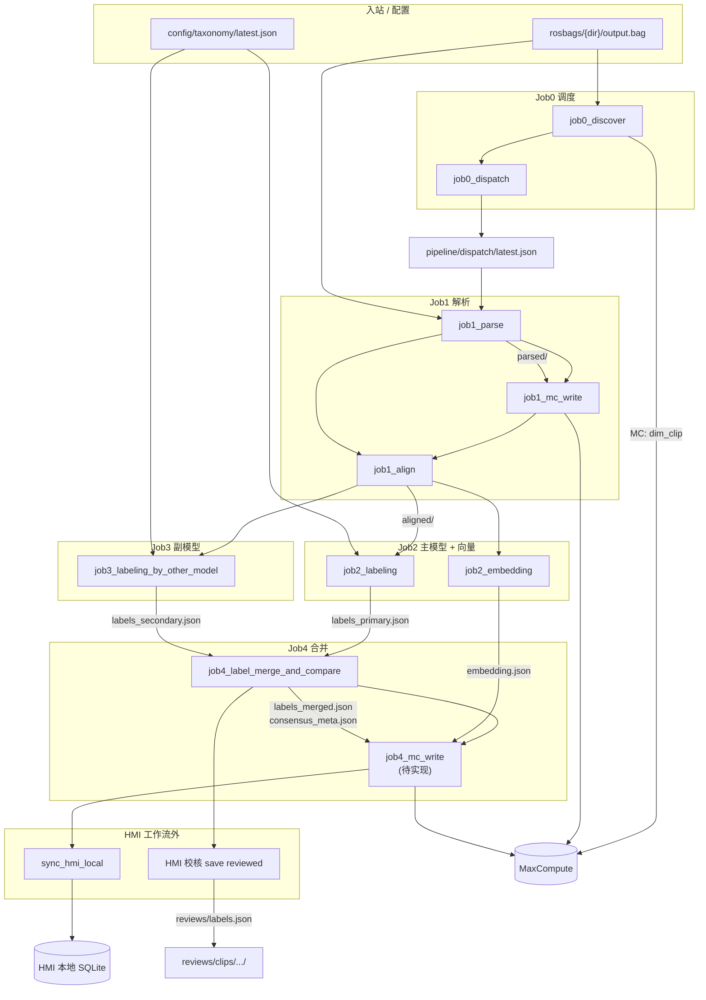
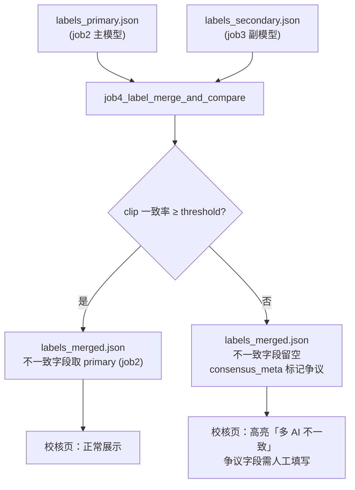

# DataWorks 工作流编排（clip-omni v2）

> **管线开发完整手册（推荐给同事 onboarding）**：[`PIPELINE_DEVELOPER_GUIDE.md`](PIPELINE_DEVELOPER_GUIDE.md)  
> **完整说明（参数传递 / idle 判断 / 数据流）**：[`WORKFLOW_COMPLETE.md`](WORKFLOW_COMPLETE.md)  
> **Dispatch 专篇**：[`DISPATCH_PARAMS.md`](DISPATCH_PARAMS.md)  
> **强制栈**：MaxFrame + 自定义 DPE 镜像 + 节点粘贴代码（`.cursor/rules/maxframe-dpe-cloud.mdc`）。

**v2 管线**：双模型整 clip 打标 + 比对合并 + clip 向量化；**无**帧抽样、ASR、逐帧打标、逐帧向量。  
**桶**：`rosbag-labels-pipeline-bucket2` · **路径前缀**：`clips/{clip_id}/runs/{run_id}/`  
管线写 `parsed/` · `aligned/` · `ai/`；人工校核写顶层 `reviews/`（仅 HMI）。

---

## 管线流程图（总览）



### OSS 目录速查

```
rosbag-labels-pipeline-bucket2/
├── rosbags/{clip_dir}/output.bag          ← Job0 / Job1 读
├── config/taxonomy/latest.json            ← Job2 / Job3 读
├── pipeline/dispatch/latest.json          ← Job0 dispatch 写，Job1~4 读
└── clips/{clip_id}/runs/{run_id}/
    ├── parsed/                            ← Job1 写
    ├── aligned/                           ← Job1 align 写
    └── ai/
        ├── labels_primary.json            ← job2_labeling
        ├── labels_secondary.json          ← job3_labeling_by_other_model
        ├── embedding.json                 ← job2_embedding
        ├── labels_merged.json             ← job4（HMI 主读）
        ├── consensus_meta.json            ← job4
        └── labels.json                    ← job4 别名（同 merged）

reviews/clips/{clip_id}/runs/{run_id}/     ← 仅 HMI 写（桶顶层）
    ├── labels.json
    └── meta.json
```

---

## 逐节点：执行前提 · 输入 · 输出

| 节点 | 执行前提 | 输入（OSS / MC / 配置） | 输出 OSS | 输出 MC |
|------|----------|-------------------------|----------|---------|
| **job0_discover** | OSS `rosbags/` 下有新 `.bag`；`clip_id` 尚未入库 | • OSS：`rosbags/**/*.bag`<br>• 参数：`scan_prefix` | — | • `dim_clip`（`active_run_id=NULL`，`bag_oss_key`） |
| **job0_dispatch** | `job0_discover` 完成；MC 有待处理 clip | • MC：`dim_clip` + `pipeline_step`（查 v2 六步是否 completed）<br>• OSS：`config/taxonomy/latest.json`（可选） | • `pipeline/dispatch/latest.json` | — |
| **job1_parse** | dispatch `action=run` **或** 节点手写 `clip_id`+`run_id` | • OSS：`rosbags/.../output.bag`<br>• dispatch manifest / 节点参数 | • `parsed/`（图像、audio、events）<br>• `parsed/job1_mc_payload.json` | — |
| **job1_mc_write** | `job1_parse` 成功 | • OSS：`parsed/job1_mc_payload.json` | — | • `fact_frame` / `fact_audio_chunk` / `fact_event` / `clip_parse_summary`<br>• `pipeline_step(job1_parse)`<br>• 更新 `dim_clip.active_run_id` |
| **job1_align** | `parsed/` 存在 | • OSS：`parsed/`（manifest、events、帧时间戳） | • `aligned/timeline.json`<br>• `aligned/sync_manifest.jsonl` | • `pipeline_step(job1_align)` |
| **job2_labeling** | `aligned/` 存在 | • OSS：`aligned/`<br>• OSS：`config/taxonomy/latest.json`<br>• 参数：`primary_model` | • `ai/labels_primary.json` | • `pipeline_step(job2_labeling)` |
| **job2_embedding** | `aligned/` 存在 | • OSS：`aligned/`（+ 可选 `parsed/`）<br>• 参数：`embed_model` | • `ai/embedding.json` | • `pipeline_step(job2_embedding)`<br>• `fact_clip_embedding`（经 mc_write） |
| **job3_labeling_by_other_model** | `aligned/` 存在 | • OSS：`aligned/`<br>• OSS：`config/taxonomy/latest.json`<br>• 参数：`secondary_model` | • `ai/labels_secondary.json` | • `pipeline_step(job3_labeling_by_other_model)` |
| **job4_label_merge_and_compare** | `labels_primary.json` **且** `labels_secondary.json` 均存在 | • OSS：上述两个文件<br>• 参数：`agreement_threshold=0.7` | • `ai/labels_merged.json`<br>• `ai/consensus_meta.json`<br>• `ai/labels.json`（别名） | • `pipeline_step(job4_label_merge_and_compare)`<br>• `fact_clip_label`（经 mc_write） |
| **job4_mc_write** *(待实现)* | job4 合并 + embedding 均完成 | • OSS：`ai/labels_merged.json`<br>• OSS：`ai/embedding.json`<br>• OSS：`ai/consensus_meta.json` | — | • `fact_clip_label`（含 `multi_ai_meta_json`）<br>• `fact_clip_embedding` |
| **sync_hmi_local** *(HMI)* | OSS/MC 有完整 run | • OSS + MC 全量同步 | • 本地 `artifacts/...` | • 本地 SQLite 事实表 |
| **HMI 校核** *(工作流外)* | AI 标签已入库 / 已入队 | • DB：`clip_label_review` | • `reviews/.../labels.json`<br>• `reviews/.../meta.json` | — |

---

## job4 合并逻辑



| clip 一致率 vs 阈值 | 行为 |
|---------------------|------|
| **≥ threshold**（默认 0.7） | 合并为最终标签；单字段不一致时 **以 job2（primary）为准** |
| **< threshold** | 不一致字段 **留空**；`consensus_meta.json` 写入争议列表；校核页高亮 |

配置：`shared/shared/config.yaml` → `cloud.job4_label_merge_and_compare.agreement_threshold`

---

## 并行关系

| 可并行 | 共同前提 |
|--------|----------|
| `job2_labeling` ∥ `job2_embedding` ∥ `job3_labeling_by_other_model` | 均依赖 `job1_align` 产出 `aligned/` |
| **必须串行** | `job4` 需等 **两个打标** 完成；`job4_mc_write` 需等 **job4 合并 + embedding** |

**推荐首次联调（全串行）**：

```
job0_discover → job0_dispatch
  → job1_parse → job1_mc_write → job1_align
  → job2_labeling → job2_embedding → job3_labeling_by_other_model
  → job4_label_merge_and_compare → job4_mc_write
```

---

## 调度与 dispatch

**定时任务**：工作流级 `clip_id` / `run_id` **留空**。`job0_dispatch` 写 `pipeline/dispatch/latest.json`（`pipeline_version=clip_omni_v2`）；下游 `resolve_pipeline_context()` 读 manifest。**无需赋值节点**。详见 [`DISPATCH_PARAMS.md`](DISPATCH_PARAMS.md)。

**pipeline_step（dispatch 去重，六步）**：

`job1_parse` → `job1_align` → `job2_labeling` → `job2_embedding` → `job3_labeling_by_other_model` → `job4_label_merge_and_compare`

六步均为 `completed` 时，dispatch 跳过该 clip 的 `active_run_id`。

**下游节点参数**：

- **不必**配 job0_dispatch 的节点输出参数
- 工作流保留 `oss_bucket=rosbag-labels-pipeline-bucket2`
- 单 clip 调试：节点参数面板手写 `clip_id` / `run_id`

---

## 镜像依赖

| 节点 | 粘贴文件 | 运行时 |
|------|----------|--------|
| Job0 发现 | `job0_discover_node.py` | MaxFrame DPE |
| Job0 调度 | `job0_dispatch_node.py` | Driver |
| Job1 解析 | `job1_parse_node.py` | MaxFrame DPE |
| Job1 写 MC | `job1_mc_write_node.py` | Driver + DPE |
| Job1 对齐 | `job1_align_node.py` | Driver（stub）/ DPE |
| Job2 主模型打标 | `job2_labeling_node.py` | DPE + MaxFrame AI |
| Job2 向量 | `job2_embedding_node.py` | DPE + MaxFrame AI |
| Job3 副模型打标 | `job3_labeling_by_other_model_node.py` | DPE + MaxFrame AI |
| Job4 合并 | `job4_label_merge_and_compare_node.py` | Driver |
| Job4 写 MC | *待实现（v2）* | Driver | 读 `ai/labels_merged.json` + `embedding.json`；勿用 legacy `job4_mc_write_node.py`（帧级 embed） |

本地生成 bundled 粘贴包：

```bash
py -3 pipeline/scripts/bundle_all_dataworks.py
```

---

## DataWorks 参数怎么配（必读）

日志里 `SKYNET_ARGS=` 为空 → 节点没收到参数，会报 `Missing required parameter: oss_bucket`。

| 参数名 | 参数值 |
|--------|--------|
| `oss_bucket` | `rosbag-labels-pipeline-bucket2` |
| `cloud_region` | `cn_shanghai` |
| `pipeline_version` | `clip_omni_v2` |
| `scan_prefix` | `rosbags/` |

完整模板见 [`workflow-params.example`](workflow-params.example) · [`PARAMETERS.md`](PARAMETERS.md)。

---

## 工作流参数（全流程配一次）

```properties
oss_bucket=rosbag-labels-pipeline-bucket2
cloud_region=cn_shanghai
table_prefix=aig_rosbag__
pipeline_version=clip_omni_v2
dispatch_oss_key=pipeline/dispatch/latest.json

scan_prefix=rosbags/
clip_id_format=sha256:{hex}

oss_ram_role_arn=acs:ram::<账号ID>:role/<角色名>
oss_prefix_template=clips/{clip_id}/
oss_runs_subdir=runs/{run_id}/
dpe_image=sq_maxframe
dpe_cpu=4
dpe_memory_gb=16
ds=${bizdate}

# Job2 主模型
primary_model=

# Job2 向量
embed_model=
embedding_dim=768

# Job3 副模型
secondary_model=

# Job4 合并
agreement_threshold=0.7
label_taxonomy_oss_key=config/taxonomy/latest.json
```

---

## 逐节点粘贴说明

### Job0 发现 · `job0_discover_node.py`

- **前提**：OSS 有新 bag
- **输出 MC**：`dim_clip`
- **日志**：`DISCOVERED clip_id=...`

### Job0 调度 · `job0_dispatch_node.py`

- **前提**：MC 有待处理 clip
- **输出 OSS**：`pipeline/dispatch/latest.json`

### Job1 解析 · `job1_parse_node.py`

- **前提**：dispatch `action=run` 或手写参数
- **输入**：`rosbags/.../output.bag`
- **输出**：`parsed/` + `job1_mc_payload.json`

### Job1 写 MC · `job1_mc_write_node.py`

- **前提**：`job1_parse` 完成
- **输入**：`parsed/job1_mc_payload.json`
- **输出 MC**：frame/audio/event 表 + `active_run_id`

### Job1 对齐 · `job1_align_node.py`

- **前提**：`parsed/` 存在
- **输出**：`aligned/timeline.json` · `sync_manifest.jsonl`

### Job2 主模型打标 · `job2_labeling_node.py`

- **前提**：`aligned/` 存在
- **输入**：`aligned/` + taxonomy
- **输出**：`ai/labels_primary.json`

### Job2 向量 · `job2_embedding_node.py`

- **前提**：`aligned/` 存在
- **输出**：`ai/embedding.json`

### Job3 副模型打标 · `job3_labeling_by_other_model_node.py`

- **前提**：`aligned/` 存在
- **输入**：同 job2_labeling，模型参数换 `secondary_model`
- **输出**：`ai/labels_secondary.json`

### Job4 合并 · `job4_label_merge_and_compare_node.py`

- **前提**：primary + secondary 标签均已写入
- **输出**：`labels_merged.json` · `consensus_meta.json` · `labels.json`

### Job4 写 MC · *待实现（v2）*

- **前提**：job4 合并 + embedding 均完成
- **输入 OSS**：`ai/labels_merged.json` · `ai/embedding.json` · `ai/consensus_meta.json`
- **输出 MC**：`fact_clip_label`（含 `multi_ai_meta_json`）· `fact_clip_embedding`
- **注意**：仓库内 `job4_mc_write_node.py` 为 **legacy 帧级** embed 写 MC，v2 需新节点或改造

**验收 SQL**：

```sql
SELECT step_id, status FROM aig_rosbag__pipeline_step
WHERE run_id='<uuid>' AND ds='${bizdate}'
ORDER BY step_id;
-- 期望六步：job1_parse, job1_align, job2_labeling, job2_embedding,
--           job3_labeling_by_other_model, job4_label_merge_and_compare
```

---

## 人工校核（HMI，非 DataWorks）

| 路径 | 写入方 | 内容 |
|------|--------|------|
| `reviews/clips/{clip_id}/runs/{run_id}/labels.json` | HMI | 校核员 `labels_json` |
| `reviews/clips/{clip_id}/runs/{run_id}/meta.json` | HMI | `reviewer_id` · `reviewed_at` |

触发：`review_status=reviewed` → `export_review_to_oss()`。

数据集导出：**特征** = `fact_clip_embedding` / `ai/embedding.json`；**目标** = HMI 校核后 labels。

---

## 参数传递（两种模式）

| 模式 | 做法 |
|------|------|
| **定时任务（推荐）** | `job0_dispatch` 写 manifest → 下游自动读 |
| **单 clip 调试** | 节点参数手写 `clip_id` / `run_id` / `bag_oss_key` |

---

## 状态机（dim_clip）

| `active_run_id` | 含义 |
|-----------------|------|
| `NULL` | Job0 已发现，待 Job1 |
| 非空 UUID | Job1 写 MC 完成，当前生效 run |

---

## 本地辅助脚本

```bash
py -3 pipeline/scripts/init_oss_layout.py
py -3 pipeline/scripts/verify_pipeline_run.py --clip-id sha256:... --run-id <uuid>
py -3 pipeline/scripts/sync_hmi_local.py --clip-id sha256:... --run-id <uuid>
py -3 pipeline/scripts/seed_demo_clip_data.py --reset
py -3 archive/legacy-scripts/mock_pipeline_artifacts.py --all --reset
py -3 archive/legacy-scripts/mock_pipeline_artifacts.py --export-fixtures   # → data/mock_pipeline/
```

---

## 排错速查

| 现象 | 检查 |
|------|------|
| dispatch idle | v2 六步是否均已 completed |
| Job1 找不到 bag | `bag_oss_key` · RAM 角色 · bucket2 |
| job4 失败 | primary/secondary 是否都已写入 |
| 校核页无争议高亮 | `consensus_meta.json` · `gate_passed=false` |
| HMI 无标签 | `sync_hmi_local.py` 或 `fact_clip_label` |

---

## 附录：Legacy 十节点工作流（已废弃）

帧级管线：`job2_sample` · `job2_asr` · `job3_label` · `job4_embed`。  
验收：`py -3 pipeline/scripts/verify_pipeline_run.py --legacy ...`  
代码与 bundled 文件仍保留；OSS 归档至 `legacy/`。
