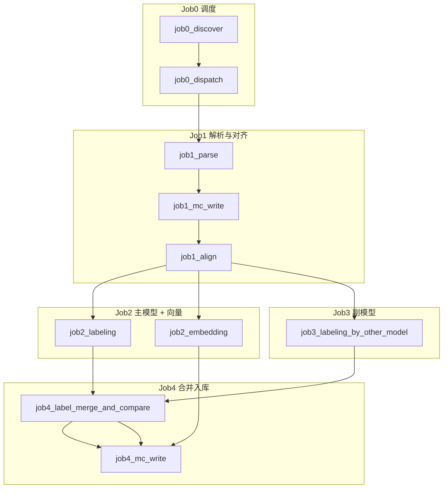
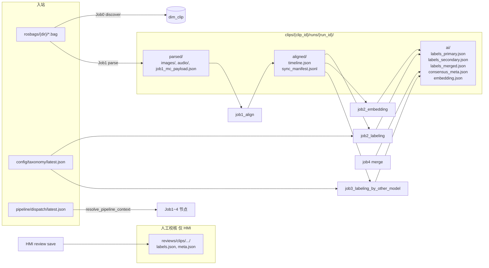
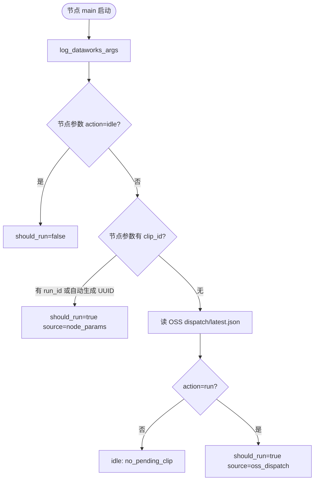
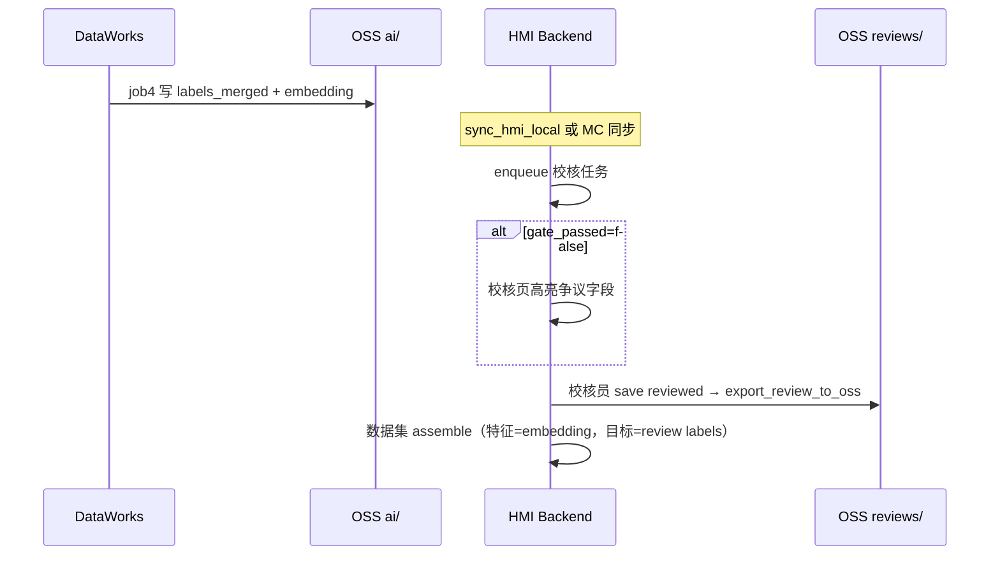

# DataWorks 十节点完整工作流说明（clip-omni v2）

> **配套文档**：`WORKFLOW.md`（粘贴/镜像速查）· `DISPATCH_PARAMS.md`（dispatch 专篇）· `PARAMETERS.md`（参数逐项手册）  
> **规则**：`.cursor/rules/dataworks-dispatch-oss.mdc` · `maxframe-dpe-cloud.mdc`

本文档回答四个问题：**节点怎么连**、**参数怎么传**、**什么时候该跑/该跳过**、**数据从哪来、到哪去**。

---

## 1. 总览

| # | 节点 | 引擎 | 主要职责 |
|---|------|------|----------|
| 0a | `job0_discover` | MaxFrame DPE | 扫描 OSS `rosbags/`，算 hash，写 `dim_clip` |
| 0b | `job0_dispatch` | Driver | 从 MC 挑 clip/run，写 OSS dispatch manifest |
| 1a | `job1_parse` | MaxFrame DPE | 读 bag，写 `parsed/` |
| 1b | `job1_mc_write` | Driver + DPE | 读 payload，写 MC 事实表 + `active_run_id` |
| 1c | `job1_align` | Driver（stub）/ DPE | 多模态时间轴对齐，写 `aligned/` |
| 2a | `job2_labeling` | DPE + MaxFrame AI | **主模型**整 clip 打标 → `ai/labels_primary.json` |
| 2b | `job2_embedding` | DPE + MaxFrame AI | clip 向量化 → `ai/embedding.json` |
| 3 | `job3_labeling_by_other_model` | DPE + MaxFrame AI | **副模型**整 clip 打标 → `ai/labels_secondary.json` |
| 4a | `job4_label_merge_and_compare` | Driver | 双模型比对合并 → `labels_merged.json` 等 |
| 4b | `job4_mc_write` | Driver | *待实现*：写 `fact_clip_label` · `fact_clip_embedding` |

**不在工作流内**

| 组件 | 职责 |
|------|------|
| HMI 校核 | 人工标签 export 到 `reviews/clips/.../` |
| `sync_hmi_local.py` | OSS `ai/` + `reviews/` → 本地 SQLite |

**存储分工**

- **OSS `rosbag-labels-pipeline-bucket2`**：bag + 各 run 产物（`parsed/` · `aligned/` · `ai/`）+ dispatch + taxonomy
- **OSS `reviews/`**：仅 HMI 写入的人工校核标签（桶顶层，非 `clips/` 下）
- **MaxCompute `rogbag_label_pipline`**：维度表 + 事实表 + `pipeline_step`（供 dispatch 去重、HMI、检索）
- **Dispatch 桥**：`pipeline/dispatch/latest.json`（含 `pipeline_version=clip_omni_v2`）

**v2 与 v1 区别**：不再使用单体 `job2_clip_omni`；打标拆为主/副两路，job4 合并后再入库。

---

## 2. 编排拓扑图

### 2.1 节点依赖（推荐：首次联调全串行）



### 2.2 并行关系

| 可并行 | 共同前提 |
|--------|----------|
| `job2_labeling` ∥ `job2_embedding` ∥ `job3_labeling_by_other_model` | 均依赖 `job1_align` 产出 `aligned/` |
| **必须串行** | `job4_label_merge_and_compare` 需等 **两个打标** 完成；`job4_mc_write` 需等 **job4 合并 + embedding** |

v2 **无旁路**：无 Job2 sample/ASR；无逐帧 Job3/Job4 embed。

---

## 3. OSS 数据流图



**路径约定**

| 类型 | OSS Key 模式 | 说明 |
|------|--------------|------|
| Bag（只读） | `rosbags/{clip_dir_name}/output.bag` | `clip_id` 由内容 SHA256 决定 |
| Dispatch | `pipeline/dispatch/latest.json` | 含 `pipeline_version=clip_omni_v2` |
| 解析 | `clips/{clip_id}/runs/{run_id}/parsed/` | Job1 |
| 对齐 | `.../aligned/` | Job1 align |
| AI 产物 | `.../ai/` | 管线写入（**禁止**写 reviews） |
| 人工标签 | `reviews/clips/{clip_id}/runs/{run_id}/` | HMI export |
| Taxonomy | `config/taxonomy/` | 发布版 YAML + `latest.json` |
| Legacy 归档 | `legacy/` | 旧 job2/job3/job4 布局 |

`clip_id` 格式：`sha256:{hex}`。

---

## 4. MaxCompute 数据流图

```mermaid
flowchart TB
  J0[job0_discover] --> dim[aig_rosbag__dim_clip]
  J0P[job0_dispatch] --> step_check[pipeline_step v2 六步 completed?]

  J1W[job1_mc_write] --> dim
  J1W --> ff[fact_frame]
  J1W --> ac[fact_audio_chunk]
  J1W --> ev[fact_event]
  J1W --> ps1[pipeline_step job1_parse]

  J1A[job1_align] --> ps1a[pipeline_step job1_align]

  J2L[job2_labeling] --> ps2l[pipeline_step job2_labeling]
  J2E[job2_embedding] --> ps2e[pipeline_step job2_embedding]
  J3L[job3_labeling_by_other_model] --> ps3[pipeline_step job3_labeling_by_other_model]
  J4M[job4_label_merge_and_compare] --> ps4[pipeline_step job4_label_merge_and_compare]

  J4W[job4_mc_write] --> fcl[fact_clip_label]
  J4W --> fce[fact_clip_embedding]
```



**`dim_clip` 状态**

| 字段 | 含义 |
|------|------|
| `clip_id` | 内容 hash 主键 |
| `bag_oss_key` | bag 在 OSS 上的 key |
| `active_run_id` | `NULL` = 已发现待 Job1；非空 = 当前生效 run UUID |

**`pipeline_step` 六步**（dispatch 去重用，`REQUIRED_PIPELINE_STEPS`）：  
`job1_parse` · `job1_align` · `job2_labeling` · `job2_embedding` · `job3_labeling_by_other_model` · `job4_label_merge_and_compare`

Legacy 五步见 `pipeline_dispatch.py` → `LEGACY_PIPELINE_STEPS`。

---

## 5. 参数传递机制

### 5.1 三层参数来源（优先级从高到低）

所有节点通过 `get_arg(name)` 读取，合并顺序：

1. **DataWorks 节点参数** → PyODPS 注入的全局 `args` 字典
2. **`SKYNET_ARGS` / 环境变量**（部分节点）
3. **代码内 `_PROJECT_DEFAULTS`**（如 `oss_bucket=rosbag-labels-pipeline-bucket2`）

### 5.2 clip_id / run_id 解析（核心）

函数：`resolve_pipeline_context()`（`pipeline/dataworks/pipeline_dispatch.py`）



Dispatch payload 额外字段：`pipeline_version` · `taxonomy_version_id` · `taxonomy_oss_key`。

### 5.3 idle / 跳过逻辑

`job0_dispatch` → `pick_dispatch_target()`：

- 遍历 `dim_clip`
- 若 `active_run_id` 对应 run 的 v2 **六步**均已 `completed` → 跳过，选下一个 clip
- 否则 `action=run`，`reason=new_run` 或 `resume_incomplete`

下游节点：`exit_if_pipeline_idle(pipeline_ctx, node_name=...)` → manifest `action=idle` 时 no-op 成功退出。

---

## 6. 输入输出速查

| 节点 | 读 OSS | 写 OSS | 写 MC |
|------|--------|--------|-------|
| job0_discover | `rosbags/` | — | `dim_clip` |
| job0_dispatch | — | `pipeline/dispatch/latest.json` | — |
| job1_parse | bag | `parsed/` | — |
| job1_mc_write | `parsed/job1_mc_payload.json` | — | frame/audio/event + `pipeline_step(job1_parse)` |
| job1_align | `parsed/` | `aligned/timeline.json`, `sync_manifest.jsonl` | `pipeline_step(job1_align)` |
| job2_labeling | `aligned/` + taxonomy | `ai/labels_primary.json` | `pipeline_step(job2_labeling)` |
| job2_embedding | `aligned/` | `ai/embedding.json` | `pipeline_step(job2_embedding)` * |
| job3_labeling_by_other_model | `aligned/` + taxonomy | `ai/labels_secondary.json` | `pipeline_step(job3_labeling_by_other_model)` |
| job4_label_merge_and_compare | primary + secondary | `labels_merged.json`, `consensus_meta.json`, `labels.json` | `pipeline_step(job4_label_merge_and_compare)` * |
| job4_mc_write | `ai/labels_merged.json`, `ai/embedding.json` | — | `fact_clip_label`, `fact_clip_embedding` |

\* 部分 step / fact 表写入可合并到 `job4_mc_write`，以实现为准。

---

## 7. job4 合并逻辑

| clip 一致率 vs 阈值 | 行为 |
|---------------------|------|
| **≥ threshold**（默认 0.7） | 合并为 `labels_merged.json`；单字段不一致时 **以 job2（primary）为准** |
| **< threshold** | 不一致字段 **留空**；`consensus_meta.json` 标记争议；HMI 校核页高亮 |

实现：`pipeline/dataworks/label_merge.py` · 配置：`shared/config.yaml` → `cloud.job4_label_merge_and_compare.agreement_threshold`

---

## 8. 逐节点详解

### 8.1 job0_discover

| 项 | 内容 |
|----|------|
| **输入** | OSS `rosbags/`；`scan_prefix`, `max_scan` |
| **输出 MC** | `dim_clip`（`active_run_id=NULL`, `bag_oss_key`） |
| **粘贴** | `pipeline/dataworks/job0_discover_node.py` |

### 8.2 job0_dispatch

| 项 | 内容 |
|----|------|
| **输入** | MC `dim_clip` + `pipeline_step`（v2 六步） |
| **输出 OSS** | `pipeline/dispatch/latest.json`（含 `pipeline_version=clip_omni_v2`） |
| **粘贴** | `pipeline/dataworks/bundled/job0_dispatch_node.py` |

### 8.3 job1_parse · job1_mc_write · job1_align

同 v1 Job1 三节；align 产出 `aligned/` 供 Job2/Job3 并行消费。

### 8.4 job2_labeling（主模型）

| 项 | 内容 |
|----|------|
| **输入 OSS** | `aligned/`；taxonomy：`config/taxonomy/latest.json` |
| **输出 OSS** | `ai/labels_primary.json` |
| **参数** | `primary_model`（留空 = stub） |
| **粘贴** | `pipeline/dataworks/job2_labeling_node.py` |

### 8.5 job2_embedding

| 项 | 内容 |
|----|------|
| **输入 OSS** | `aligned/`（+ 可选 `parsed/`） |
| **输出 OSS** | `ai/embedding.json` |
| **参数** | `embed_model`, `embedding_dim=768` |
| **粘贴** | `pipeline/dataworks/job2_embedding_node.py` |

### 8.6 job3_labeling_by_other_model（副模型）

| 项 | 内容 |
|----|------|
| **输入 OSS** | 同 job2_labeling |
| **输出 OSS** | `ai/labels_secondary.json` |
| **参数** | `secondary_model`（留空 = stub） |
| **粘贴** | `pipeline/dataworks/job3_labeling_by_other_model_node.py` |

### 8.7 job4_label_merge_and_compare

| 项 | 内容 |
|----|------|
| **输入 OSS** | `labels_primary.json` + `labels_secondary.json` |
| **输出 OSS** | `labels_merged.json`, `consensus_meta.json`, `labels.json`（别名） |
| **参数** | `agreement_threshold=0.7` |
| **粘贴** | `pipeline/dataworks/job4_label_merge_and_compare_node.py` |

### 8.8 job4_mc_write（待实现）

| 项 | 内容 |
|----|------|
| **输入 OSS** | `ai/labels_merged.json`, `ai/embedding.json`, `ai/consensus_meta.json` |
| **输出 MC** | `fact_clip_label`（含 `multi_ai_meta_json`）, `fact_clip_embedding` |
| **参考** | 现有 `job4_mc_write_node.py` 为 legacy 帧级向量；v2 需新实现读 `ai/` |

---

## 9. HMI 与 reviews/ 数据流



---

## 10. 推荐工作流参数（v2）

```properties
# === 全局 ===
oss_bucket=rosbag-labels-pipeline-bucket2
cloud_region=cn_shanghai
table_prefix=aig_rosbag__
pipeline_version=clip_omni_v2
dispatch_oss_key=pipeline/dispatch/latest.json
oss_ram_role_arn=acs:ram::<账号>:role/maxframe-rosbag-oss
oss_mount_prefix=
oss_prefix_template=clips/{clip_id}/
oss_runs_subdir=runs/{run_id}/
ds=${bizdate}

# === DPE ===
dpe_image=sq_maxframe
dpe_mount_path=/mnt/oss
dpe_cpu=4
dpe_memory_gb=16

# === Job2 主模型 ===
label_taxonomy_oss_key=config/taxonomy/latest.json
primary_model=

# === Job2 向量 ===
embed_model=
embedding_dim=768

# === Job3 副模型 ===
secondary_model=

# === Job4 合并 ===
agreement_threshold=0.7

# === MaxFrame AI ===
ai_modelset_project=bigdata_public_modelset
ai_cu_quota_name=
ai_gu_quota_name=
ai_parallel_partitions=4
ai_memory=8G
total_rpm_limit=12000
request_timeout=300
```

**定时任务**：工作流级 `clip_id` / `run_id` **留空**，由 dispatch 驱动。

---

## 11. 验收与排错

### 11.1 日志关键字

| 阶段 | 成功标志 |
|------|----------|
| discover | `DISCOVERED clip_id=` |
| dispatch | `Job0 dispatch OSS manifest:` 或 `PIPELINE_IDLE` |
| Job1~4 | `resolve_pipeline_context: loaded dispatch from OSS (action=run)` |
| align | `aligned/timeline.json` 已写入 OSS |
| labeling | `ai/labels_primary.json` 已写入 OSS |
| merge | `ai/labels_merged.json` + `consensus_meta.json` |

### 11.2 命令

```bash
# v2 全链 MC+OSS 验收（默认）
py -3 pipeline/scripts/verify_pipeline_run.py --clip-id sha256:... --run-id <uuid>

# legacy 十节点验收
py -3 pipeline/scripts/verify_pipeline_run.py --legacy --clip-id sha256:... --run-id <uuid>

# HMI 本地同步（含 ai/ 入库）
py -3 pipeline/scripts/sync_hmi_local.py --clip-id sha256:... --run-id <uuid>

# Mock demo 数据
py -3 archive/legacy-scripts/mock_pipeline_artifacts.py --all --reset
py -3 pipeline/scripts/seed_demo_clip_data.py --reset
```

### 11.3 常见错误

| 现象 | 原因 | 处理 |
|------|------|------|
| `Missing required parameter: oss_bucket` | 节点未配工作流参数 | 工作流级添加参数 |
| `Dispatch OSS manifest missing` | 未先跑 dispatch | 同实例从 dispatch 起跑 |
| dispatch idle 但想重跑 | v2 六步已完成 | 新 run_id 或 reset |
| job4 失败 | primary/secondary 未齐 | 检查 job2_labeling + job3 |
| 校核页无争议高亮 | 缺 consensus_meta | 检查 `gate_passed=false` |
| HMI 无 clip 标签 | 未 sync / 无 fact_clip_label | 跑 sync_hmi_local 或补 job4_mc_write |
| AI 标签出现在 reviews/ | 管线误写路径 | 仅 HMI 写 reviews/ |

### 11.4 验收 SQL

```sql
SELECT step_id, status FROM aig_rosbag__pipeline_step
WHERE run_id='<uuid>' AND ds='${bizdate}'
ORDER BY step_id;
-- 期望六步：job1_parse, job1_align, job2_labeling, job2_embedding,
--           job3_labeling_by_other_model, job4_label_merge_and_compare
```

---

## 12. 粘贴与 bundle

| 节点 | 源文件 | Bundle |
|------|--------|--------|
| job0_dispatch | `job0_dispatch_node.py` | `py -3 pipeline/scripts/bundle_pipeline_dispatch.py dataworks/job0_dispatch_node.py` |
| job1_align | `job1_align_node.py` | 同上 |
| job2_labeling | `job2_labeling_node.py` | 同上 |
| job2_embedding | `job2_embedding_node.py` | 同上 |
| job3_labeling_by_other_model | `job3_labeling_by_other_model_node.py` | 同上 |
| job4_label_merge_and_compare | `job4_label_merge_and_compare_node.py` | 同上 |
| job1_parse 等 | 见 `pipeline/dataworks/bundled/` | `py -3 pipeline/scripts/bundle_all_dataworks.py` |

DataWorks 粘贴 **`pipeline/dataworks/bundled/`** 下对应整文件。

**已废弃**：`job2_clip_omni_node.py`（调用会直接 exit）。

---

## 附录 A：Legacy 十节点工作流

已废弃的帧级管线（sample → ASR → frame label → frame embed）：

```
job0_discover → job0_dispatch → job1_parse → job1_mc_write
  → job2_sample ──→ job3_label → job3_mc_write → job4_embed → job4_mc_write
  → job2_asr   ──┘ → job2_mc_write
```

- dispatch 五步：`job1_parse` · `job2_sample` · `job2_asr` · `job3_label` · `job4_embed`
- OSS：`job2/` · `job3/` · `job4/`（现归档至 `legacy/`）
- 验收：`verify_pipeline_run.py --legacy`

---

## 来源

- v2 设计：`shared/config.yaml` · `hmi/backend/hmi/oss_layout.py` · `pipeline/dataworks/label_merge.py`
- Dispatch：`pipeline_dispatch.py` · `DISPATCH_PARAMS.md`
- Legacy：2026-06 十节点 E2E 验证记录
