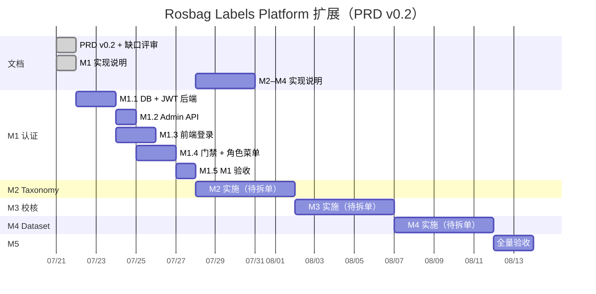

# 路线图甘特（总览）

```mermaid
gantt
  title Rosbag Labels Platform 扩展（PRD v0.2）
  dateFormat YYYY-MM-DD
  axisFormat %m/%d

  section 文档
  PRD v0.2 + 缺口评审     :done, doc_prd, 2026-07-21, 1d
  M1 实现说明             :done, doc_m1, 2026-07-21, 1d
  M2–M4 实现说明          :doc_m234, after m1_exit, 3d

  section M1 认证
  M1.1 DB + JWT 后端      :m11, 2026-07-22, 2d
  M1.2 Admin API          :m12, after m11, 1d
  M1.3 前端登录           :m13, after m11, 2d
  M1.4 门禁 + 角色菜单    :m14, after m12, 2d
  M1.5 M1 验收            :m1_exit, after m14, 1d

  section M2 Taxonomy
  M2 实施（待拆单）       :m2, after m1_exit, 5d

  section M3 校核
  M3 实施（待拆单）       :m3, after m2, 5d

  section M4 Dataset
  M4 实施（待拆单）       :m4, after m3, 5d

  section M5
  全量验收                :m5, after m4, 2d
```

> 日期为计划占位，实际以 `tracking.csv` 为准。
